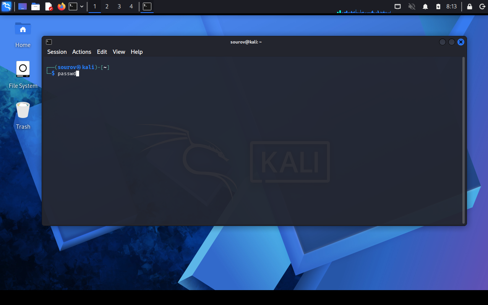

# 🐬 Day 02 (Week 01 • Day 02): A Tour of Kali Linux & Basic Command Line

Welcome to Day 02 of Week 01 of my Linux Security learning journey. This document covers logging into Kali Linux, terminal and shell fundamentals, basic command navigation, the Linux filesystem hierarchy, security best practices (root vs. standard user), keyboard shortcuts, and file permissions.

---

## 🎯 Key Points & Core Concepts

### 1. 🖥️ A Tour of Kali Linux & Terminal Interface

#### Kali Login & Credentials

* **Default Username:** `root`
* **Default Password:** `toor` *(or your custom password if changed)*
* **Interface:** Access to the full Kali desktop interface upon successful login.

#### Terminal & Shell Fundamentals

* **The Shell:** The command line environment opened by the terminal to run OS commands, execute scripts, manage files, and configure system settings.
* **Default Shell:** **Bash** (Bourne-Again SHell) is the default and most popular shell in Kali and many Linux distributions.

---

### 2. 📂 The Linux Filesystem Structure

#### Logical Structure Concept

Unlike Windows (which uses physical drives like `C:`), Linux uses a **logical filesystem** structured like an upside-down tree starting from the **Root Directory (`/`)**. All directories branch from it.

> ⚠️ **Note:** The root `/` directory is completely different from the `root` user account.

#### Most Important Directories

| Directory | Purpose |
| --- | --- |
| **`/root`** | Home directory of the root user |
| **`/home`** | Regular users' home directories |
| **`/etc`** | System configuration files |
| **`/bin`** | Essential command binaries |
| **`/sbin`** | System binaries (for root only) |
| **`/lib`** | System libraries (like Windows DLLs) |
| **`/usr`** | User programs and libraries |
| **`/var`** | Variable data (logs, cache, etc.) |
| **`/tmp`** | Temporary files |
| **`/mnt`** | Mount point for filesystems |
| **`/media`** | Mount point for removable media (CDs, USBs) |
| **`/opt`** | Optional software packages |

#### Directory Hierarchy View

```plaintext
/
├── root          (root user's home)
├── home          (regular users)
├── etc           (configuration)
├── bin           (commands)
├── lib           (libraries)
├── var           (logs, data)
└── tmp           (temporary files)

```

---

### 3. 🛡️ Security Best Practice: Root vs. Regular User

#### Security Risk of Routine Root Usage

Do not log in as `root` for routine tasks (browsing the web, running tools like Wireshark/Burp Suite, opening emails, installing untrusted software).

* If hacked while logged in as `root`, the attacker immediately gains full **root privileges** and complete control over the system.

#### Best Practices

* **For Labs:** Staying logged in as `root` is fine for practice/training exercises in a controlled learning environment.
* **General Use:** Log in as a regular user and use `sudo` for elevated tasks (e.g., `sudo apt-get update`).

---

### 4. 🛠️ Command Reference & Shortcuts

#### Terminal Keyboard Shortcuts

| Shortcut | Function |
| --- | --- |
| **`Ctrl + C`** | Cancel/stop current command |
| **`Ctrl + L`** | Clear screen |
| **`Ctrl + Z`** | Suspend current process |
| **`↑ Arrow`** | Previous command |
| **`↓ Arrow`** | Next command |
| **`Tab`** | Auto-complete filename or command |

---

### 5. 🖼️ Terminal Commands & Execution Output Views

#### Password Change (`passwd`)

* **Command Execution:**
```bash
passwd

```
#### 🖼️ Terminal Command (`passwd`)


#### 🖼️ Terminal Output (`passwd`)


---
