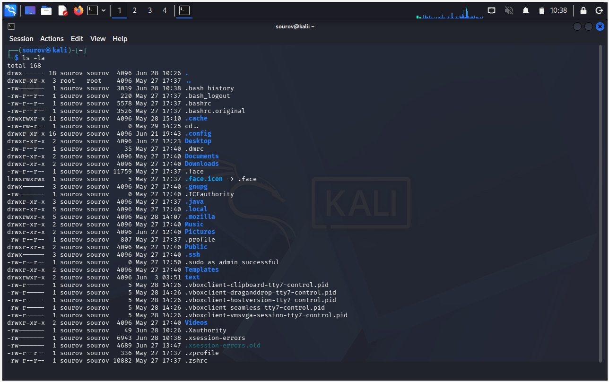

# 🐧 Day 03 : Linux Basics & Core Commands

Welcome to Day 03 of Week 01 of my Linux Security learning journey. This absolute fundamental note covers the core concepts and commands required to navigate the Linux filesystem, identify users, check contents, and get help using Kali Linux as a non-root standard user.

---

## 🎯 Key Points & Core Concepts

### 1. 📍 Present Working Directory (`pwd`)
* Description: Returns your exact current location or absolute path within the Linux hierarchical directory structure.
* Core Importance: Unlike graphical user interface (GUI) environments, the command line interface (CLI) doesn't always visually display your current directory. You must know your precise coordinate before executing or creating scripts.

Example — Querying current directory path:
```bash
sourov@kali > pwd
/home/sourov

```
#### 🖼️ Terminal Output


### 2. 👤 Active Session Identification (whoami)
 * Description: Displays the specific username of the current active terminal shell session.
 * Root vs Non-Root Architecture: The root account is the all-powerful system superuser required to run deep administration and advanced network tracking tools.
 * Privilege Escalation Constraint: Since you are logged in as the standard user sourov, certain security utilities (such as nmap or aircrack-ng) will deny execution due to restricted permissions. To bypass this, you must prefix those commands with sudo to invoke elevated administrative privileges.
Example — Verifying active session identity:
```bash
sourov@kali > whoami
sourov

```
#### 🖼️ Terminal Output


### 3. 📂 Changing Directory Layouts (cd)
 * Description: Used to seamlessly migrate and shift your working operational environment from one directory to another.
 * Syntax Rule & Navigation Variants:
   * cd [path] : Moves the terminal context to a specific target path (e.g., cd /etc).
   * cd .. : Jumps upward exactly one parent directory tier closer to the system root (/).
   * cd ../.. : Jumps upward exactly two full structural directory tiers.
   * cd ../../.. : Jumps upward exactly three structural directory tiers.
   * cd / : Immediately snaps your terminal context directly to the absolute top/root level of the entire file layout.
Example — Shifting path locations:
```bash
sourov@kali > cd /etc
sourov@kali > cd ..

```
#### 🖼️ Terminal Output


### 4. 🗂️ Listing Directory Contents (ls)
 * Description: Scans and displays the filenames and active subdirectories nested inside a designated directory layer.
 * Standard Execution: Running ls without arguments prints contents of your current path, while passing an explicit variable (like ls /path) previews that target's inventory.
 * Tactical Switches & Flags:
   * -l : Long Listing mode. Unlocks data rows detailing file security permissions, owners, file size, and creation timestamps.
   * -a : All files flag. Forces the system to render hidden files that begin with a structural dot index (e.g., .bashrc).
   * -la : Combined utility flag. Renders a long listing layout that includes hidden configurations. This is highly recommended for security audits.
Example 1 — Standard Contents List:
```bash
sourov@kali > ls
Desktop  Documents  Downloads  Music  Pictures  Public  Templates Text  Videos

```
#### 🖼️ Terminal Output


Example 2 — Long Listing Representation (-l):
```bash
sourov@kali > ls -l

```
#### 🖼️ Terminal Output


Example 3 — Hidden Files Discovery View (-a):
```bash
sourov@kali > ls -a

```
#### 🖼️ Terminal Output


Example 4 — Combined Long and Hidden Manifest (-la):
```bash
sourov@kali > ls -la

```
#### 🖼️ Terminal Output



### 5. ❓ Standard Help Switch Execution (--help)
 * Description: Displays a fast reference syntax summary, tool description, and available flag arguments inside the active standard output.
 * Rule of Thumb: Use a double dash (--) before complete word options, and use a single dash (-) to invoke single-letter flags.
 * Safety Note: If --help fails to run on a custom compiled tool, drop back to checking -h or -?.
Example 1 — Checking aircrack-ng help layout:
```bash
sourov@kali > aircrack-ng --help

```
#### 🖼️ Terminal Output


Example 2 — Checking nmap scanner help parameters:
```bash
sourov@kali > nmap --help

```
#### 🖼️ Terminal Output

[nmap help](Screenshot/nmap-help.png)

### 6. 📖 Deep Documentation Manuals (man)
 * Description: Opens the comprehensive, complete official manual pages for any targeted Linux binary, command, or structural utility.
 * Viewport Navigation Matrix:
   * [Enter Key] : Scroll down line-by-line for deep inspection.
   * [Spacebar] / [Pg Dn] : Scroll down page-by-page.
   * [Pg Up] : Scroll back up page-by-page.
   * [q] : Gracefully terminates the manual reader interface and returns you back to the command prompt.
Example — Opening full manual configurations:
```bash
sourov@kali > man aircrack-ng

```
#### 🖼️ Terminal Output


## 🛠️ Utilities & Tool Reference
| Category | Component/Tool | Syntax / Structure | Description |
|---|---|---|---|
| Environment Check | pwd | pwd | Displays the current absolute path of your active directory. |
| User Auditing | whoami | whoami | Returns the system username of the current running shell instance. |
| Navigation Engine | cd | cd [target_directory] | Changes current text context and traverses across filesystem tiers. |
| Inventory View | ls | ls -la [target_path] | Lists explicit file blocks, size variables, and hidden dot files. |
| Fast Help Switch | --help / -h | [command] --help | Dumps syntax templates and argument switches to the terminal screen. |
| Official Documentation | man | man [command] | Launches structural manual screens with built-in page controls. |
## 🔑 Key Takeaways for Revision
 1. pwd → Shows current directory coordinate path.
 2. whoami → Identifies current active system profile name.
 3. cd → Shifts context locations across folder paths.
 4. ls → Details standard, long (-l), or hidden (-a) folder inventories.
 5. --help / man → Safely parses parameters and commands when working with new tools.

```

```
