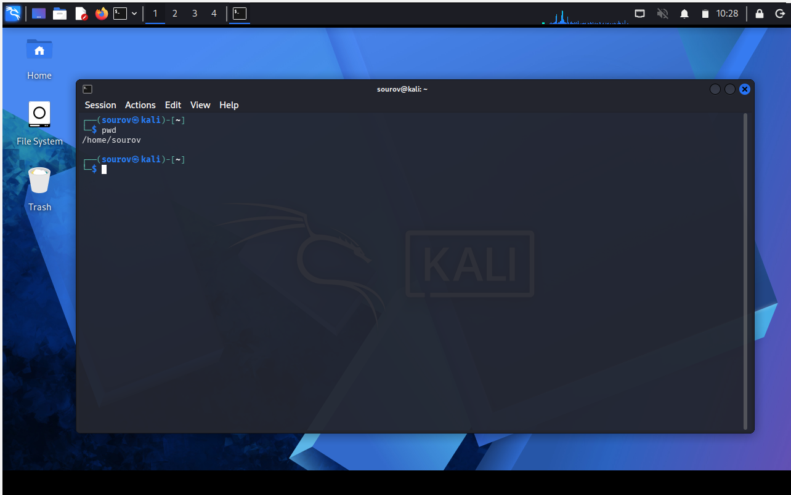
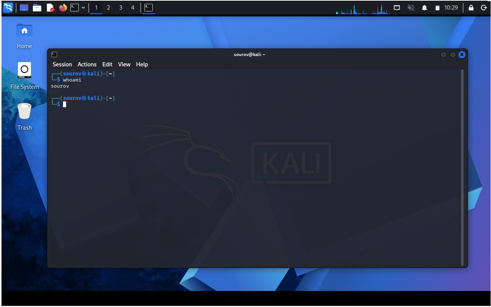
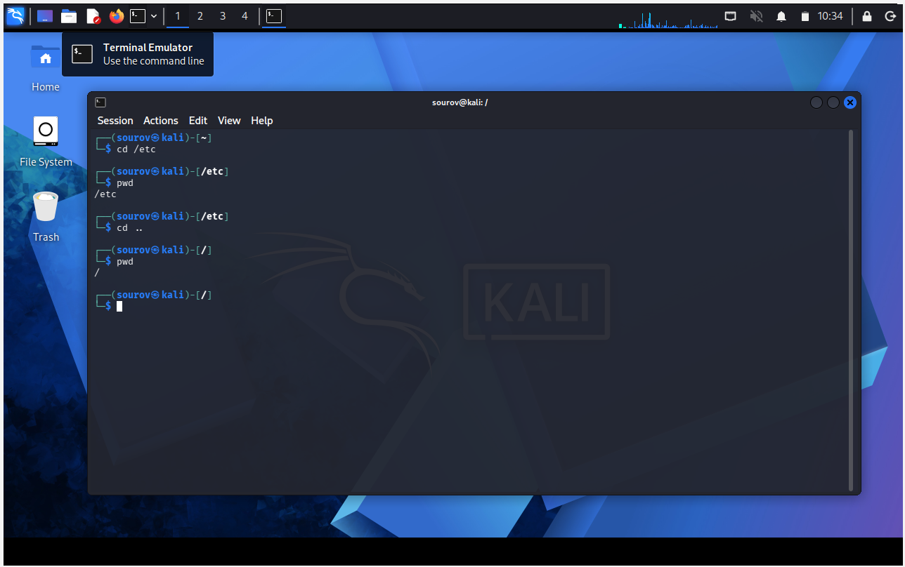
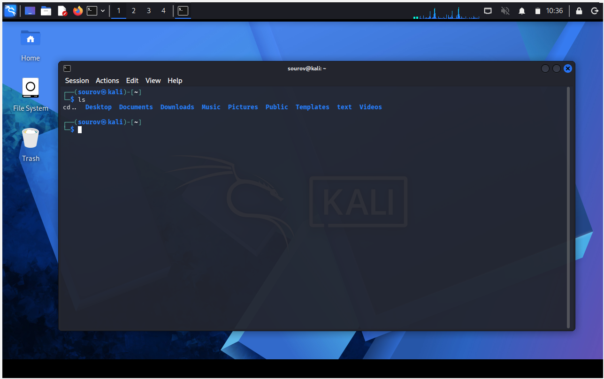
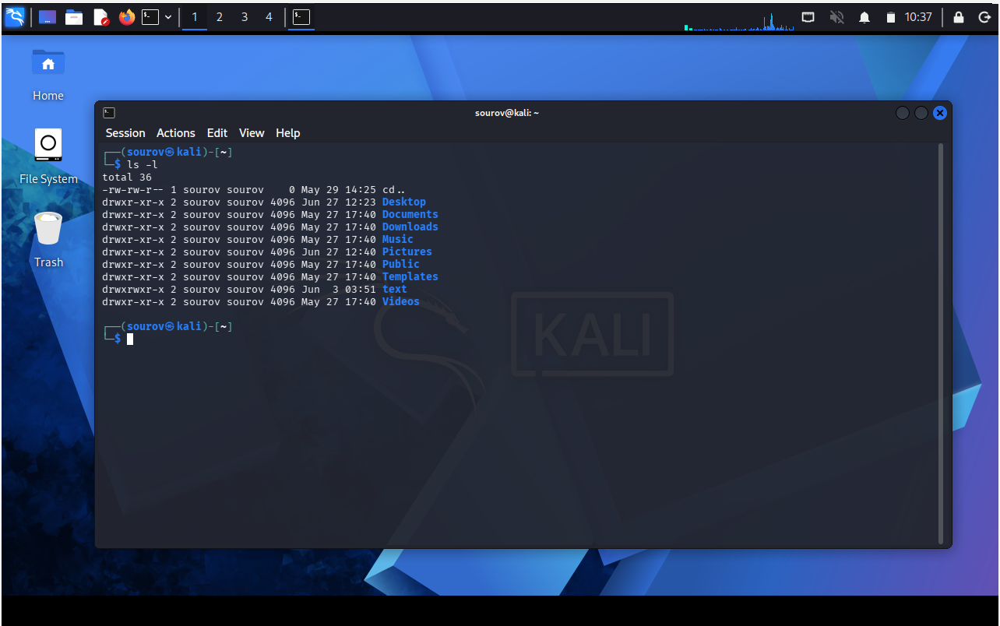
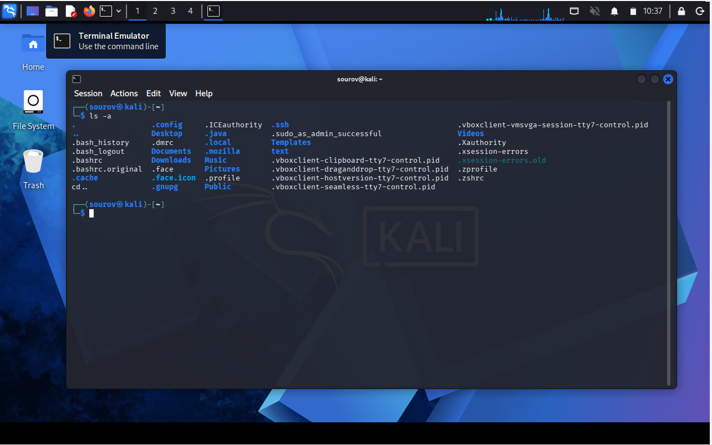

LINUX BASICS & CORE COMMANDS

OS: Kali Linux
User: sourov (Standard User / Non-root)

This note covers the absolute fundamental concepts and commands required to navigate the Linux filesystem, identify users, check contents, and get help.

1. IDENTIFYING YOUR ENVIRONMENT

pwd (Present / Print Working Directory)

Purpose: Returns your exact current location within the directory structure.

Why it matters: Unlike GUI environments, the CLI doesn't always show where you are. You must know your location before navigating.

Example:

whoami

Purpose: Displays the username of the current active session.

Root vs sourov:

root is the all-powerful superuser (needed for advanced/hacking tools).

Since you are logged in as sourov, some administrative commands or hacking tools (like nmap, aircrack-ng) will require elevated privileges. You will need to prefix those commands with sudo.

Example:

2. NAVIGATING THE FILESYSTEM

cd (Change Directory)

Purpose: Used to move from one directory to another.

Syntax & Variations:

cd [path]       : Moves to a specific directory.Example: cd /etc

cd ..           : Moves UP exactly one level towards the root (/).

cd ../..        : Moves UP two levels.

cd ../../..     : Moves UP three levels (and so on).

cd /            : Moves directly to the absolute top/root level of the system.

Example Scenario:

3. LISTING DIRECTORY CONTENTS

ls (List)

Purpose: Displays the files and subdirectories inside a directory.

Usage: Type ls for current directory, or ls /path for a specific directory.

Example:

Common Flags/Switches for ls:

ls -l  : Long Listing. Shows detailed info (permissions, owner, size, date).

Example:

ls -a  : All. Shows hidden files (files starting with a dot, e.g., .bashrc).

Example:

ls -la : Combined flag. Long listing including hidden files (Highly Recommended).

Example:

4. GETTING HELP IN LINUX

Linux provides built-in documentation for almost every tool and command.

The Help Switch (--help, -h, -?)

Purpose: Displays a quick description and a list of available options/flags.

Rule of Thumb: Use double dash (--) for word options and single dash (-) for single-letter options.

Example for aircrack-ng:

Example for nmap:

Note: If one option (--help) doesn't work for a tool, try -h or -?.

man (Manual Pages)

Purpose: Opens a comprehensive, detailed official manual for any command.

Usage: Type man followed by the command name.

Example:

Navigation within 'man' page:

[Enter Key]      : Scroll down line by line.

[Pg Up] / [Pg Dn]: Scroll up or down page by page.

[Arrow Keys]     : Navigate smoothly.

[q]              : Quit/Exit the manual and return to the terminal prompt.

SUMMARY

pwd → shows current directory

whoami → shows current user

cd → change directory

ls → list files

--help / man → get help
