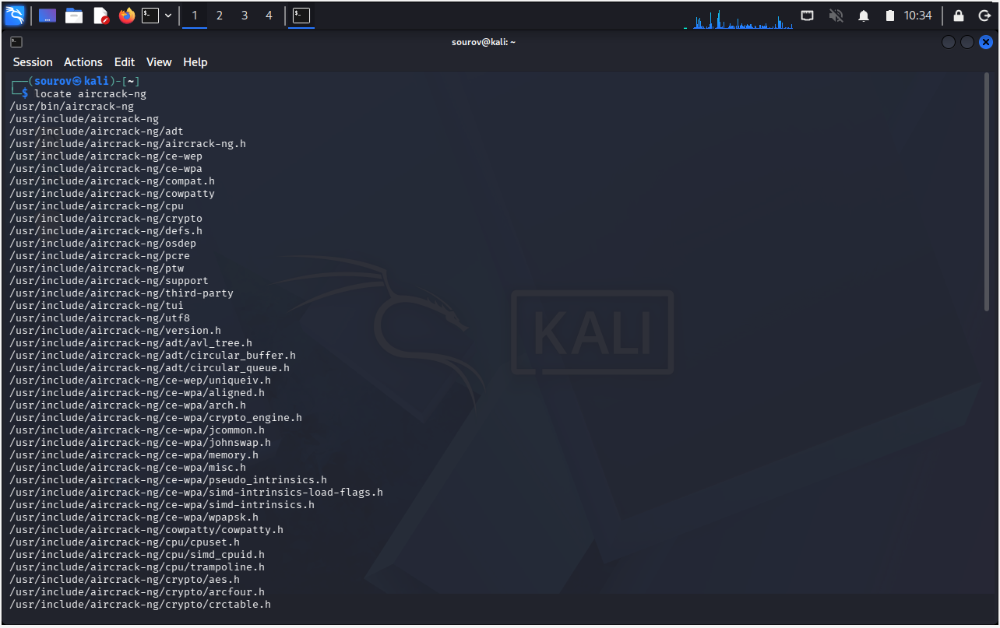
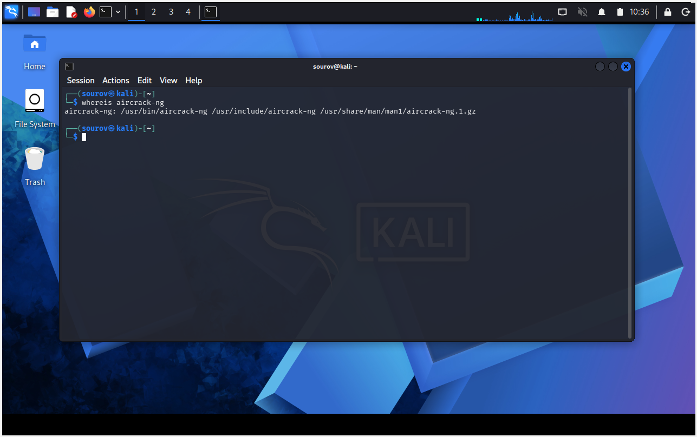
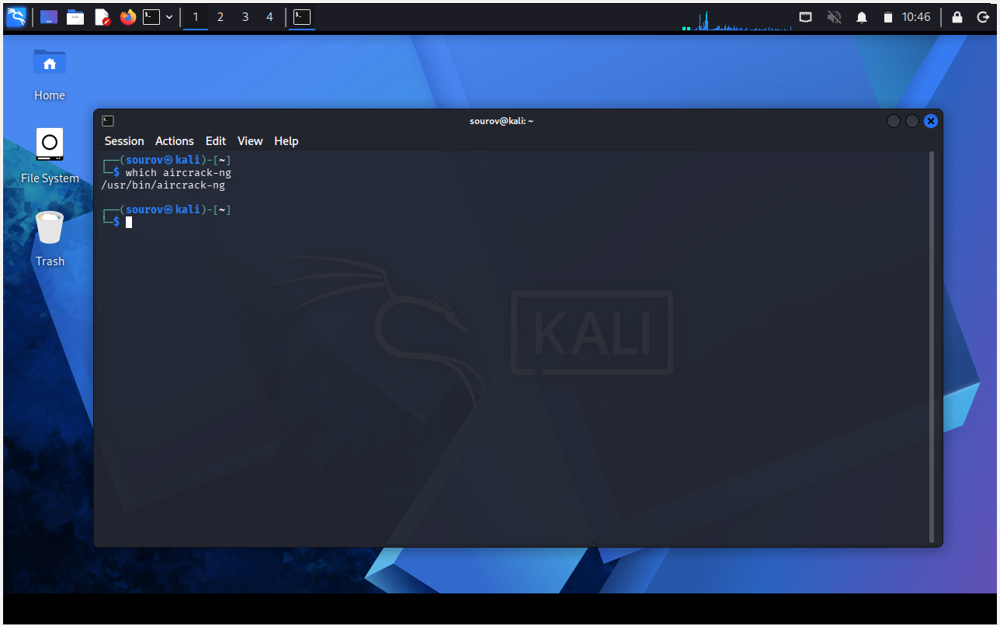
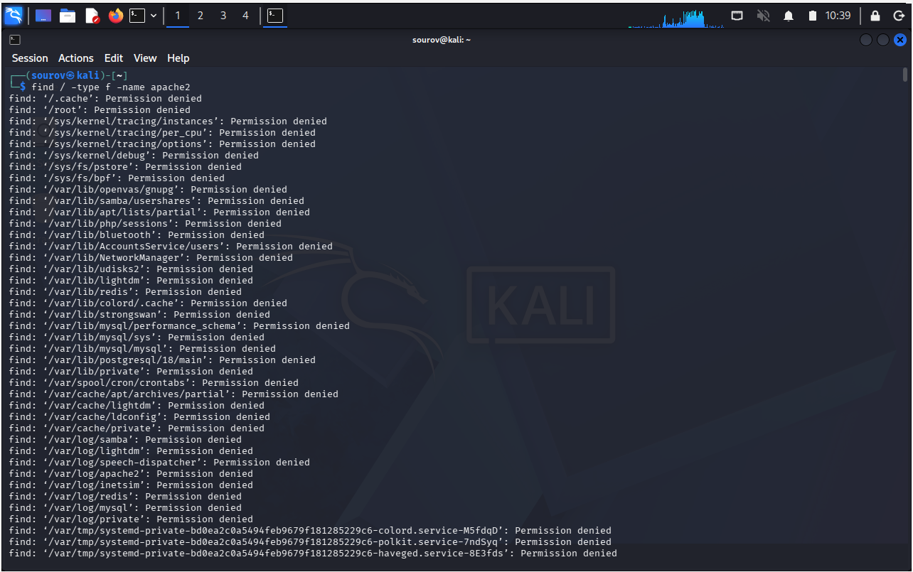
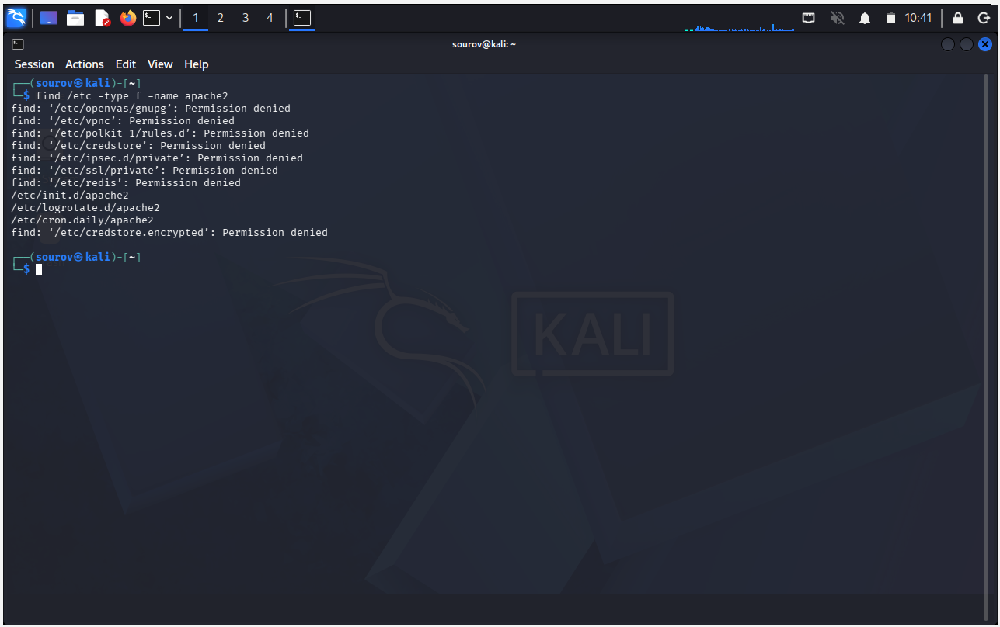
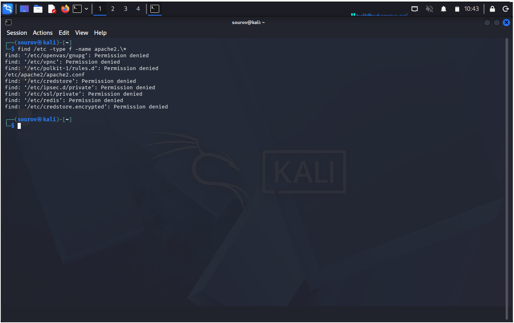
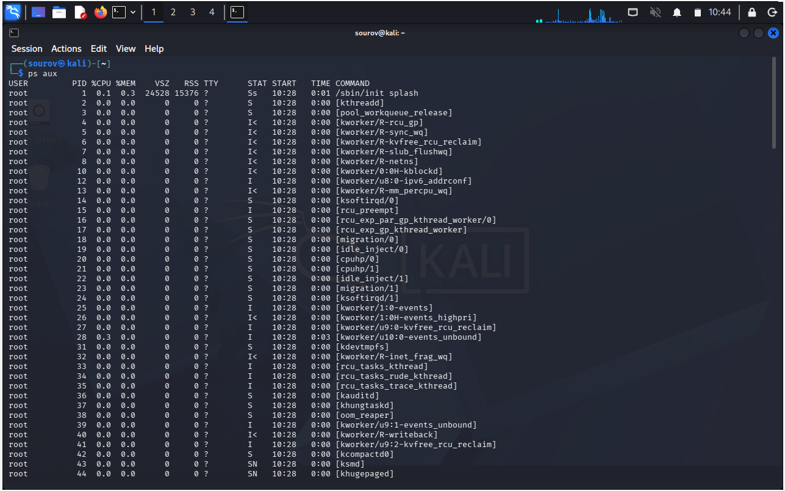
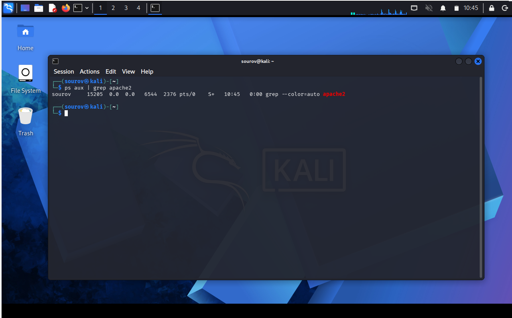

# 🐧 Day 04: Linux File Searching & Filtering Utilities

Welcome to Day 04 of my Linux Security learning journey. This document serves as a professional summary of the core tools and techniques used to efficiently locate files, paths, and active processes within a Linux environment.

---

## 🎯 Key Points & Core Concepts

### 1. 🔍 Searching with 'locate'
* **Description:** Scans the entire filesystem for a keyword. Very fast but uses a database updated once a day (new files won't show up).
* **Mechanism:** It does not scan live; instead, it looks inside a pre-built system database.
* **Limitations:** The database usually updates only once a day. If you create a file a few minutes ago, `locate` will not find it until the next day's update. It can also produce overwhelming results.
* **Example:**
  ```bash
  kali > locate aircrack-ng

#### 🖼️ Terminal Output



---

### 2. 📁 Finding Binaries with 'whereis'

* **Description:** Finds binary, source, and manual (`man`) page locations.
* **Hacker's Perspective:** This is much more efficient than `locate` when trying to find out where a target tool or exploit binary is hidden.
* **Example:**
```bash
kali > whereis aircrack-ng

```

#### 🖼️ Terminal Output



---

### 3. 🌐 Finding Binaries in PATH with 'which'

* **Description:** Only searches and returns binaries located in directories listed in the `$PATH` variable.
* **What is PATH?** A built-in Linux variable holding a list of directories (like `/usr/bin`, `/usr/sbin`) where the Operating System automatically looks whenever you type a command.
* **Example:**
```bash
kali > which aircrack-ng

```

#### 🖼️ Terminal Output



---

### 4. 💪 Powerful Searches with 'find'

* **Description:** Most powerful and flexible search tool. Can look by name, date, size, permissions, etc. Only shows exact matches.
* **Syntax:** ```bash
find [directory] [options] [expression]


### ⚙️ Understanding Syntax:

1. **[directory]:** Where to start searching (e.g., `/` for root, `/etc` for config folder, `.` for current folder).
2. **[options]:** Search criteria (e.g., `-type f` for files, `-type d` for folders).
3. **[expression]:** What name or pattern to match (e.g., `-name apache2`).

### 🚀 Practical Examples

* **Example 1 (Search from Root - Slow):**
```bash
kali > find / -type f -name apache2

```
#### 🖼️ Terminal Output





* **Example 2 (Search in /etc - Faster):**
```bash
kali > find /etc -type f -name apache2

```
#### 🖼️ Terminal Output





---

### 5. 🃏 A Quick Look at Wildcards

Wildcards help match multiple characters when you don't know the exact name:

* **`?`** $\rightarrow$ Matches exactly **1** character (e.g., `?at` finds *cat*, *hat*).
* **`[]`** $\rightarrow$ Matches characters inside brackets (e.g., `[c,b]at` finds *cat*, *bat*).
* **`*`** $\rightarrow$ Matches any characters of **any length**.
* **Example using Wildcard with Find:**
```bash
kali > find /etc -type f -name apache2.\*

```
#### 🖼️ Terminal Output





---

### 6. 🪠 Filtering with 'grep' and Piping (`|`)

* **Piping (`|`):** Sends the output of one command as direct input to another command.
* **Grep:** Filters text or command outputs for specific keywords.
* **Process Tracking:** Combining `ps aux` (displays all active system processes) with `| grep <keyword>` allows a hacker to immediately verify if a background service is running.
* **Example (List all processes and filter for apache2):**
```bash
kali > ps aux

```

#### 🖼️ Process Output





#### 🖼️ Process & Filter Output





---


## 🛠️ Utilities & Tool Reference

| Category | Component/Tool | Syntax / Structure | Description |
| :--- | :--- | :--- | :--- |
| **Quick Search** | `locate` | `locate [keyword]` | Fast, database-driven file scanning across the system. |
| **Binary Search** | `whereis` | `whereis [binary_name]` | Returns binary, source code, and man page paths. |
| **PATH Search** | `which` | `which [binary_name]` | Only finds executables inside the system `$PATH`. |
| **Live Search** | `find` | `find [directory] [options] [expression]` | Real-time, multi-parameter, heavy-duty file locator. |
| **Data Filter** | `grep` | `[command] \| grep [keyword]` | Filters command outputs or file content for keywords. |

---
```

```
