# 🐧 Day 05: Linux File & Directory Modification Utilities

Welcome to Day 05 of my Linux Security learning journey. This document serves as a professional summary of the core tools and techniques used to efficiently create, copy, rename, and delete files and directories within a Linux environment.

---

## 🎯 Key Points & Core Concepts

### 1. 🔍 Creating Files with 'cat'
* **Description:** 'cat' is short for concatenate (meaning to combine pieces together). While generally used to display file contents, it can also be used to create small files.
* **Note on Large Files:** For bigger files, it's better to use text editors like `vim`, `emacs`, `leafpad`, `gedit`, or `kate`.
* **Mechanism:** When using a single redirect (`>`), Linux goes into interactive mode. Type your text and press `Ctrl-D` to save, exit, and return to the prompt. Running `cat` without a redirect simply prints the file's contents back.
* **Limitations:** If the file already exists, a single redirect (`>`) will completely overwrite it. To add or append content to the end without deleting old text, use the double redirect (`>>`).
* **Example 1 (Create/Overwrite):**
  ```bash
  kali > cat > LinuxSkills
  My goal is to become a cybersecurity engineer.


#### 🖼️ Terminal Output

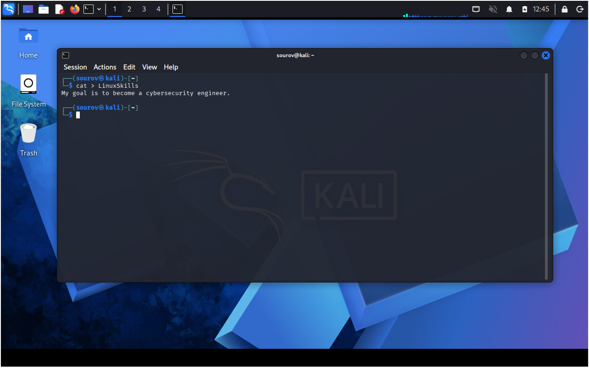

---

* **Example 2 (Display Content):**
```bash
kali > cat LinuxSkills

```


#### 🖼️ Terminal Output

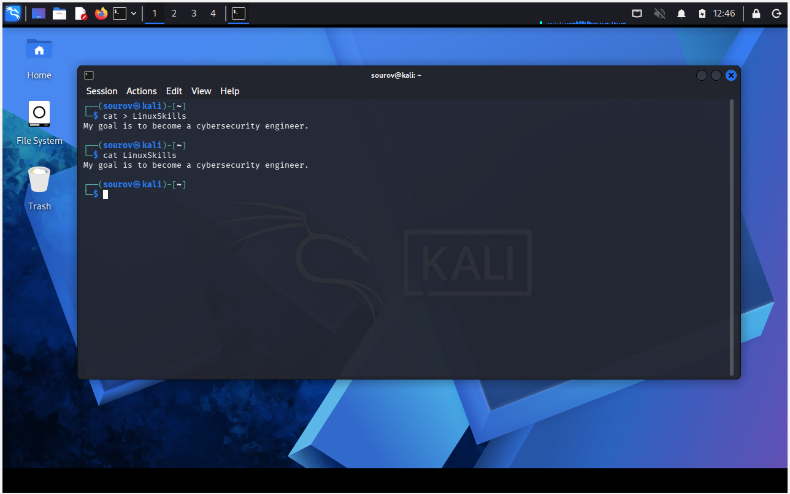

---

* **Example 3 (Append Content):**
```bash
kali > cat >> LinuxSkills
So,Linux is very important for my learning journey.

```


#### 🖼️ Terminal Output

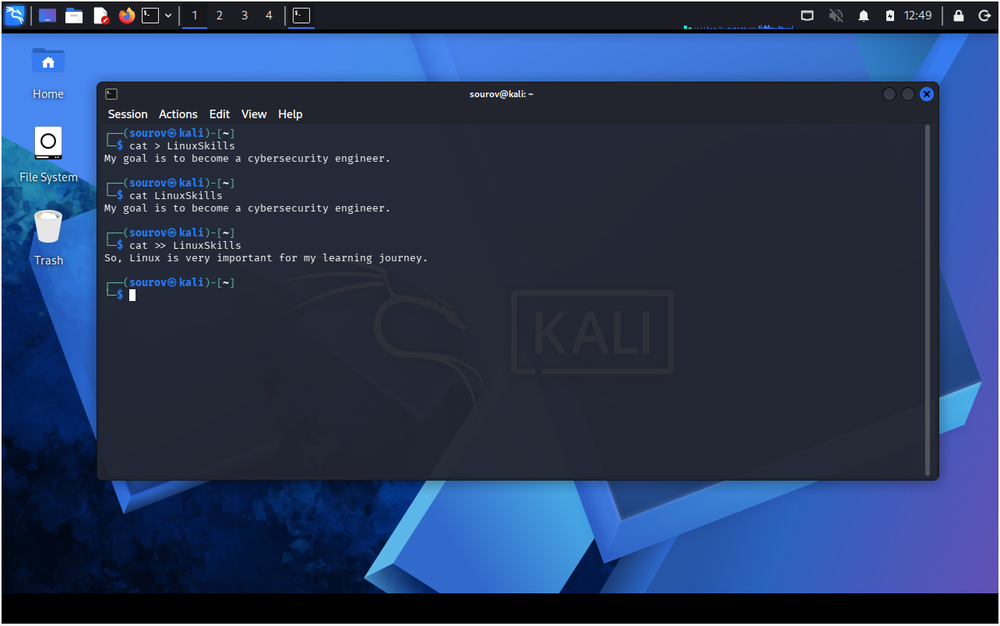

---

* **Example 4 (Display Appended Content):**
```bash
kali > cat LinuxSkills

```


#### 🖼️ Terminal Output

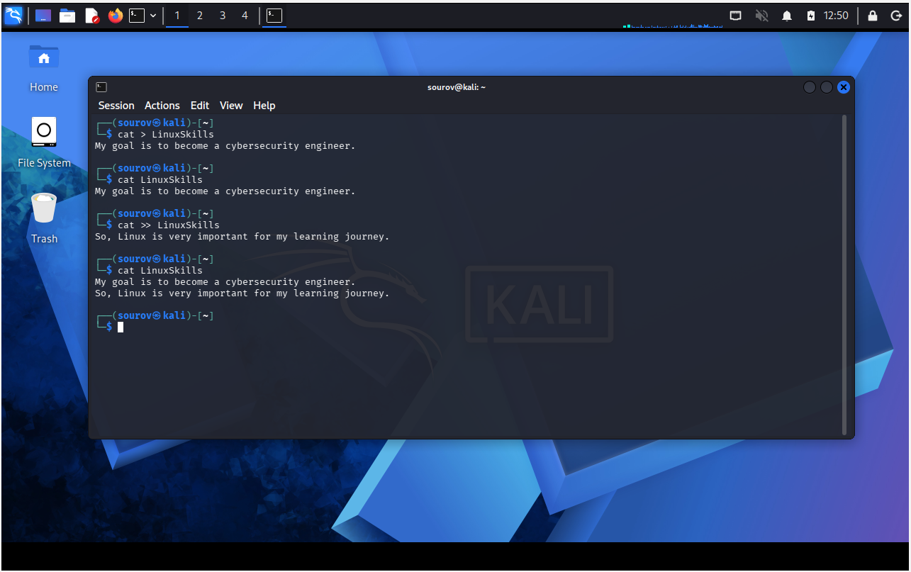

---

* **Example 5 (Overwriting Existing File):**
```bash
kali > cat > LinuxSkills
Everyone in IT security without hacking skills is in the dark

```


#### 🖼️ Terminal Output

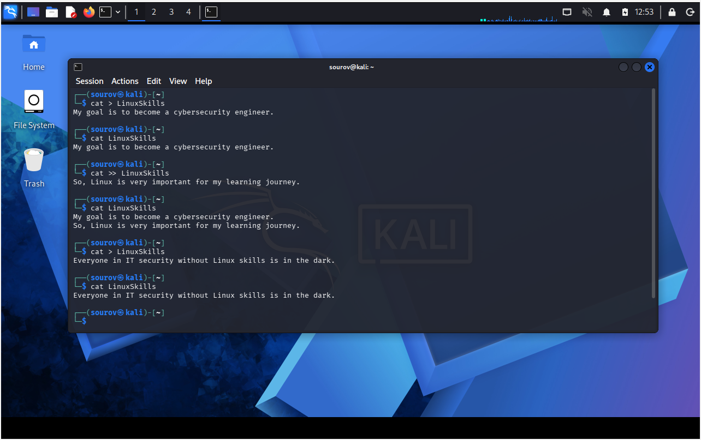

---

* **Example 6 (Display Overwritten Content):**
```bash
kali > cat LinuxSkills

```


#### 🖼️ Terminal Output


---

### 2. 📁 File Creation with 'touch'

* **Description:** Originally developed so a user could change file details, such as the date it was created or modified. However, if the file doesn't already exist, this command creates that file by default.
* **Note:** Its size is 0 bytes because there is no content inside the file initially.
* **Example:**

```bash
kali > touch newfile

```

#### 🖼️ Terminal Output

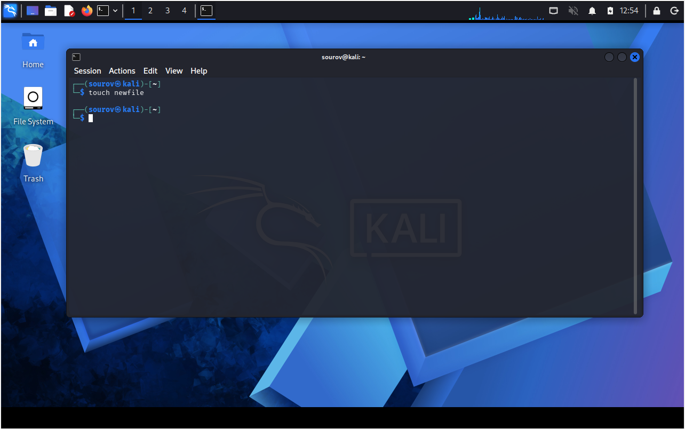

---

### 3. 🌐 Creating a Directory with 'mkdir'

* **Description:** 'mkdir' is a contraction of "make directory". It is used to create new folders in Linux.
* **Navigation:** To navigate straight into the newly created directory, use the `cd` (change directory) command.
* **Example:**

```bash
kali > mkdir newdirectory
kali > cd newdirectory

```

#### 🖼️ Terminal Output

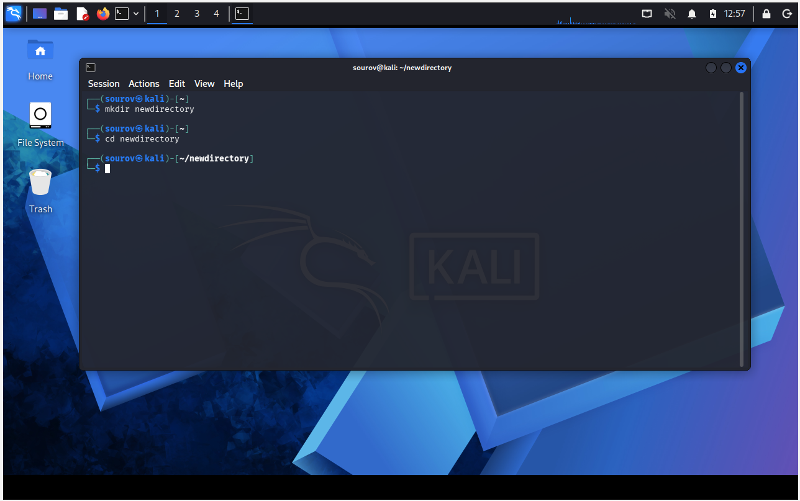


---

### 4. 💪 Copying a File with 'cp'

* **Description:** Creates a duplicate of the file in the new location and leaves the old one in place.
* **Syntax:** ```bash
cp [source_file] [destination_path]

### ⚙️ Understanding Syntax:

1. **[source_file]:** The original file you want to duplicate (e.g., `oldfile`).
2. **[destination_path]:** The target folder path where the copy will be placed (e.g., `/root/newdirectory/newfile`).
3. **Renaming:** Renaming the file is optional and is done simply by adding the name you want to give it to the end of the directory path. If you don't rename it, the file retains the original name by default.

### 🚀 Practical Examples

* **Example (Copy and Rename):**
```bash
kali > touch oldfile
kali > cp oldfile  /root/newdirectory/newfile
kali > cd newdirectory
kali > ls

```

#### 🖼️ Terminal Output


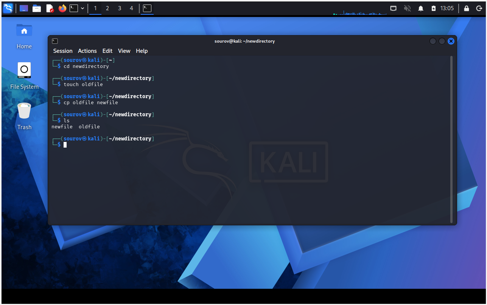


---

### 5. 🃏 Renaming a File with 'mv'

Linux doesn't have a command intended solely for renaming a file like some other operating systems do:

* **`mv`** $\rightarrow$ Stands for **move**.
* **Function 1** $\rightarrow$ Moves a file or directory to a completely new location.
* **Function 2** $\rightarrow$ Gives an existing file or directory a new name within the same folder path.
* **Example using Move to Rename:**

```bash
kali > mv newfile newfile2
kali > ls

```

#### 🖼️ Terminal Output

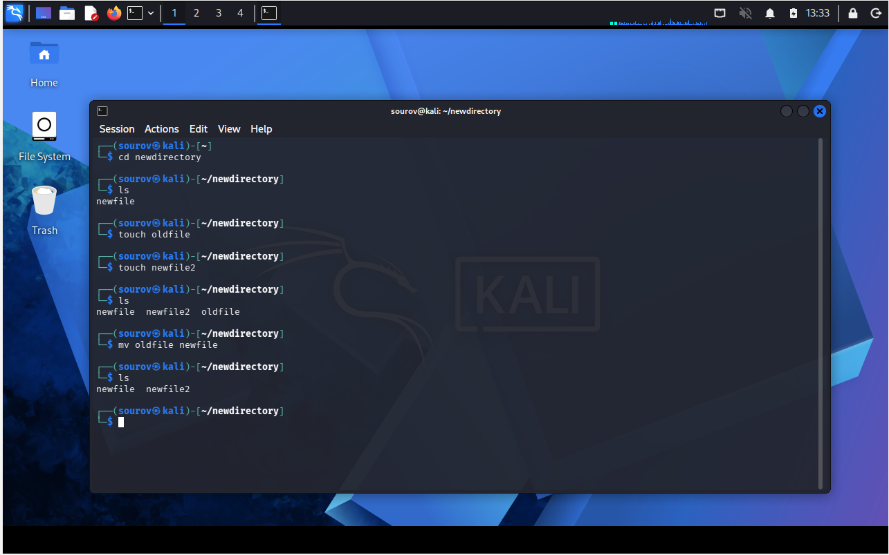

---

### 6. 🪠 Removing Files and Directories ('rm', 'rmdir', 'rm -r')

* **rm filename:** Removes a specific file permanently from the directory path.
* **rmdir dirname:** Safe command that removes empty folders only.
* **Critical Rule:** `rmdir` will NOT remove a directory if it is not empty, giving a warning message instead. This stops you from accidentally deleting objects inside.
* **Recursive Deletion (`rm -r`):** If you want to remove a directory and all of its content all in one go, use the `-r` switch after rm.
* **⚠️ Caution:** Be very wary of using the `-r` option with rm. Using `rm -r` in your home directory would delete every file and directory there.
* **Example 1 (Remove File):**

```bash
kali > rm newfile2

```

#### 🖼️ Process Output


* **Example 2 (Failed Directory Removal - Non-Empty):**

```bash
kali > rmdir newdirectory

```

#### 🖼️ Process & Filter Output

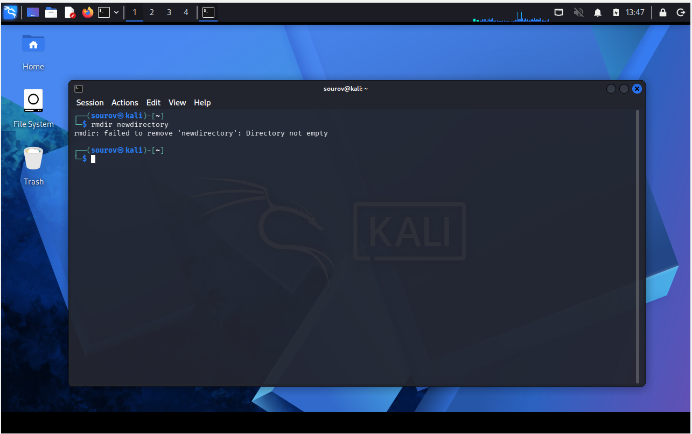

* **Example 3 (Recursive Force Delete Directory):**

```bash
kali > rm -r newdirectory

```

#### 🖼️ Process & Filter Output


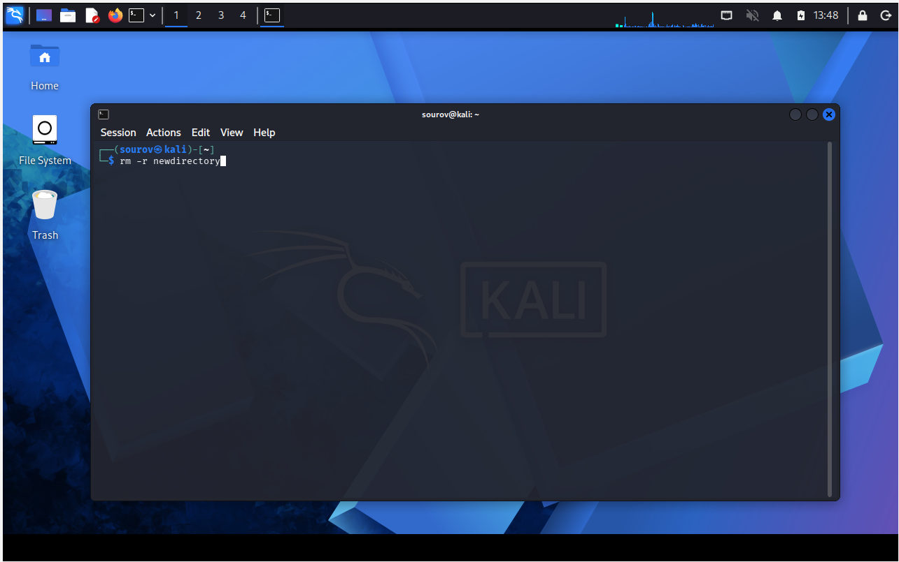


---

## 🛠️ Utilities & Tool Reference

| Category | Component/Tool | Syntax / Structure | Description |
| --- | --- | --- | --- |
| **File Creation** | `cat >` | `cat > [filename]` | Enters interactive mode to create or overwrite a small file. |
| **Data Appending** | `cat >>` | `cat >> [filename]` | Enters interactive mode to append text to the end of a file. |
| **File Creation** | `touch` | `touch [filename]` | Creates a completely blank file with a size of 0 bytes. |
| **Folder Creation** | `mkdir` | `mkdir [directory_name]` | Generates a brand new directory folder. |
| **Copy File** | `cp` | `cp [source] [destination]` | Duplicates a file to a new path; leaves the original intact. |
| **Move / Rename** | `mv` | `mv [old_name] [new_name]` | Changes file/folder name or transfers it to another path. |
| **Safe Deletion** | `rmdir` | `rmdir [directory_name]` | Removes directories *only* if they are completely empty. |
| **Force Deletion** | `rm -r` | `rm -r [directory_name]` | Deletes a directory and all its contents recursively. |

---
