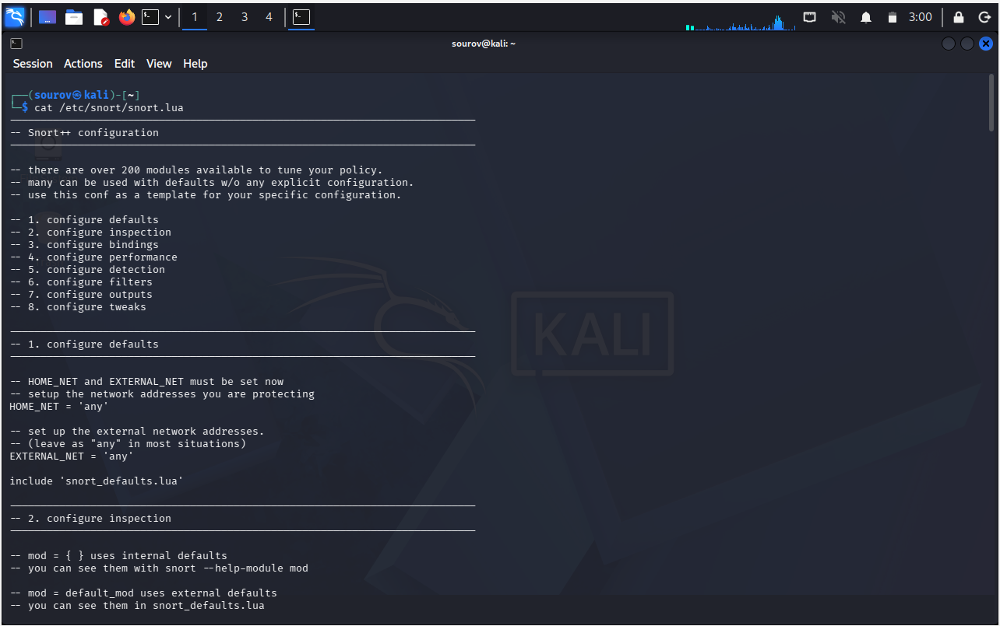
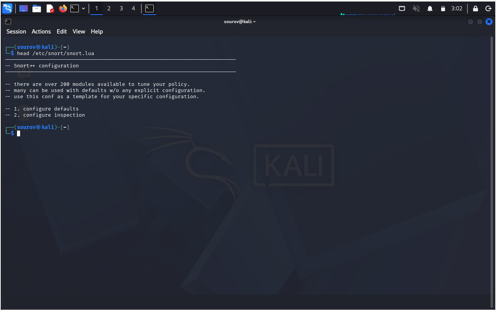
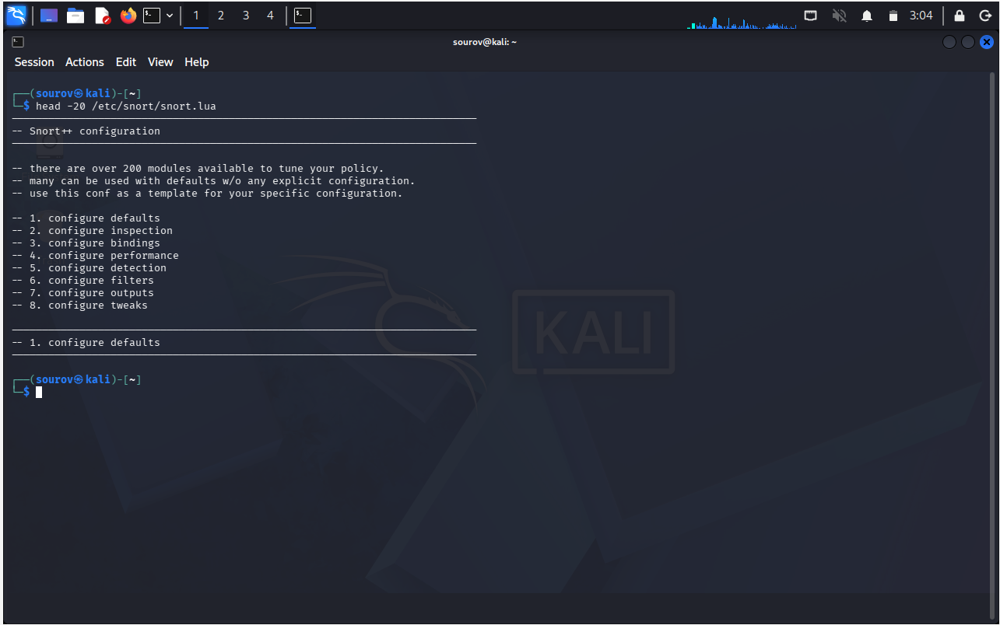
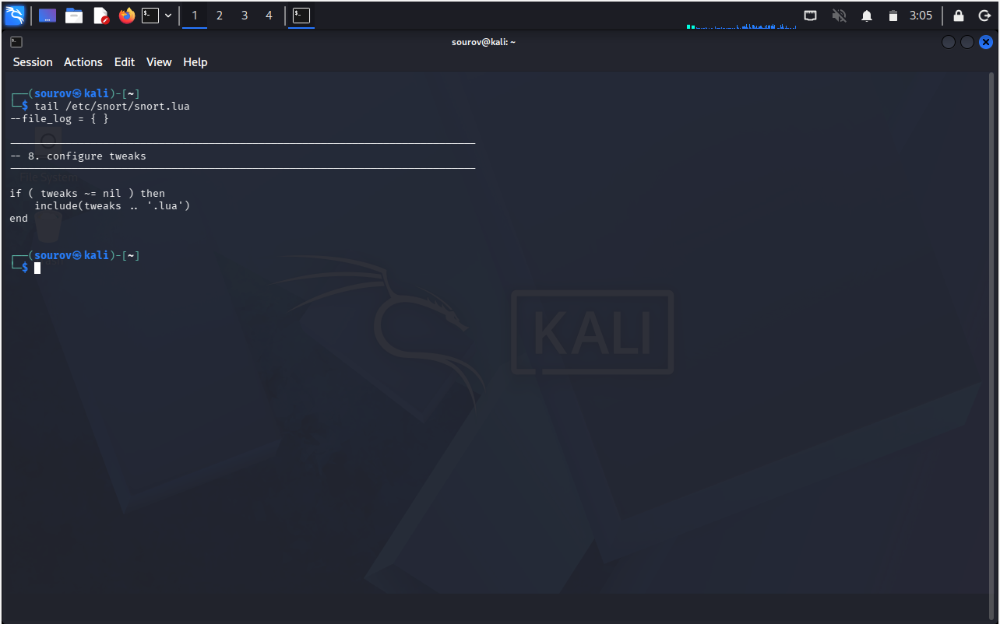
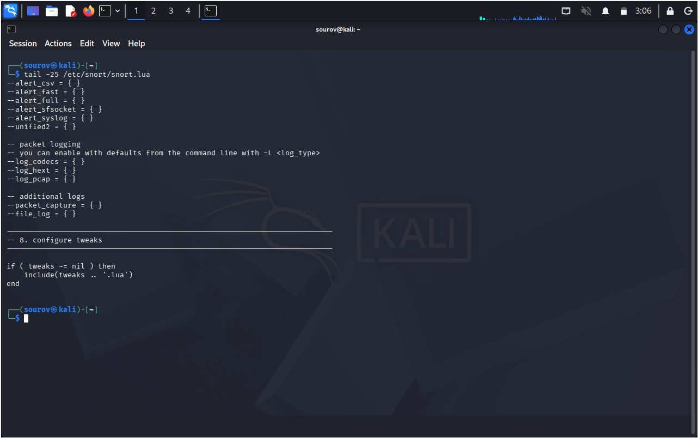
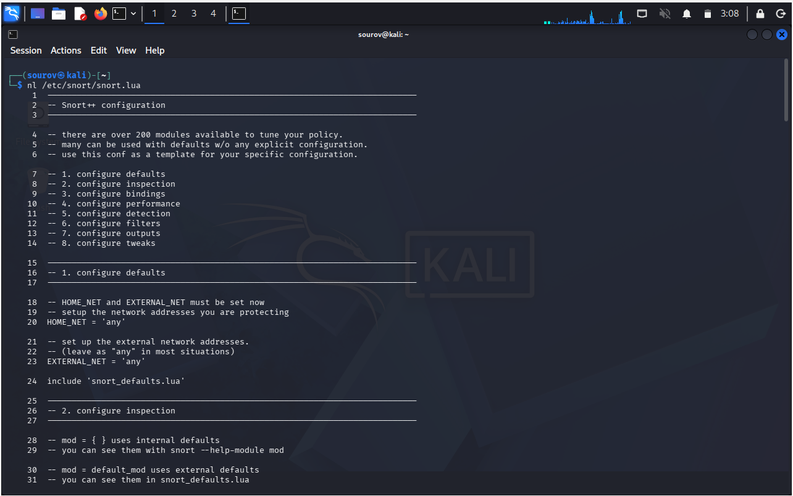
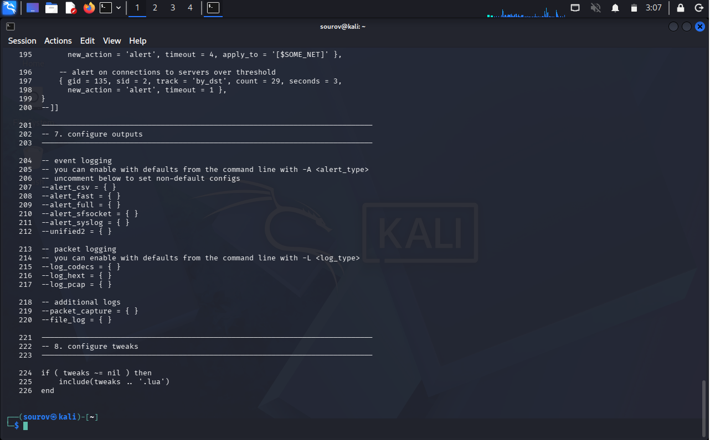

# 🐧 Day 06: Linux Text Manipulation Utilities

Welcome to Day 06 of my Linux Security learning journey. This comprehensive document details the core text manipulation utilities in Linux, focusing on the underlying mechanics of text management, file streaming limitations, and targeted portioning methods essential for security administration and tactical log analysis.

---

## 🎯 Key Points & Core Concepts

### 1. 🔍 The Architecture of Text Manipulation in Linux

- **The Philosophy of Linux Storage:** In the Linux operating system, almost every component—from system configurations, process states, to hardware mappings—is represented directly as a file. Most crucially, the vast majority of these are structured as standard text files. 
- **The Application Reconfiguration Lifecycle:** Because configurations are stored in plain text, managing, tuning, or hardening a Linux application does not require complex proprietary binary editors. Instead, the entire reconfiguration process follows a simple, repeatable 4-step lifecycle:
  1. **Open:** Access the configuration text file using a standard viewer or text editor.
  2. **Change:** Modify the specific configuration variables, flags, or parameters within the text.
  3. **Save:** Commit the text changes back to the persistent storage layer.
  4. **Restart:** Restart the application service to force it to parse the newly updated text configuration.
- **The Crucial Need for Manipulation Utilities:** Because administrative tasks are text-heavy, a security engineer or system administrator must master text manipulation. Manually parsing hundreds of lines of raw text without targeted utilities is inefficient and prone to human error.

---

### 🛡️ Cybersecurity Insight: The Snort NIDS Ecosystem

- **What is Snort?** To master text manipulation in a realistic security context, this study utilizes the configuration files of **Snort**—recognized globally as the world’s premier Network Intrusion Detection System (NIDS). 
- **Historical Context:** Snort was originally designed and developed by **Marty Roesch**. Due to its enterprise-grade capabilities in traffic analysis and signature matching, it was later acquired and is currently maintained by **Cisco**.
- **The Hacker's and Defender's Perspective:** A Network Intrusion Detection System is deployed inline or passively to intercept and analyze network packets for malicious signatures, effectively deterring attacks by hackers. 
  - **For the Defender:** You must understand how to read, modify, and manage Snort's rule inclusions via text utilities to maintain defensive visibility.
  - **For the Hacker/Attacker:** To successfully execute an exploit, a penetration tester or attacker must thoroughly understand how NIDS configurations parse rules, what traffic signatures trigger alerts, and how to manipulate payloads to safely bypass or abuse detection thresholds.
- 💡 **Installation Note:** If your specific distribution of Kali Linux does not include the Snort binaries pre-packaged, you can safely pull the files directly from the official Kali upstream repositories by executing:
  ```bash
  kali > sudo apt install snort3 -y
---

### 2. 📄 Complete File Streaming vs. Partial Content Viewing

#### A. The Mechanics and Limitations of `cat`

* **Functional Description:** The `cat` (concatenate) utility is the fundamental command used in Linux to read and display file contents. However, when dealing with large-scale production files, `cat` has a critical design limitation: it forces an immediate, continuous stream of the entire file layout onto the standard output (stdout).
* **The Practical Limitation:** The file `snort.lua` located within `/etc/snort/` is a massive Lua programming language script. Running `cat` on it dumps hundreds of lines rapidly, scrolling past your viewport until it hits the final End-of-File (EOF) marker. This behavior makes active modification or real-time analysis completely impractical.
* **Example — Full File Streaming Event:**

```bash
kali > cat /etc/snort/snort.lua
```

#### 🖼️ Terminal Output



#### B. The Optimization Strategy: Partial Content Filtering

* To solve the streaming limitation of `cat`, Linux provides specialized text processing engines like `head` and `tail`. Instead of processing the entire file, these utilities isolate precise geographic boundaries (the absolute top or the absolute bottom) of a text structure.

---

### 3. 🔝 Isolating the File Header with `head`

* **Functional Description:** The `head` command is engineered to read down from the very beginning (the top) of a target file. This is highly useful for reviewing file headers, version controls, or initial global variables without processing the deeper configuration lines.
* **Default Baseline Behavior:** When invoked without any explicit parameters, the `head` binary automatically parses and prints exactly the first **10 lines** of the specified file.
* **Custom Line Adjustments via Switches:** If your analysis requires viewing a different scope of text, you can override the 10-line baseline. This is achieved by injecting a dash (`-`) switch coupled directly with your desired integer between the command call and the file path.
* **Example 1 — Standard Header Invocation (Default 10 Lines):**

```bash
kali > head /etc/snort/snort.lua

```

#### 🖼️ Terminal Output (Default Head)



* **Example 2 — Expanded Header Invocation (Custom 20 Lines via `-20`):**

```bash
kali > head -20 /etc/snort/snort.lua

```

#### 🖼️ Terminal Output (Custom Head)



---

### 4. 🔚 Analyzing the File Footprint with `tail`

* **Functional Description:** The `tail` utility mirrors the architecture of `head` but operates from the inverse direction, reading upward from the absolute bottom (the end) of a text file. In security engineering, this is critical for reading trailing logs, include statements, or appended parameters.
* **The Context of Snort Rules:** In `snort.lua`, the bottom of the file is historically reserved for defining external rule files via the `#include $SO_RULE_PATH/` directive. Isolating the tail allows engineers to verify which rule packages are actively being loaded into the engine.
* **Default Baseline Behavior:** By default, `tail` displays exactly the last **10 lines** of the target file.
* **Custom Tail Adjustments:** Just like `head`, you can specify a precise line count by injecting a dash (`-`) followed by the exact number of lines desired.
* **Example 1 — Standard Footprint Invocation (Default 10 Lines):**

```bash
kali > tail /etc/snort/snort.lua

```

#### 🖼️ Terminal Output (Default Tail)




* **Example 2 — Expanded Footprint Invocation (Custom 20 Lines to view full rule block):**

```bash
kali > tail -25 /etc/snort/snort.lua

```

#### 🖼️ Terminal Output (Custom Tail)



---

### 5. 🔢 Sequential Indexing with `nl` (Number Lines)

* **Functional Description:** As files scale in size—for example, `snort.lua` which spans well over ** 220+ individual lines** of data—navigating or troubleshooting errors becomes extremely difficult. The `nl` (number lines) utility addresses this by dynamically injecting sequential numbers onto the text layout output.
* **Operational Benefits:**
* Facilitates precision code/configuration auditing.
* Allows multiple engineers to reference exact line positions during an active security incident.
* Makes it trivial to document modifications and return precisely to the same working location later.


* **Critical Structural Behavior (Blank Line Exclusion):** A vital technical detail of the `nl` utility is its default filtering matrix: **it automatically skips the numbering sequence for completely blank or empty lines**. This preserves spacing layouts without incrementing indices unnecessarily on empty carriage returns.
* **Example — Numbered Text Parsing:**

```bash
kali > nl /etc/snort/snort.lua

```

#### 🖼️ Terminal Output







---

## 🛠️ Utilities & Tool Reference

| Category | Component / Tool | Exact Command Syntax | Detailed Behavioral Description |
| --- | --- | --- | --- |
| **Complete Terminal Streaming** | `cat` | `cat [filename]` | Streams the entire file continuously from line 1 to EOF. Highly impractical for larger configuration sets. |
| **Upper Limit Portioning** | `head` | `head -[number] [filename]` | Pulls data from the top downward. Default value is 10 lines. Custom quantities require the dash (`-`) parameter. |
| **Lower Limit Portioning** | `tail` | `tail -[number] [filename]` | Pulls data from the bottom upward. Default value is 10 lines. Essential for parsing trailing rule sets or real-time log additions. |
| **Dynamic Text Indexing** | `nl` | `nl [filename]` | Attaches sequential line numbers to the standard output. Automatically drops indexing numbers on blank rows. |

---
