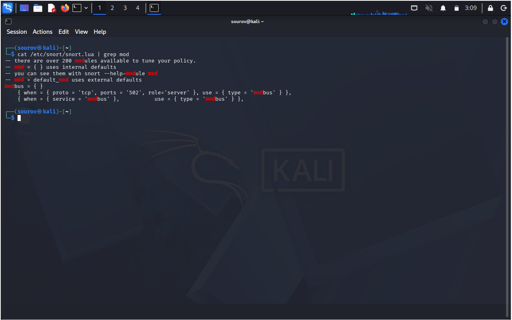
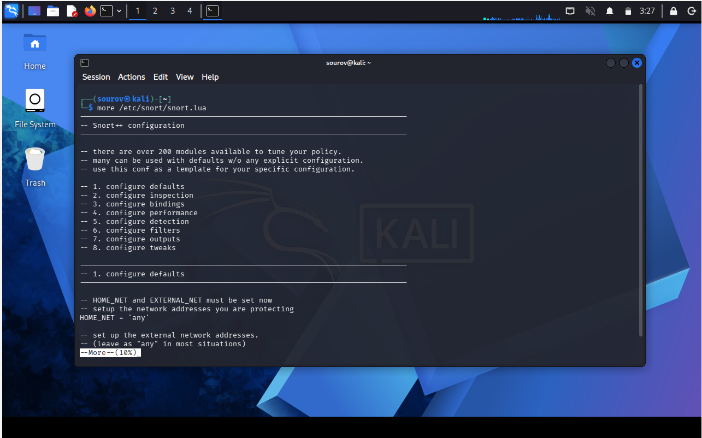
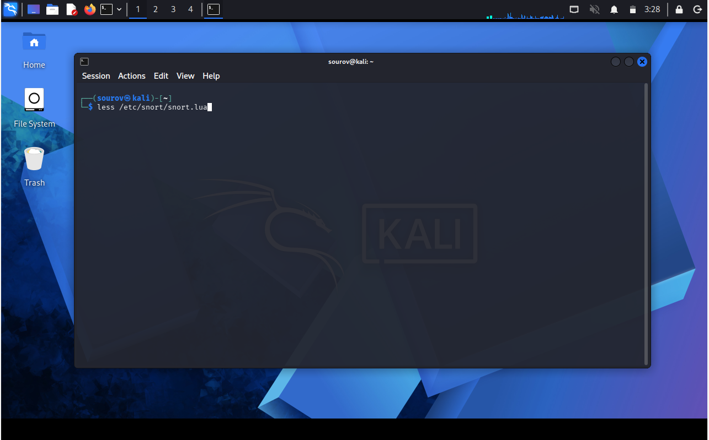

# 🐧 Day 07: Linux Text Manipulation Utilities (Part 2)

Welcome to Day 07 of my Linux Security learning journey. This document summarizes core tools and techniques for filtering text with grep, solving structural text challenges, modifying contents with sed, and handling pagination with more and less. It focuses on practical usage, common options, and safety notes useful for learners.

---

## 🎯 Key Points & Core Concepts

### 1. 🪠 Filtering Text with `grep`

* Description: `grep` is probably the most widely used text manipulation command. It lets you filter the content of a file for display based on specific words or phrases.
* Interaction: It uses the pipe (`|`) operator to send input to `grep`. The command first views the file and then sends it to `grep`, which takes the file as input, searches, and displays matches only.
* Benefit: Extremely powerful for working in Linux because it can save you hours of manual searching for every occurrence of a word or command in a file.

Example — Filter for "mod" keyword:
```bash

kali > cat /etc/snort/snort.lua | grep mod

```

#### 🖼️ Terminal Output



---

### 🏆 Hacker Challenge: Using grep, nl, tail, and head

* Description: Isolating a specific structural block of text by combining multiple commands based on geographical line coordinates within a file.
* Scenario: Displaying the 5 lines immediately preceding line 512 (`# Step #6: Configure output plugins`), plus the anchor line itself (total 6 lines).
* Step 1 — Locate the line number using `nl` and `grep`:

```bash
kali > nl /etc/snort/snort.lua | grep mod
    34    # 6) Configure output plugins
   512    # Step #6: Configure output plugins
   518    # output unified2: filename merged.log, limit 128, nostamp...

```

#### 🖼️ Terminal Output (Challenge Step 1)

* Step 2 — Use `tail` to start at line 507 and pipe into `head` for the top 6 lines:

```bash
kali > tail -n+507 /etc/snort/snort.conf | head -n 6
nested_ip inner, \
whitelist $WHITE_LIST_PATH/white_list.rules, \
blacklist $BLACK_LIST_PATH/black_list.rules
###################################################
# Step #6: Configure output plugins

```

#### 🖼️ Terminal Output (Challenge Step 2)

---

### 2. ⚡ Using `sed` to Find and Replace

* Description: `sed` stands for "Stream Editor". In its most basic form, it operates exactly like the Find and Replace function in Windows.
* Case Sensitivity: Remember that most of Linux syntax is strictly case-sensitive (e.g., `mysql` vs `MySQL`).
* Positional Flags:
* `/g` : global replacement flag (replaces every single occurrence in the file)
* `No flag` : default behavior (replaces only the first occurrence found on a line)
* `[number]` : specific instance replacement (e.g., `2` affects only the second occurrence)


Example 1 — Global replacement (using `/g` flag):

```bash
kali > cat /etc/snort/snort.conf | grep mysql
include $RULE_PATH/mysql.rules
#include $RULE_PATH/server-mysql.rules

kali > sed s/mysql/MySQL/g /etc/snort/snort.conf > snort2.conf
kali > cat snort2.conf | grep MySQL
include $RULE_PATH/MySQL.rules
#include $RULE_PATH/server-MySQL.rules

```

#### 🖼️ Terminal Output (Global Replace)

Example 2 — First occurrence replacement (leaving out `g` option):

```bash
kali > sed s/mysql/MySQL/ snort.conf > snort2.conf

```

#### 🖼️ Terminal Output (First Occurrence)

Example 3 — Specific instance replacement (replacing only the second occurrence):

```bash
kali > sed s/mysql/MySQL/2 snort.conf > snort2.conf

```

#### 🖼️ Terminal Output (Specific Instance)

---

### 3. 📄 Viewing Files with `more` and `less`

* Description: Although `cat` is a good utility, it has severe limitations when displaying large files because it scrolls through every page until it hits the end. `more` and `less` are advanced viewing utilities designed to handle larger files efficiently.

#### A. Controlling the Display with `more`

* Description: `more` displays a text file one complete page at a time and stops, letting you page down through it.
* Navigation notes: Press the `Enter` key or `Spacebar` to see additional lines/pages. Enter `q` to quit the viewer.
* It also shows what percentage of the file's text is displayed on the screen.

Example:

```bash
kali > more /etc/snort/snort.lua

```

#### 🖼️ Terminal Output



#### B. Displaying and Filtering with `less`

* Description: Very similar to `more` but contains significantly expanded functionality. Hence the common Linux quip, *"Less is more."*
* Operational features: It allows you to scroll through a file at your leisure both forward and backward, and it doesn't need to read the entire file before launching.
* In-Viewer Filtering: Pressing the forward slash (`/`) key lets you enter search terms dynamically. Pressing `n` automatically takes you to the next highlighted occurrence.

Example:

```bash
kali > less /etc/snort/snort.lua

```

#### 🖼️ Terminal Command



#### 🖼️ Terminal Output


---

## 🛠️ Utilities & Tool Reference

| Category | Component/Tool | Syntax / Structure | Description |
| --- | --- | --- | --- |
| Text Filtering | `grep` | `grep [pattern] [file]` / `cat [file] | grep [pattern]` | Filter content or stream output for specific keywords or string matching. |
| Stream Modification | `sed` | `sed s/[old]/[new]/[flag] [file] > [newfile]` | Find and substitute specific text strings globally (`g`) or selectively. |
| File Pagination | `more` | `more [filename]` | Displays terminal text output one complete page at a time. |
| Advanced Pagination | `less` | `less [filename]` | Premium pagination tool allowing multidirectional scrolling and interactive searching (`/`). |

---

```

```
