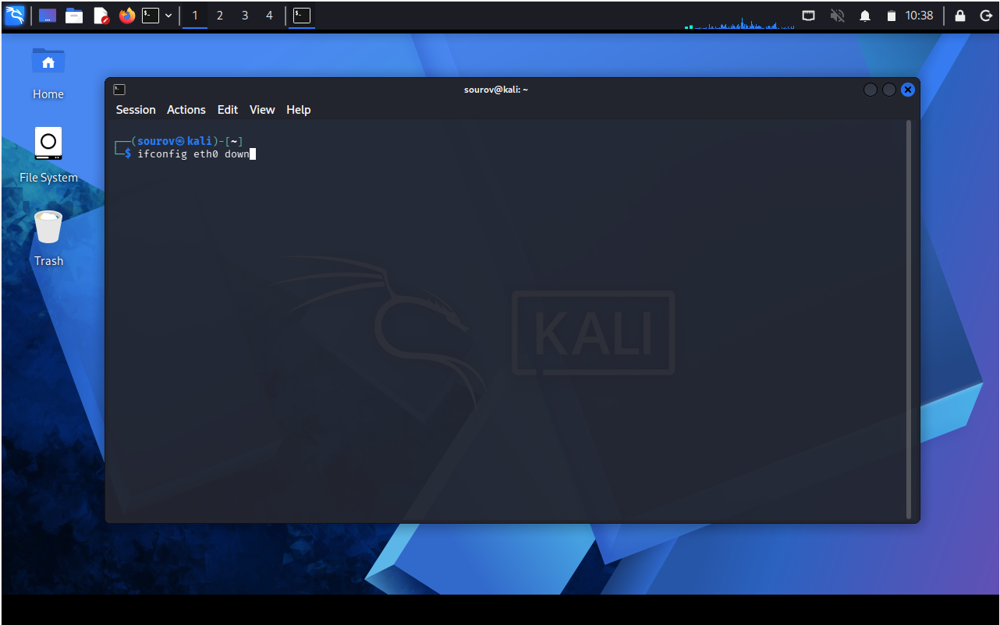

# 🐧 Day 08 : Linux Networking Basics

Welcome to Day 01 of Week 02 of my Linux Security learning journey. This document serves as a clean, structured summary of analyzing network interfaces, verifying wireless configurations, and modifying network parameters for testing and learning in a safe, lab environment.

---

## 🎯 Key Points & Core Concepts

### 1. 🔍 Analyzing Networks with `ifconfig`
* Description: The `ifconfig` command is a traditional tool for examining and interacting with active network interfaces. It can be used to list interfaces, view IPv4 addresses, MAC (hardware) addresses, and basic statistics for each interface.
* Interface Naming: Interface names commonly appear as `eth0`, `wlan0`, `lo`, or on modern systems as `enp0s3`, `wlp2s0`, etc. These names identify wired, wireless, and loopback devices.
* Hardware Address (MAC): The output shows a physical address (MAC) for each interface. This address is globally unique to the network adapter and often labeled as HWaddr or ether depending on the tool/version.
* IP Configuration Layer: The output contains the IPv4 address assigned to that interface, the broadcast (`Bcast`) address, and the netmask. This information indicates how the interface communicates on the network.
* Loopback Interface (`lo`): The loopback interface (`lo`) uses the IP `127.0.0.1` (localhost). It's a software-only interface used for inter-process communication on the same host.
* Wireless Interface (`wlan0`/`wlp*`): A wireless adapter appears only if present and shows its own MAC address and other wireless-specific fields when using wireless tools.

Example — Querying local active network parameters (traditional):
```bash
# Show legacy ifconfig output
kali > ifconfig

```

Note: On many modern distributions `ifconfig` is deprecated in favor of the iproute2 `ip` commands. The examples below show both for compatibility.

#### 🖼️ Terminal Output


### 2. 📡 Checking Wireless Network Devices with `iwconfig`
* Description: `iwconfig` reports wireless-specific information for wireless interfaces (link quality, ESSID, mode, frequency, etc.). On modern systems, `iw` provides more detailed control and information.
* Utility Integration: The details from `iwconfig`/`iw` are useful when using wireless auditing tools (for example aircrack-ng suite) or when verifying adapter capabilities.
* Wireless Standard Extensions: Output can indicate supported 802.11 standards (b/g/n/ac), rates, and supported channels.
* Operation Modes: Displays operating mode (Managed, Monitor, Master, etc.). Monitor mode is required to capture raw 802.11 frames for wireless auditing.
* Signal Strength Parameter: Shows whether the adapter is associated with an AP and reports signal strength (dBm) or link quality.

Example — Querying wireless adapter properties (legacy and modern):
```bash
# Legacy
kali > iwconfig

# Modern (more detailed):
kali > sudo iw dev
```

#### 🖼️ Terminal Output


### 3. ⚡ Changing Your IP Address
* Description: Changing the IP address assigned to an interface is a common network administration and lab task. This is useful for testing, isolation, and learning. Always perform such actions only on networks you control or are authorized to test.
* Warning: Changing IP addresses on production networks can disrupt services. IP/MAC spoofing to evade detection or to attack networks is illegal without explicit authorization.
* How-to (legacy and modern):

Legacy (ifconfig):
```bash
# Assign a specific IPv4 address
kali > ifconfig eth0 192.168.181.115

```

Modern (iproute2):
```bash
# Add IPv4 address with prefix length; /24 equals netmask 255.255.255.0
kali > sudo ip addr add 192.168.181.115/24 dev eth0
# To remove an address
kali > sudo ip addr del 192.168.181.115/24 dev eth0
```

#### 🖼️ Terminal Command


### 4. 🌐 Changing Network Mask and Broadcast Address
* Description: You can change the netmask and broadcast address to place an interface into a custom subnet. Use caution — incorrect settings can disconnect your host.
* Syntax Rule: Provide the interface first, target IP, `netmask` and `broadcast` keywords for `ifconfig`, or use prefix notation with `ip`.

Example — Overriding Netmask and Broadcast (fixed):
```bash
# Legacy (ifconfig) — note the correct keywords and values
sudo ifconfig eth0 192.168.181.115 netmask 255.255.0.0 broadcast 192.168.1.255

# Modern (ip) — set address with prefix (e.g. /16 for 255.255.0.0)
sudo ip addr add 192.168.181.115/16 dev eth0
```

#### 🖼️ Terminal Command


### 5. 🎭 Spoofing Your MAC Address
* Description: The MAC (hardware) address identifies a network adapter at layer 2. Changing (spoofing) your MAC can be useful for privacy testing and lab exercises, but may violate network policies or laws if used maliciously.
* Interface State Sequence: To change the MAC address, bring the interface down, set the new address, then bring it back up.

Warning: Only perform MAC spoofing in lab environments or on networks where you have explicit permission.

Example — MAC spoofing (recommended modern method using `ip`):
```bash
# 1. Take interface down
sudo ip link set dev eth0 down

# 2. Change MAC address
sudo ip link set dev eth0 address 00:11:22:33:44:55

# 3. Bring interface up
sudo ip link set dev eth0 up

# 4. Verify
ip link show eth0
```

Legacy method (ifconfig):
```bash
sudo ifconfig eth0 down
sudo ifconfig eth0 hw ether 00:11:22:33:44:55
sudo ifconfig eth0 up
```

#### 🖼️ Terminal Command Steps




## 🛠️ Utilities & Tool Reference

| Category | Component / Tool | Syntax / Structure | Description |
|---|---:|---|---|
| Network Auditing | ifconfig | `sudo ifconfig` | Legacy tool to query and configure IPv4/IPv6 and link-layer settings. Deprecated on some distros in favor of `ip`.
| Network Management | ip (iproute2) | `sudo ip addr`, `sudo ip link` | Modern replacement for ifconfig/route; supports advanced routing, namespaces, and modern network features.
| Wireless Auditing | iwconfig / iw | `sudo iwconfig` / `sudo iw dev` | Wireless-specific information; `iw` is newer and more capable.
| Device Control | down / up | `sudo ip link set dev <iface> down` / `up` | Disable or enable a network interface to apply changes safely.
| Hardware Spoofing | hw ether / ip link set address | `sudo ifconfig <iface> hw ether <mac>` or `sudo ip link set dev <iface> address <mac>` | Change the MAC address of a network adapter.


## Quick commands (one-liners)

- Show all addresses: `ip addr show`
- Show link-layer info: `ip link show`
- Bring interface down: `sudo ip link set dev eth0 down`
- Bring interface up: `sudo ip link set dev eth0 up`
- Change MAC (temporary): `sudo ip link set dev eth0 address 00:11:22:33:44:55`


## Lab setup & Safety

Set up an isolated VM, container, or a dedicated test network when practicing these techniques. Never run offensive or evasive actions (MAC/IP spoofing, packet injection, DoS) on networks you do not own or have permission to test.

## Further reading

- man pages: `man ip`, `man ifconfig`, `man iw`, `man iwconfig`
- iproute2 documentation: https://wiki.linuxfoundation.org/networking/iproute2
- aircrack-ng project: https://www.aircrack-ng.org/


---

*Notes: I fixed typos, completed truncated sentences, corrected command examples (including the netmask/broadcast example), added modern `ip`/`iw` equivalents, and included explicit sudo and warning notes for operations that require root or may be illegal if misused.*
