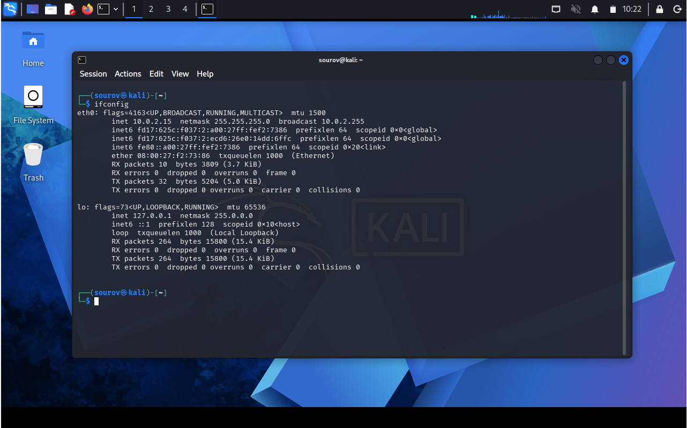

# 🐧 Day 08 : Linux Networking Basics

Welcome to Day 01 of Week 02 of my Linux Security learning journey. This document serves as a clean, structured summary of analyzing network interfaces with ifconfig, verifying wireless configurations with iwconfig, and modifying essential network variables like IP addresses, netmasks, and MAC addresses.

---

## 🎯 Key Points & Core Concepts

### 1. 🔍 Analyzing Networks with `ifconfig`
* **Description:** The `ifconfig` command is one of the most basic tools for examining and interacting with active network interfaces. You can use it to query your active network connections by simply entering it in the terminal.
* **Interface Naming:** At the top of the output is the name of the first detected interface, `eth0`, which is short for Ethernet0 (Linux starts counting at 0 rather than 1). This is the first wired network connection.
* **Hardware Address (MAC):** The type of network being used (Ethernet) is listed next, followed by `HWaddr`. This is the globally unique address stamped on every piece of network hardware—the Network Interface Card (NIC), usually referred to as the Media Access Control (MAC) address.
* **IP Configuration Layer:** The second line contains information on the IP address currently assigned to that interface, the `Bcast` (broadcast address) used to send out information to all IPs on the subnet, and finally the `netmask`, used to determine what part of the IP address is connected to the local network.
* **Loopback Interface (`lo`):** Short for loopback address and sometimes called `localhost` (represented with the IP address `127.0.0.1`). This is a special software address that connects you to your own system to test local services like web servers.
* **Wireless Interface (`wlan0`):** This connection appears only if you have a wireless interface or adapter attached, displaying its own unique physical MAC address.

Example — Querying Local Active Network Parameters:
```bash
kali > ifconfig

```

#### 🖼️ Terminal Output



---

### 2. 📡 Checking Wireless Network Devices with `iwconfig`

* **Description:** If you have an external USB wireless card, you can use the `iwconfig` command to gather crucial information for wireless hacking such as the adapter’s IP address, MAC address, its current running mode, and signal strength.
* **Utility Integration:** The information you can glean from this command is particularly important when you’re using wireless hacking tools like `aircrack-ng`.
* **Wireless Standard Extensions:** The output explicitly details what 802.11 IEEE wireless standards your device is capable of (e.g., `b` and `g`, or the newer `n` standard).
* **Operation Modes:** It displays the mode of the wireless extension (e.g., `Mode:Managed`, in contrast to `monitor` or `promiscuous` mode). Security professionals require monitor/promiscuous mode for cracking wireless passwords.
* **Signal Strength Parameter:** The output displays if the adapter is connected (`Not Associated`) to an Access Point (AP) and shows its current operational power in `dBm`, representing signal strength.

Example — Querying Wireless Adapter Properties:

```bash
kali > iwconfig

```

#### 🖼️ Terminal Output


---

### 3. ⚡ Changing Your Network Information

* **Description:** Being able to change your IP address and other network information is a useful skill because it helps you access other networks while appearing as a trusted device on those environments.
* **Evasion & Spoofing:** In a Denial-of-Service (DoS) attack, you can spoof your IP so that the attack appears to come from another source, helping you evade IP capture during forensic analysis.
* **Silent Success:** When you change settings correctly in Linux, the system will simply return the command prompt silently without saying anything. This indicates a successful execution.
* **Bypassing Access Controls:** The MAC address is globally unique and often used to trace or block hackers. Changing your MAC address to spoof a different machine is trivial and neutralizes those network access security controls.
* **Interface State Sequence:** To spoof a hardware address, you must first use the `down` option to disable the interface, inject the hardware modification command (`hw ether`), and finally bring it back up with the `up` option.

Example 1 — Changing the IP Address Allocation on eth0:

```bash
kali > ifconfig eth0 192.168.181.115

```

#### 🖼️ Terminal Output


Example 2 — Overriding Netmask and Broadcast Simultaneously:

```bash
kali > ifconfig eth0 192.168.181.115 netmask 255.255.0.0 broadcast 192.168.1.255

```

#### 🖼️ Terminal Output


Example 3 — Executing a Hardware MAC Address Spoofing Attack Pattern:

```bash
kali > ifconfig eth0 down

```

#### 🖼️ Terminal Output


---

## 🛠️ Utilities & Tool Reference

| Category | Component/Tool | Syntax / Structure | Description |
| --- | --- | --- | --- |
| Network Auditing | `ifconfig` | `ifconfig` | Queries, displays, and configures active standard network configuration states. |
| Wireless Auditing | `iwconfig` | `iwconfig` | Targets and displays parameters specific to wireless media extensions and standards. |
| Device Control | `down / up` | `ifconfig [interface] down` / `up` | Disables or enables a target interface to safely apply configuration changes. |
| Hardware Spoofing | `hw ether` | `ifconfig [interface] hw ether [mac]` | Programmatically re-writes the active physical address of a target network adapter. |

---

```

```
