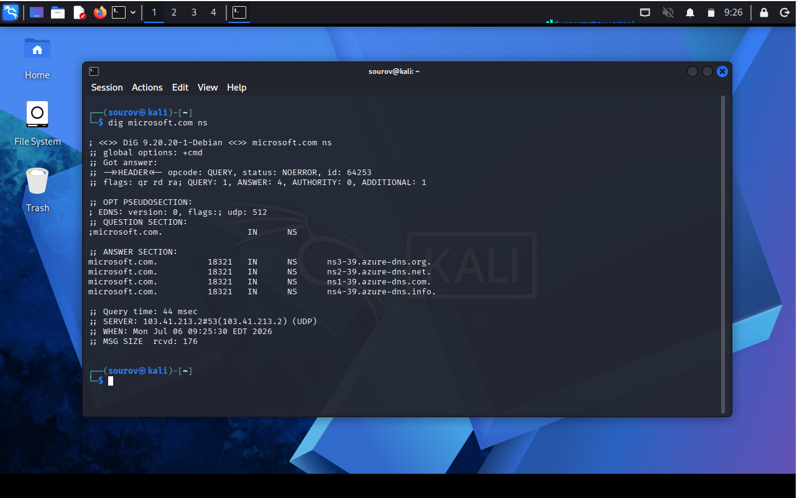
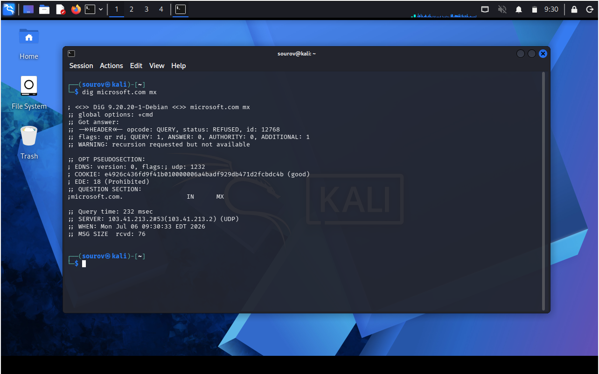
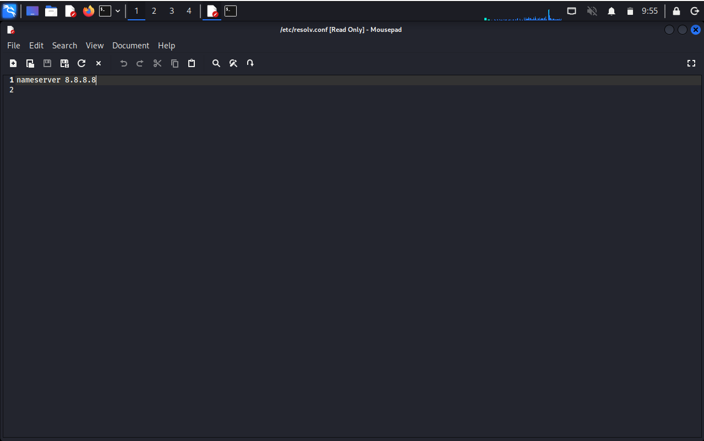
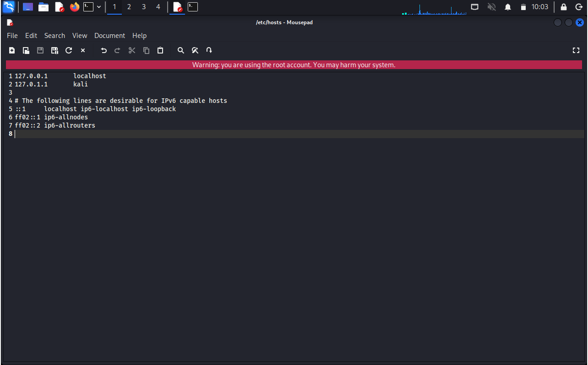
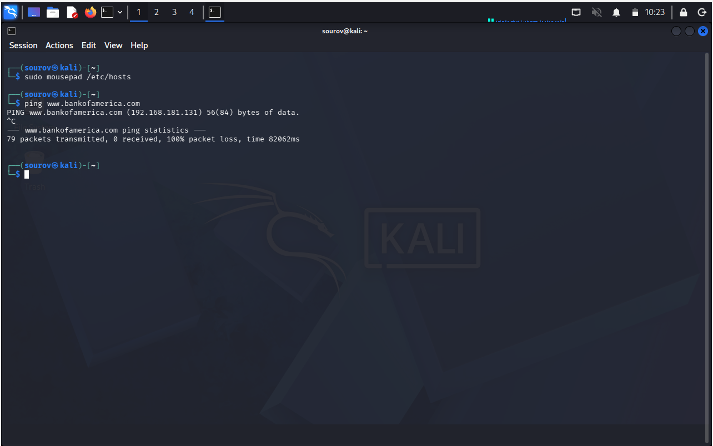

# 🐧 Day 09 : DHCP, DNS Manipulation, and Hosts Mapping

Welcome to Day 02 of Week 02 of my Linux Security learning journey. This document details the underlying mechanics of dynamic host configurations, tactical DNS reconnaissance with dig, routing manipulation via name resolution files, and local domain redirection attacks using the hosts architecture.

---

## 🎯 Key Points & Core Concepts

### 1. 🌐 Assigning New IP Addresses from the DHCP Server
* Description: DHCP (Dynamic Host Configuration Protocol) runs a background process or daemon called `dhcpd`. It automatically manages and assigns dynamic IP configurations to host interfaces on a local subnet while maintaining logs, which forensic analysts often use to trace hackers.
* Lease Request Necessity: After releasing or modifying a static IP layout, you must explicitly request a new lease from the active DHCP pool to safely restore automated internet routing without requiring a system reboot.
* The 4-Step Handshake Behind the Scenes:
  1. `DHCPDISCOVER` : Sent from your interface (e.g., `eth0`) as a broadcast to find an available DHCP server.
  2. `DHCPOFFER` : Received back from the server containing an available IP address package.
  3. `DHCPREQUEST` : Your client system replies, requesting the specific offered IP allocation.
  4. `DHCPACK` : The server confirms the transaction and formally commits the IP, netmask, and broadcast parameters to your interface.

Example — Requesting a fresh DHCP lease configuration for eth0:
```bash
kali > sudo dhclient eth0

```

#### 🖼️ Terminal Output


---

Example — Verifying the newly assigned dynamic network details:

```bash
kali > ifconfig

```

#### 🖼️ Terminal Output


---

### 2. 🔍 Examining Nameservers (NS) with `dig`(Domain Informaion Groper)

* Description: The Domain Name System (DNS) translates human-readable domains (e.g., `microsoft.com`) into machine-routable IP addresses. It serves as an absolute treasure trove for active reconnaissance during early information-gathering phases before an attack.
* The `dig` Engine: A dedicated terminal utility used to gather critical infrastructure domain information, such as target name servers, mail servers, subdomains, and associated IP addresses.
* Layout Breakdown: The `ANSWER SECTION` identifies the designated target name servers (e.g., `ns6.wixdns.net`), while the `ADDITIONAL SECTION` exposes the absolute IP addresses of those infrastructure servers.

Example — Querying infrastructure Nameservers:

```bash
kali > dig microsoft.com ns

```

#### 🖼️ Terminal Output





---

### 3. ✉️ Querying Mail Exchange (MX) Records

* Description: Mail Exchange records are critical indicators when planning attacks on email infrastructure. They explicitly map the mail servers tasked with handling domain communications.
* BIND Integration Note: In Linux engineering, the terms DNS and BIND (*Berkeley Internet Name Domain*) are frequently used interchangeably, as BIND represents the most prominent open-source DNS server system in Linux environments.

Example — Querying domain Mail Exchange infrastructure:

```bash
kali > dig microsoft.com mx

```

#### 🖼️ Terminal Output





---

### 4. 🛠️ Changing Your DNS Server via Graphical / Text Editor

* Description: To route your DNS requests through a specific server (like Google’s public DNS at `8.8.8.8`), you need to modify the persistent system file `/etc/resolv.conf`.
* Interactive Editing: You can use a lightweight graphical text editor like `mousepad` to open and manually append or edit your resolver configurations.

Example — Manually editing the operational resolution architecture:

```bash
kali > mousepad /etc/resolv.conf
# Manually add the line: nameserver 8.8.8.8

```

#### 🖼️ Terminal Output




---

### 5. 🪚 Changing Your DNS Server Directly via Command Line

* Description: For precision speed or terminal scripting, you can use output redirection to instantly overwrite system name resolution behaviors.
* Multi-DNS Setup Nuance: You can list multiple nameservers inside the file. The OS queries them in the exact order they appear. Keeping a local DNS first maintains speed, while adding a public DNS below acts as a reliable backup.

Example — Overwriting the resolver configuration instantly via the shell:

```bash
kali > echo "nameserver 8.8.8.8" > sudo /etc/resolv.conf

```

#### 🖼️ Terminal Output


*(⚠️ DHCP Overwrite Warning: If you are using DHCP, renewing your dynamic IP lease will often automatically overwrite `/etc/resolv.conf` with the DHCP server's default DNS settings.)*

---

### 6. 🎭 Mapping Your Own IP Addresses via the Hosts File

* Description: The `/etc/hosts` file is a local plaintext configuration file that performs domain-to-IP translation before the system ever attempts to query an external DNS server.
* Hacking Utility: By mapping a legitimate domain name directly to a malicious local handler IP, you can hijack local TCP connections and redirect target traffic using deployment tools like `dnsspoof`.
* Formatting Mapping Rules:
* The IP address must occupy the absolute first position on a line, followed by the domain name second.
* ✓ Critical Formatting Rule: Always use the `[TAB]` key—not the spacebar—between the IP address and the domain name when editing this configuration file.


Example — Editing the local hosts mapping file:

```bash
kali > mousepad /etc/hosts

# Default file structure vs Malicious entry setup:
127.0.0.1       localhost
127.1.1.1       kali
192.168.181.131 bankofamerica.com
192.168.181.131 www.bankofamerica.com

```

#### 🖼️ Terminal Output





---

Example — Ping the dns: 

```bash
kali > ping www.bankofamerica.com

```

#### 🖼️ Terminal Output




---

## 🛠️ Utilities & Tool Reference

| Category | Component/Tool | Syntax / Structure | Description |
| --- | --- | --- | --- |
| **IP Management** | `dhclient` | `dhclient [interface]` | Requests, processes, and applies a dynamic dynamic IP lease from the subnet's DHCP daemon. |
| **DNS Reconnaissance** | `dig` | `dig [domain] [record_type]` | Gathers infrastructure domain intelligence data (such as NS or MX records). |
| **Name Resolution** | `resolv.conf` | `/etc/resolv.conf` | Coordinates active nameserver routing blocks for network queries. |
| **Precedence Mapping** | `hosts` | `/etc/hosts` | Plaintext mapping repository that overrides external network name searches using TAB spacing. |

---

## 🔑 Key Takeaways for Revision

### Quick Reference — DNS Query Execution Order

Your operating system queries name resolution sources in this strict priority sequence:

1. **`/etc/hosts`** — Local custom mapping database file (**Fastest & Take Precedence**).
2. **`/etc/resolv.conf`** — Configured nameservers used for external lookup routing.
3. **External DNS Servers** — Routed internet name lookup resources queried as a final resort.

---


```

```
