# 🐧 Day 11 : Managing Repositories, GUI Installers, and Git

Welcome to Day 11 of my Linux Security learning journey. This document covers advanced software management methods beyond standard apt packages, including modifying the system repository database inside sources.list, deploying GUI-based installation managers like Synaptic, and leveraging Git to clone software repositories directly from GitHub.

---

## 🎯 Key Points & Core Concepts

### 1. 🗃️ Understanding the Repository Network & `sources.list`

**What is a Repository?**
Repositories are specialized upstream hosting servers that hold pre-compiled packages (software binaries) configured for specific Linux distributions. They act as centralized storage locations where distributions host their official software packages. The primary index file where Linux stores these repository URLs is called `sources.list`, located at `/etc/apt/sources.list`.

**Why Modify Repositories?**
Since Kali Linux specializes in security and offensive hacking applications, it occasionally lacks common administrative utilities or highly specific third-party tools. By adding backup repositories (such as Ubuntu or Debian repositories), you can access a wider range of software that may not be available in Kali's default repositories. This is a common practice among penetration testers who need both security-specific tools and general-purpose utilities.

**How to Access sources.list:**

Open the repository index file using a text editor with sudo privileges:

```bash
sudo mousepad /etc/apt/sources.list

```

#### 🖼️ Terminal Output

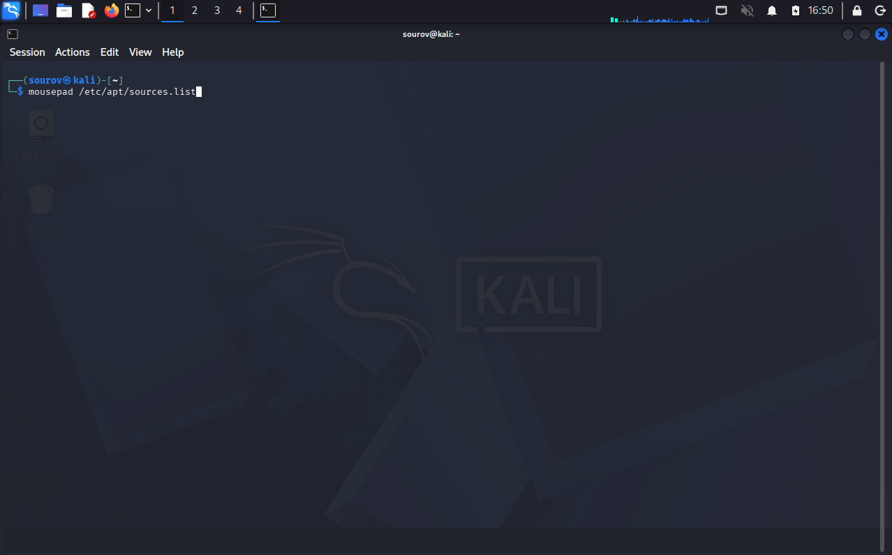

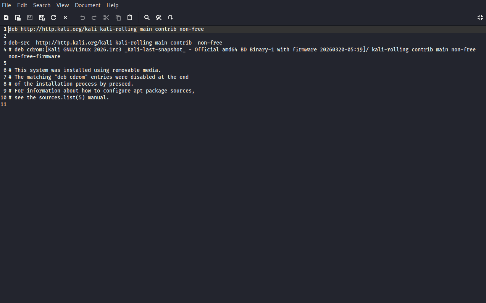

---

2. 🗂️ Debian Repository Segment Categories
What are Repository Categories? To maintain structural clarity and organization, standard Debian-based distributions split their software index pools into five core category frameworks. Each category serves a specific purpose based on licensing, support status, and whether the software is open-source or proprietary.

The Five Repository Categories:

main : Contains fully supported, standard open-source software packages that are maintained by the Debian community. These are the most stable and recommended packages for production use.

universe : Holds community-maintained, open-source utilities and tools that are not officially supported by Debian/Ubuntu. Community volunteers maintain these packages, and they may not have the same level of reliability guarantees as main packages.

multiverse : Contains software restricted due to licensing, copyright laws, or legal constraints. This includes proprietary media codecs, fonts, and software that may have licensing restrictions in certain jurisdictions.

restricted : Houses proprietary device drivers (such as NVIDIA GPU drivers, Intel wireless chipset drivers, Broadcom Wi-Fi drivers) and other hardware-specific binary blobs. These drivers are often necessary for hardware to function properly.

backports : Delivers updated versions of packages that have been ported backward from later, newer distribution releases. This allows users of older distribution versions to get newer software while maintaining system stability.

Security & Stability Warning:

⚠️ CRITICAL: Security professionals and system administrators strongly advise against adding testing, experimental, or unstable repositories into your system's source manifest. Here's why:

Untested or unstable packages can break system functionality
Security vulnerabilities may not have been patched yet
Dependency conflicts can cause cascading failures across your system
In production penetration testing environments, system instability can compromise your entire operation
Example of sources.list entries:

```bash

# Main repository (stable, supported)
deb http://deb.debian.org/debian bullseye main

# Universe (community-maintained)
deb http://deb.debian.org/debian bullseye universe

# Multiverse (licensing restricted)
deb http://deb.debian.org/debian bullseye multiverse

# Restricted (proprietary drivers)
deb http://deb.debian.org/debian bullseye restricted

# Backports (newer versions of packages)
deb http://deb.debian.org/debian bullseye-backports main

```

### 3. ➕ Injecting Custom Personal Package Archives (PPA)

* Description: When a specific proprietary tool or specialized development kit (such as legacy Oracle Java instances) is unavailable on default channels, you can manually expand your `sources.list` parameters.
* Distribution Architecture Compatibility: Because Kali Linux is architecturally built upon the Debian testing framework (just like Ubuntu), compatible Debian/Ubuntu third-party software structures can be integrated smoothly.

Example — Appending third-party repository strings into the sources config:

```bash
# Add these tracking references to your /etc/apt/sources.list file:
deb [http://ppa.launchpad.net/webupd8team/java/ubuntu](http://ppa.launchpad.net/webupd8team/java/ubuntu) trusty main
deb-src [http://ppa.launchpad.net/webupd8team/java/ubuntu](http://ppa.launchpad.net/webupd8team/java/ubuntu) precise main

```

#### 🖼️ Terminal Output


---

### 4. 🖼️ Installing and Launching the Synaptic GUI Installer

* Description: Modern versions of Kali Linux strip out graphical software store managers by default to maintain a minimal layout. However, you can always manually implement a GUI installation engine such as `Synaptic` or `Gdebi` via the terminal.
* Graphical Operations: Synaptic provides an interactive visual dashboard where you can filter keywords, examine dependencies, and apply complex package actions using point-and-click operations.

Example — Pulling down and deploying the Synaptic graphical installation manager:

```bash
kali > sudo apt-get install synaptic
Reading package lists... Done
Building dependency tree
Reading state information... Done
Processing triggers for menu (2.1.47)...

```

#### 🖼️ Terminal Output

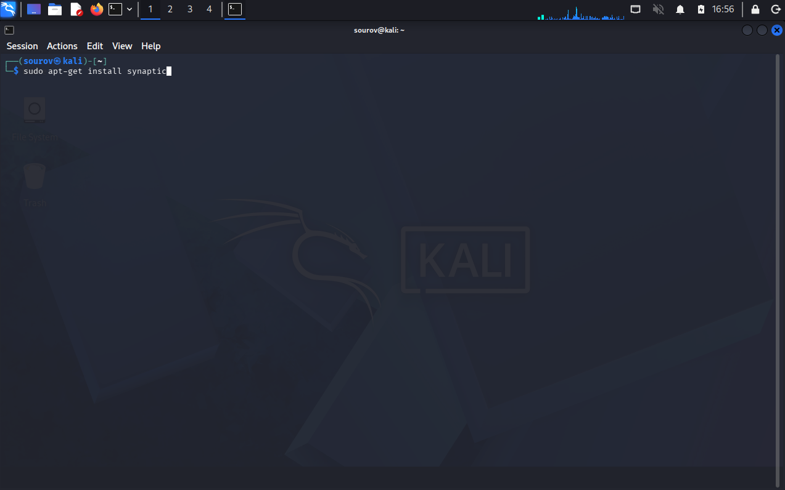

---

Example — Launching the Synaptic package manager interface via the terminal prompt:

```bash
kali > synaptic

```

#### 🖼️ Terminal Output

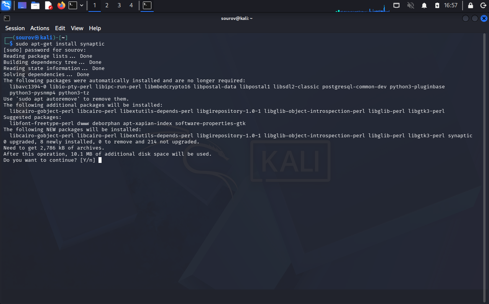

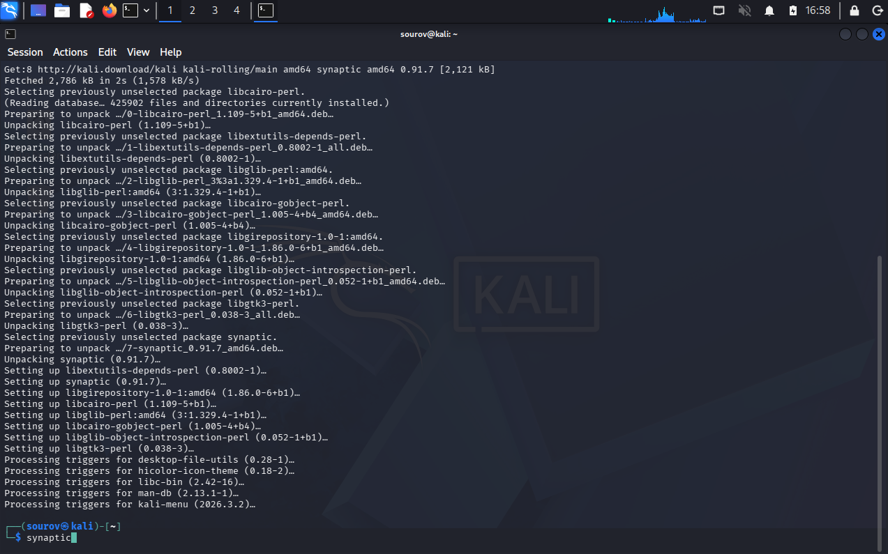

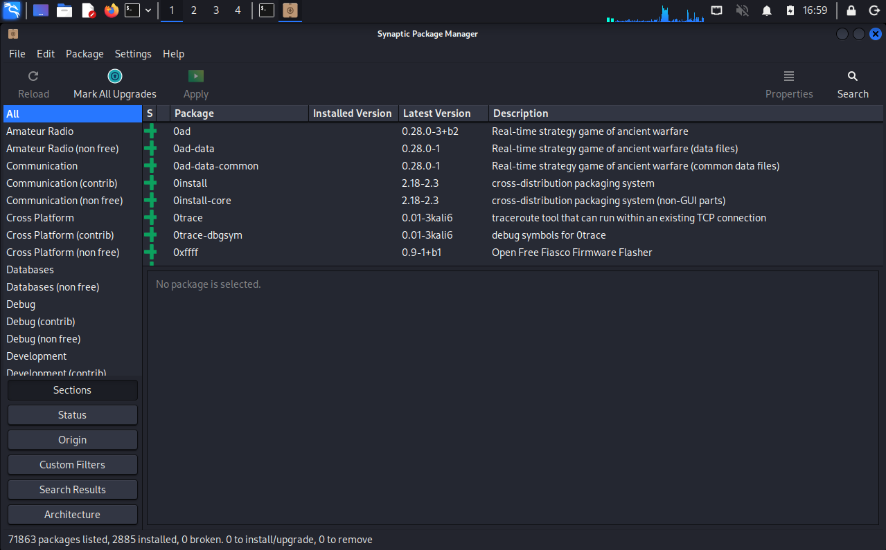

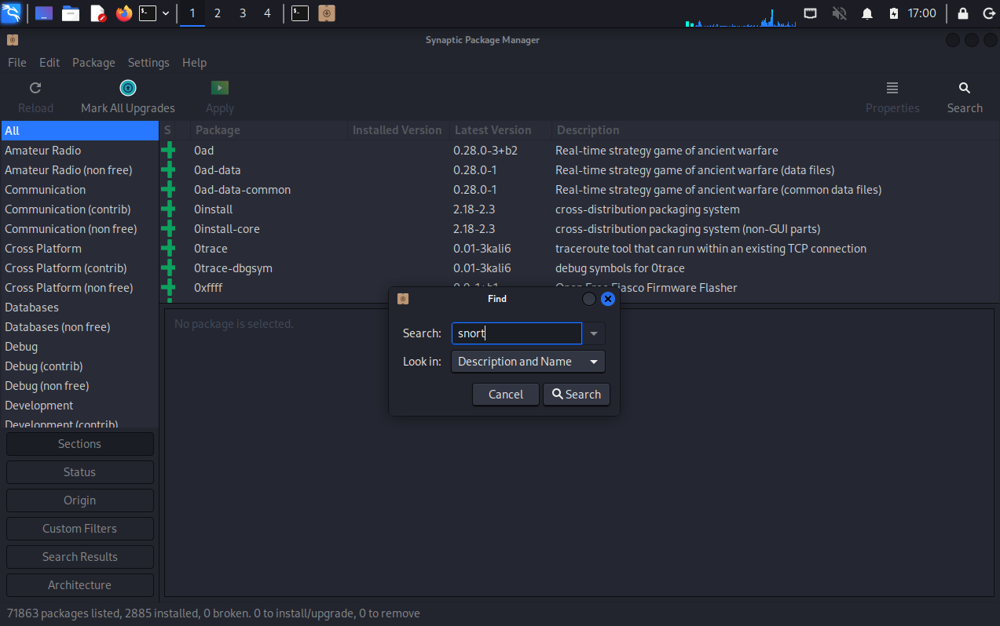

---

### 5. 🐙 Cloning Remote Repositories with `git clone`

* Description: Sometimes the software you want isn't available in any of the repositories—especially if it's brand new—but it may be available on GitHub. The `git clone` command allows you to download an entire software repository—including all source files, scripts, and revision histories—directly onto your local machine.
* Non-APT Flexibility: This method is highly essential because it allows you to install custom tools (like the Bluetooth hacking and pentesting suite `bluediving`) that do not come pre-packaged with your default Linux distribution.

Example — Cloning a custom security repository from GitHub:

```bash
kali > git clone https://github.com/balle.bluediving.git
Cloning into 'bluediving'...
remote: Counting objects: 131, Done.
remote: Total 131 (delta 0), reused 0 (delta 0), pack-reused 131
Receiving objects: 100% (131/131), 900.81 KiB | 646.00 KiB/s, Done.
Resolving deltas: 100% (9/9), Done.
Checking connectivity... Done.

```

#### 🖼️ Terminal Output

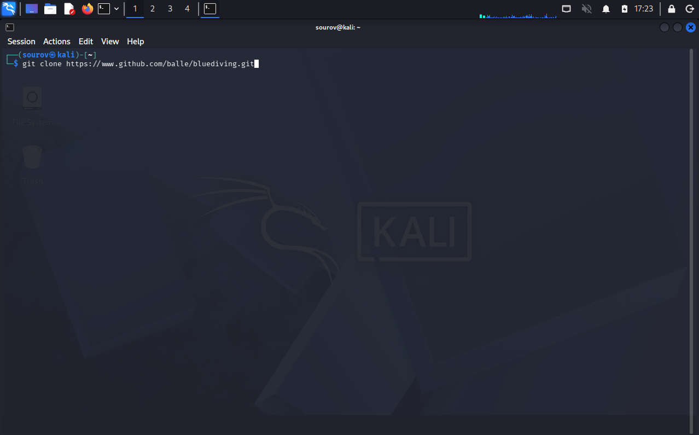

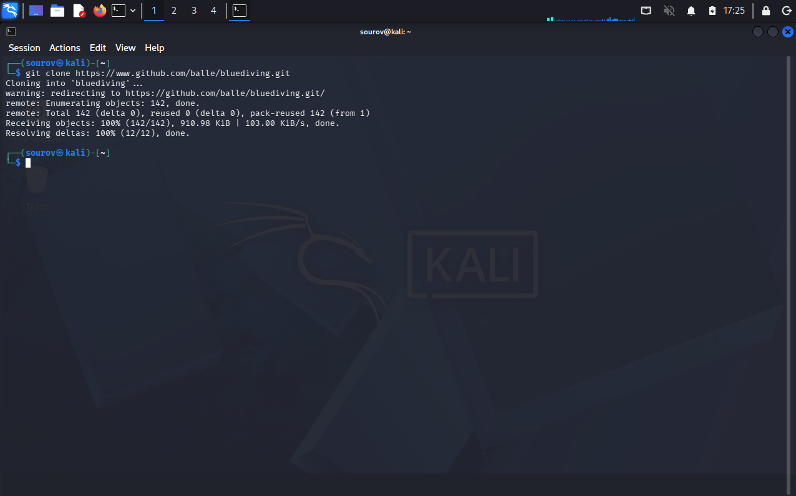

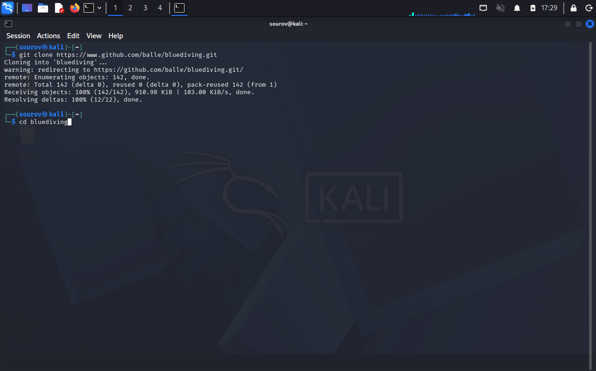

---

### 6. 🛠️ Post-Git Clone Directory Auditing (`ls -l`)

* Description: When software is pulled down manually via code repositories using tools like `git clone`, it copies all the data and files from that location onto your system.
* Directory Inventory Checks: After a clone completes, you must execute a long listing command (`ls -l`) to verify that the target directory has been successfully initialized on disk and that a new folder matching the project repository has been created.

Example — Auditing directory properties after a custom tool expansion:

```bash
kali > ls -l
total 80
drwxr-xr-x 7 root root  4096 Jan 10 22:19 bluediving
drwxr-xr-x 2 root root  4096 Dec  5 11:17 Desktop
drwxr-xr-x 2 root root  4096 Dec  5 11:17 Documents
drwxr-xr-x 2 root root  4096 Dec  5 11:17 Downloads
drwxr-xr-x 2 root root  4096 Dec  5 11:17 Music

```

#### 🖼️ Terminal Output

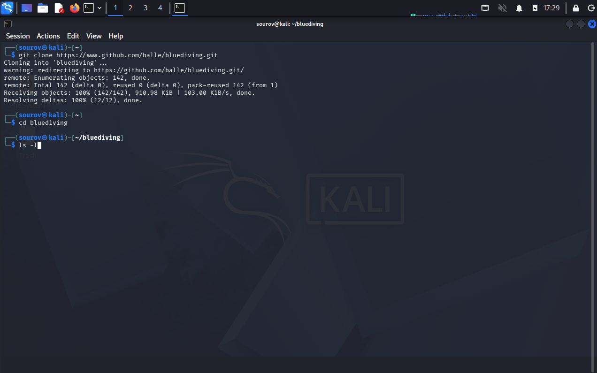


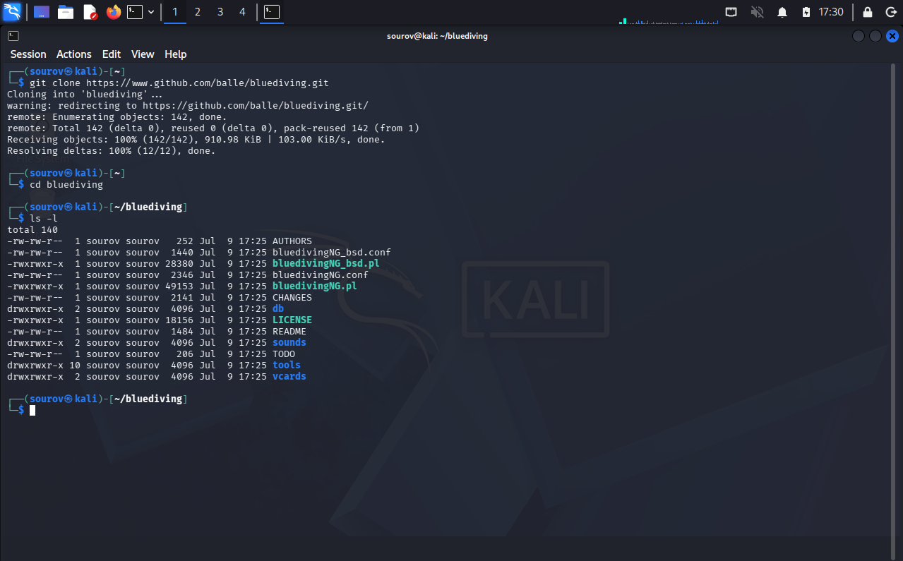

---

## 🛠️ Utilities & Tool Reference

| Category | Component/Tool | Syntax / Structure | Description |
| --- | --- | --- | --- |
| **Package Sources** | `sources.list` | `/etc/apt/sources.list` | The system database tracker file that catalogs upstream distribution repository server URLs. |
| **Graphical Deploy** | `synaptic` | `apt-get install synaptic` | A desktop-based frontend wrapper for APT used to manage system package structures visually. |
| **Source Control** | `git clone` | `git clone [repository_url]` | Connects to a remote server to download and initialize a full software development repository locally. |
| **Directory Audit** | `ls -l` | `ls -l` | Inspects current storage coordinates to verify folder generations after external source builds. |

---

## 🔑 Key Takeaways for Revision

1. **Repository Compatibility Rule:** Kali, Ubuntu, and Debian share a foundational ancestral codebase. Therefore, standard software packages can usually migrate across these ecosystems quite safely.
2. **The Danger of Bleeding-Edge Channels:** Avoid configuring `experimental` or `unstable` source hooks inside production penetration testing nodes, as unvalidated library updates can fundamentally corrupt core system functions.
3. **Direct Access via Git:** Using `git clone` cuts out the middleman repository, allowing you to access tools, frameworks, and packages directly from the developer's source control workspace.
4. **Implicit Directories:** When a clone finishes successfully, the downloaded source assets will always be saved into a newly generated folder matching the name of the project repository in your current working path.

---
