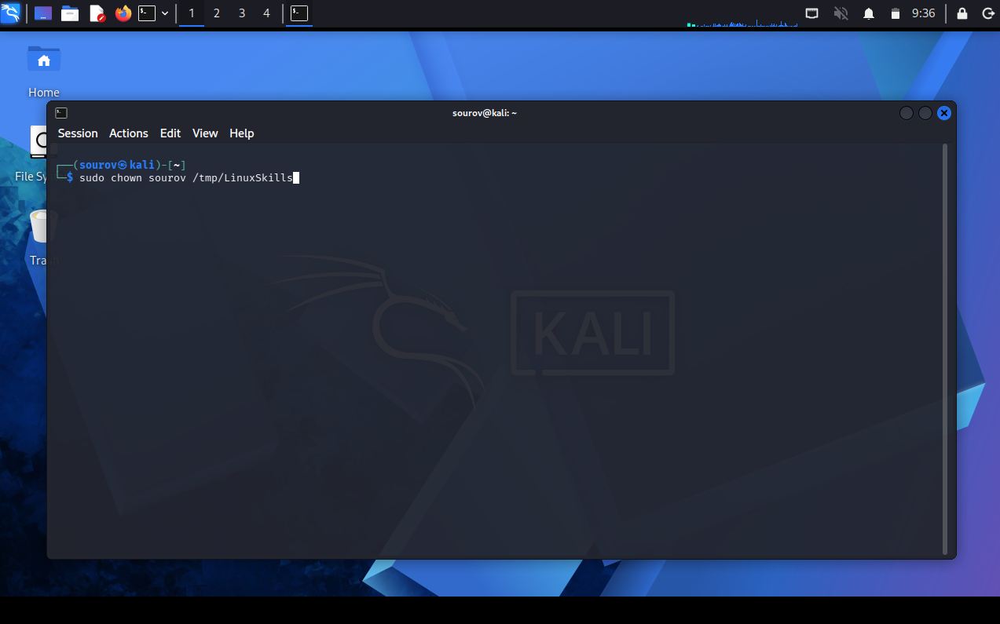
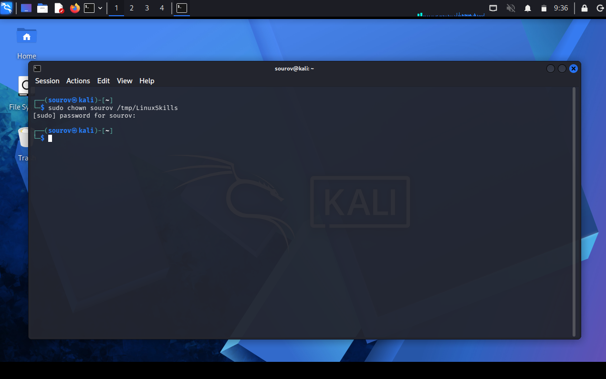
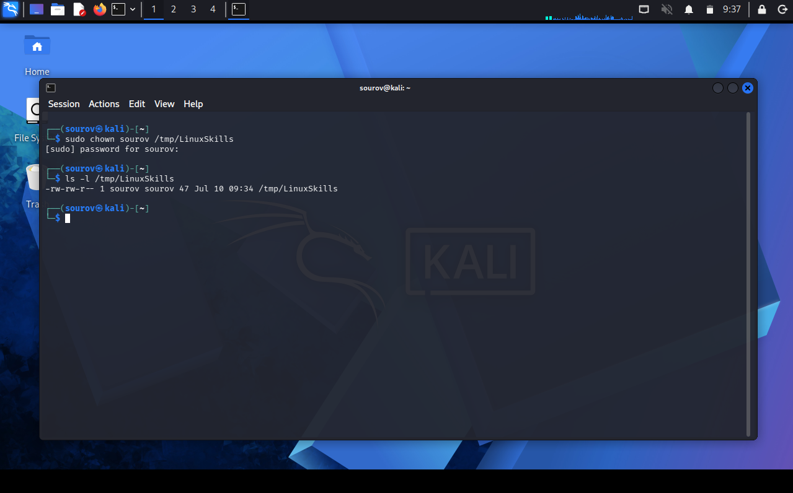
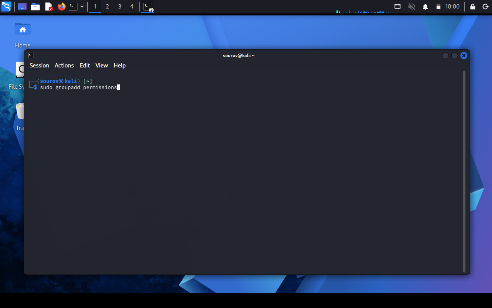
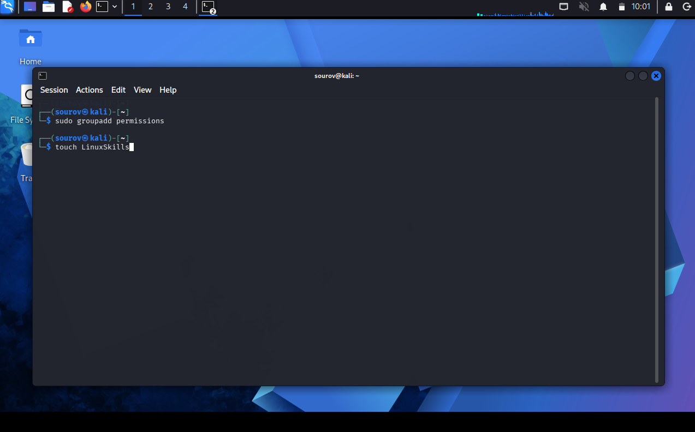
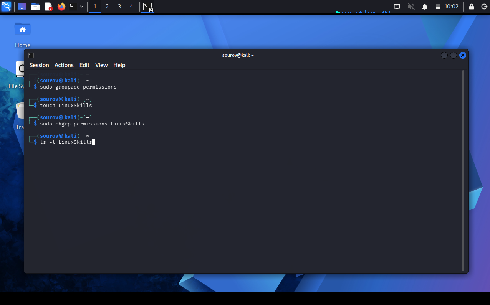
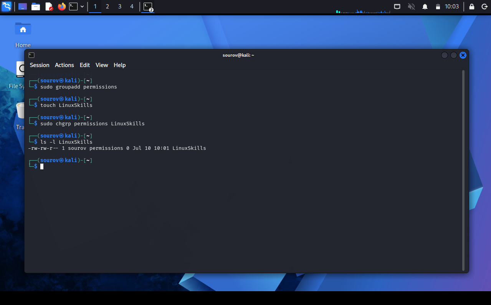
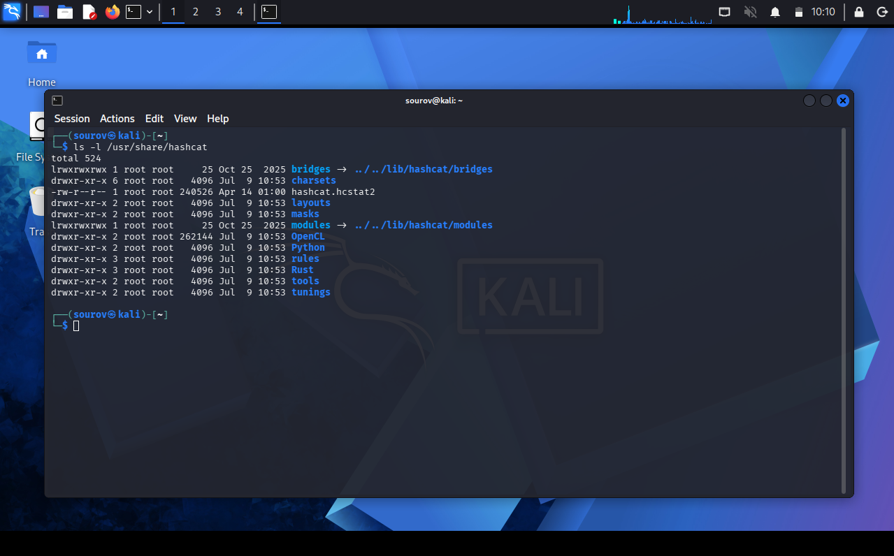

# 🐧 Day 13 : Controlling File and Directory Permissions

Welcome to Day 13 of my Linux Security learning journey. This document details the foundational mechanics of Linux security models, analyzing user/group hierarchies, modifying ownership vectors using chown/chgrp, and breaking down file system metadata layout fields via long listings.

---

## 🎯 Key Points & Core Concepts

### 1. 🛡️ Linux Permission Architecture & User Types
* Description: Linux is an enterprise-grade, multi-user operating system that relies heavily on discretionary access controls to secure files and directories from unauthorized access or tampering. The system administrator (the `root` user) or the explicit file owner can securely regulate read, write, and execute permissions.
* Role Segregation & Inheritance: The `root` user is all-powerful and holds absolute privilege boundaries across the entire kernel workspace. Non-root users have limited capabilities and are organized into functional clusters or "groups" (such as finance, developers, or security teams). Members added to these groups automatically inherit their shared data permissions.

---

### 2. 👑 Transferring Individual Ownership (`chown`)
* Description: Every file has an allocated user owner and a group owner, typically inheriting the identity parameters of the creator. To shift individual file control and delegation rights to another account, you must use the `chown` (change owner) utility.
* System Syntax Matrix: Pass the command statement first, specify the target username receiving ownership, and append the exact directory path or filename destination.

Example — Granting individual ownership of a designated file to user 'bob':
```bash
kali > sudo chown sourov /tmp/LinuxSkills

```

#### 🖼️ Terminal Output





```bash
kali > ls -l /tmp/LinuxSkills

```

#### 🖼️ Terminal Output





---

### 3. 👥 Re-Assigning Group Ownership (`chgrp`)

* Description: While security testers often operate independently, collaborative operations demand explicit group permission structures. The `chgrp` (change group) utility re-allocates a file's group ownership layer without modifying its individual owner.
* Tactical Context: If the administrative `root` group downloads a specialized analysis tool (such as `newIDS`) that defensive teams need to run, they can use this command to safely pass group execution privileges down to the `security` team.

Example — Transferring file group ownership parameters to the 'security' group:

```bash
kali > sudo groupadd permissions

```

#### 🖼️ Terminal Output










---

### 4. 📂 Auditing Access Permissions via Long Listings (`ls -l`)

* Description: To inspect current access permissions, ownership states, and metadata tags assigned to files or folders, you must execute the `ls` command with the long listing (`-l`) switch.
* Anatomy of a Long Listing Row:
* **File Type Indicator:** The absolute first character on a line. A directory is marked with `d`, while a standard file is marked with a dash (`-`).
* **Permissions Matrix Block:** The subsequent 9 characters representing three distinct chunks of three flags: **Owner**, **Group**, and **Other Users**.
* **Link Count Variable:** Tracks filesystem references mapped to the inode.
* **Owner Name:** Identifies the user account holding primary ownership.
* **Group Name:** Identifies the group layer holding inherited ownership.
* **File Size Counter:** Displays file volume measured in bytes.
* **Timestamp Index:** Dumps the exact date and time of file creation or last modification.
* **Filename Value:** Displays the terminal name of the target directory or file.


Example — Auditing directory properties inside the hashcat directory:

```bash
kali > ls -l /usr/share/hashcat
total 32952
drwxr-xr-x 5 root root     4096 Dec 5 10:47 charsets
-rw-r--r-- 1 root root 33685504 June 28 2018 hashcat.hcstat
-rw-r--r-- 1 root root 33685504 June 28 2018 hashcat.hctune
drwxr-xr-x 2 root root     4096 Dec 5 10:47 masks
drwxr-xr-x 2 root root     4096 Dec 5 10:47 OpenCL
drwxr-xr-x 3 root root     4096 Dec 5 10:47 rules

```

#### 🖼️ Terminal Output





---

### 5. 🔍 Decoding the Triple-Triad Permission String

* Description: The permission section is evaluated in sets of three values utilizing `r` (Read), `w` (Write), and `x` (Execute) positions. If any flag contains a dash (`-`), that specific right is revoked.
* Access Flag Definitions:
* **`r` (Read):** Permits a user to open, read, or look inside a file's content.
* **`w` (Write):** Permits a user to edit, append, modify, or save changes to a file.
* **`x` (Execute):** Permits a user to run binaries/scripts as a live process or enter a directory.


* Practical Evaluation Pattern (`-rw-r--r--`):
* First Char (`-`): Standard file object.
* Owner Bits (`rw-`): The owner has full Read and Write permissions but lacks Execute permission.
* Group Bits (`r--`): Members of the owning group can only Read the file.
* Others Bits (`r--`): All other system accounts can only Read the file.


Example — Checking permission metrics on a specific database file:

```bash
kali > ls -l /usr/share/hashcat/hashcat.hcstat
-rw-r--r-- 1 root root 33685504 June 28 2018 hashcat.hcstat

```

#### 🖼️ Terminal Output

---

## 🛠️ Utilities & Tool Reference

| Category | Component/Tool | Syntax / Structure | Description |
| --- | --- | --- | --- |
| **Owner Shift** | `chown` | `chown [user] [file]` | Transfers primary individual ownership metrics of a file target to a new user account. |
| **Group Shift** | `chgrp` | `chgrp [group] [file]` | Re-allocates the inherited group security association of a file to a different group. |
| **Security Audit** | `ls -l` | `ls -l [path]` | Extracts structural permission strings (`rwx`), user mappings, sizes, and names. |

---

## 🔑 Key Takeaways for Revision

### The Permission String Breakdown

When reviewing security states via `ls -l`, evaluate the ten-character token string from left to right using this priority guide:

$$\underbrace{-}_{\text{File Type}} \quad \underbrace{\text{r w -}}_{\text{Owner (User)}} \quad \underbrace{\text{r - -}}_{\text{Group}} \quad \underbrace{\text{r - -}}_{\text{Others (World)}}$$

1. **`chown` vs `chgrp`:** `chown` changes individual user privileges, while `chgrp` alters the group workspace profile attached to the resource.
2. **The Execution Constraint:** Standard user profiles can only execute structured binaries or automated scripts if their respective permission block explicitly contains the active `x` flag.

---

*⚡ End of Week 02 • Day 06 Notes • Organized for GitHub & OneNote*

```

```
