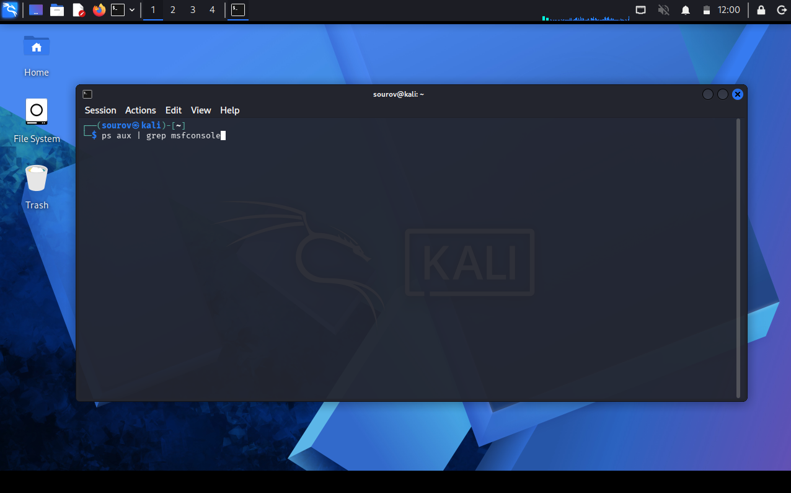
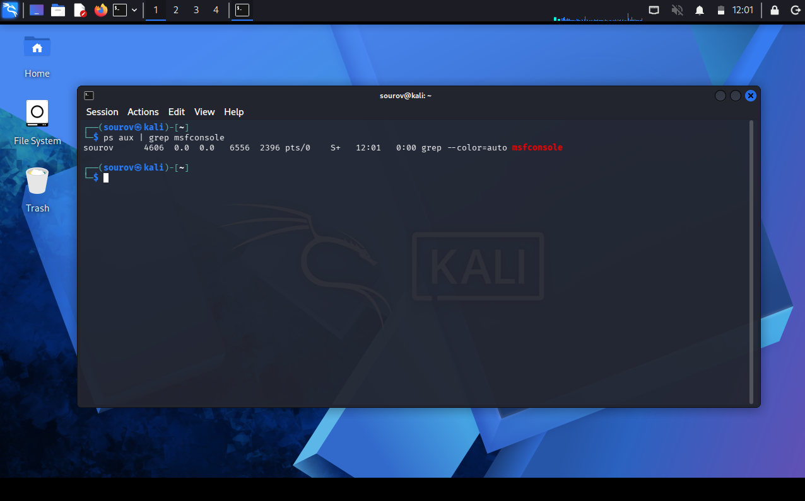

# 🐧 Day 15 : Linux Process Management (Part 01)
Welcome to Day 15 of my Linux Security learning journey. This document details the foundational principles of Linux process management, including inspecting active execution threads with ps, dynamic resource auditing via top, filtering processes with grep, and manipulating process scheduling priorities using nice and renice.
## 🎯 Key Points & Core Concepts
### 1. ⚙️ Introduction to Linux Process Management
 * Description: A process is an active instance of a running program utilizing system hardware resources like CPU, RAM, and Disk storage.
 * Purpose of Management:
   * Optimizing system efficiency and identifying resource-hungry tasks.
   * Auditing daemon behaviors and terminating unsafe or stuck processes.
   * Preparing background tasks for scheduled time-based execution routines.
 * The Process ID (PID): Every process initialized in the Linux kernel is assigned a unique numerical identification tag called a PID. System utilities require the exact PID to interact with or modify an active process.
### 2. 👁️ Viewing Running Processes (ps and ps aux)
 * Description: The ps (Process Status) utility captures a static snapshot of running processes.
 * Local vs. System-Wide Scopes:
   * ps : Displays processes bound exclusively to the current active terminal session.
   * ps aux : Displays all active processes running across all user environments on the system.
 * Key ps aux Metadata Columns:
   * USER : The user account that initialized the process.
   * PID : The process identification number.
   * %CPU / %MEM : Percentage of processing power and memory allocated to the task.
   * COMMAND : The explicit binary path or execution statement.
Example — Capturing a complete system-wide process snapshot:
```bash
ps aux

```
#### 🖼️ Terminal Command


#### 🖼️ Terminal Output


### 3. 🔍 Filtering Processes by Name (ps aux | grep)
 * Description: Because ps aux outputs hundreds of active system threads, piping its output into grep isolates specific application strings.
 * Resource Auditing: Security tools like Metasploit (msfconsole) consume substantial CPU and RAM resources. Filtering allows administrators to quickly extract their exact PID and resource metrics.
Example — Isolating active Metasploit instances from the system process tree:
```bash
ps aux | grep msfconsole

```
#### 🖼️ Terminal Command



#### 🖼️ Terminal Output




### 4. 📊 Live Dynamic Resource Monitoring (top)
 * Description: Unlike the static output of ps, the top command provides an interactive, live-updating interface (refreshing every 3 seconds) sorted by resource consumption.
 * Core Display Sections:
   * System Header: Uptime, average load statistics, and total logged-in users.
   * CPU & Memory Breakdown: Active user/system CPU percentages, physical RAM usage, and Swap memory.
   * Interactive Control Keys:
     * H or ? : Displays the interactive help menu.
     * Q : Quits the top interactive interface.
     * R : Triggers the inline renice dialogue box.
Example — Launching the dynamic resource monitoring interface:
```bash
top

```
#### 🖼️ Terminal Output
### 5. ⚖️ Setting Launch Priorities (nice)
 * Description: The Linux kernel allocates CPU time based on process priority values known as "niceness." The nice utility sets a process's scheduling priority at launch time.
 * Value Bounds & Priorities:
   * Niceness Range: -20 (highest priority / least nice) to +19 (lowest priority / most nice). Default value is 0.
   * Low/Negative Values: High CPU priority (greedy process).
   * High/Positive Values: Low CPU priority (polite process).
 * Privilege Restrictions: Standard users can only *increase* niceness (lower priority). Superuser (root) rights are required to assign negative values (raise priority).
Example — Starting a heavy task with elevated execution priority:
```bash
nice -n -10 /bin/slowprocess

```
#### 🖼️ Terminal Output
Example — Starting a background task with lowered execution priority:
```bash
nice -n 10 /bin/slowprocess

```
#### 🖼️ Terminal Output
Example — Verifying the configured niceness value (NI column) of processes:
```bash
ps -o pid,ni,comm

```
#### 🖼️ Terminal Output
### 6. 🔄 Adjusting Live Process Priorities (renice)
 * Description: The renice command alters the niceness value of an already running process using its absolute target PID.
 * Operational Context:
   * Lowering priority (renice 19 <PID>) prevents background tasks from monopolizing hardware resources.
   * Raising priority (renice -10 <PID>) speeds up critical operations, provided the command is issued by the root user.
Example — Lowering the priority of an active PID (6996) to minimum preference:
```bash
renice 19 6996

```
#### 🖼️ Terminal Output
## 🛠️ Utilities & Tool Reference
| Category | Component/Tool | Syntax / Structure | Description |
|---|---|---|---|
| **Static Inspection** | ps | ps aux | Captures a detailed static snapshot of all processes running across the system. |
| **Pattern Search** | grep | ps aux | grep [name] | Filters process lists to isolate specific execution strings and PIDs. |
| **Dynamic Audit** | top | top | Launches an interactive real-time resource monitor sorted by resource usage. |
| **Launch Priority** | nice | nice -n [val] [command] | Configures a process's scheduling priority at initialization. |
| **Runtime Priority** | renice | renice [val] [PID] | Adjusts the absolute niceness value of an active, running process. |
## 🔑 Key Takeaways for Revision
 1. **Static vs. Dynamic:** Use ps aux for scriptable, fixed process inspection; use top for active, real-time performance troubleshooting.
 2. **PID Requirement:** Operating on any specific Linux process requires identifying its unique numerical Process ID (PID).
 3. **Niceness Scale Rule:**
   
 4. **Privilege Boundary:** Non-root accounts can only demote process priorities (increase niceness value). Only root can elevate process priorities using negative niceness values.
