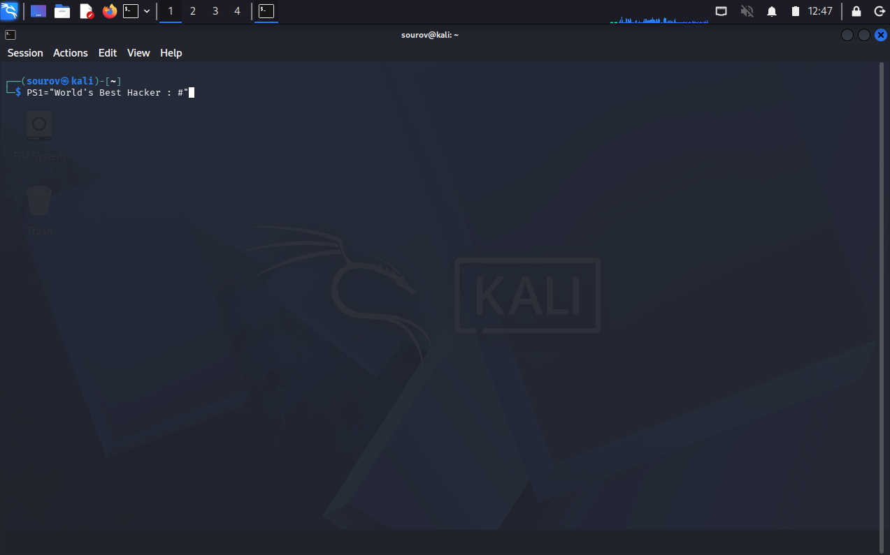
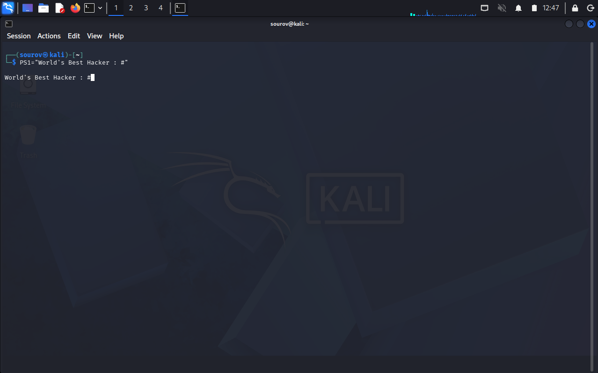
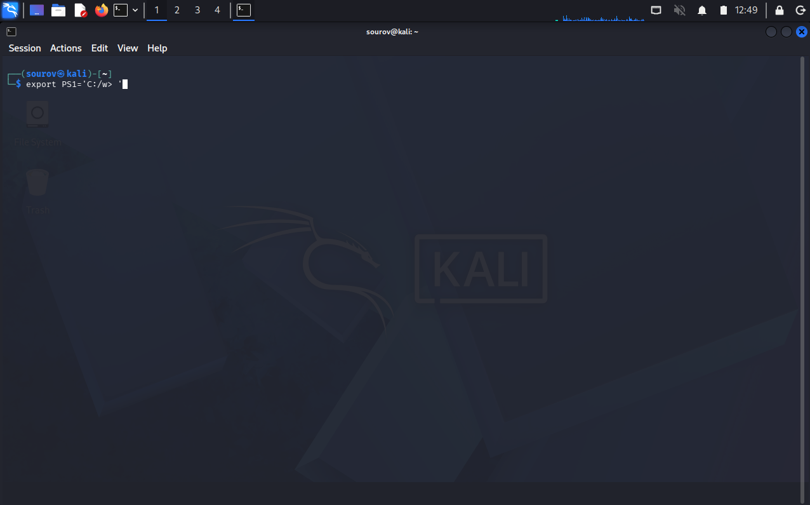
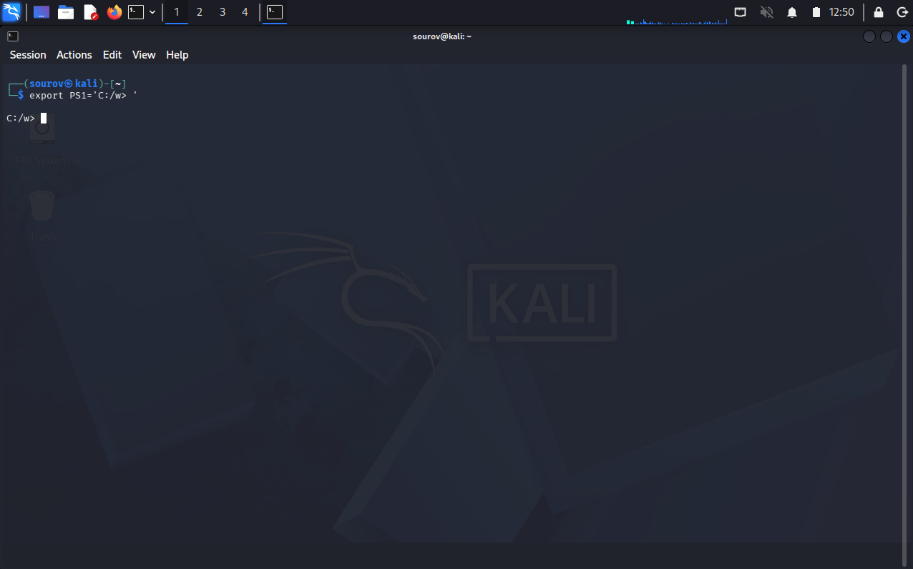
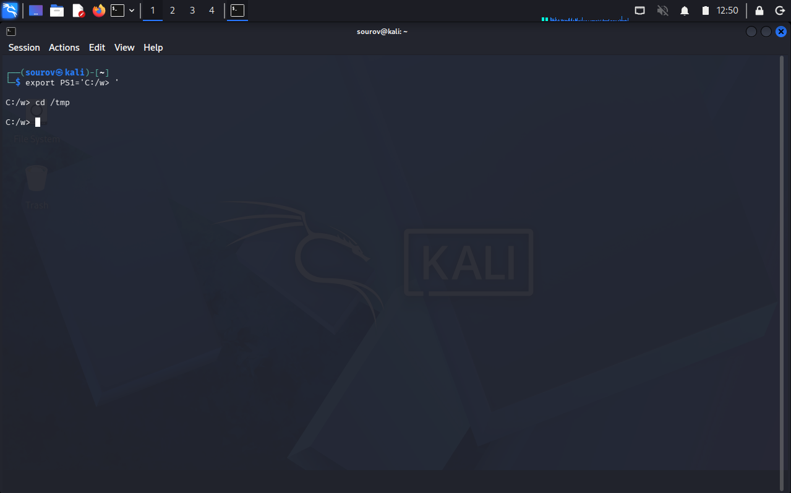

# 🐧 Day 18 : Managing User Environment Variables (Part 02)

Welcome to Day 04 of Week 03 of my Linux Security learning journey. This document details custom shell prompt configurations via `$PS1`, deep-dive modifications to the `$PATH` variable, common pitfalls when appending execution paths, and managing user-defined variables using initial assignments and the `unset` command.

---

## 🎯 Key Points & Core Concepts

### 1. 💬 Introduction to the Shell Prompt (`PS1`)

* Description: The shell prompt is governed by the `PS1` environment variable. It formats the interactive text line displayed in the terminal, indicating active identity and present location.
* Default Kali Linux Format: `username@hostname:current_directory #` (or `root@kali:~#` for the root account).
* Common Escape Tokens / Placeholders:
* `\u`: Current logged-in user name.
* `\h`: System hostname.
* `\w`: Full path of the active working directory.


---

### 2. 🎨 Customizing & Exporting the `PS1` Prompt

* Session-Specific Overrides: Updating `PS1` instantly modifies the active prompt string for the current terminal window.
* Subshell Inheritance: Exporting `PS1` passes the custom prompt design down to any subshells or child processes spawned within that session.
* Windows Command Prompt Emulation: You can reformat the terminal prompt to resemble Windows Command Prompt (`C:\path>`) while preserving active Linux path tracking.

Example — Temporarily altering the shell prompt string:

```bash
PS1="World's Best Hacker: #"

```

#### 🖼️ Terminal Command



#### 🖼️ Terminal Output




---

Example — Exporting a custom Windows-style prompt format:

```bash
export PS1='C:\w> '
cd /tmp

```

#### 🖼️ Terminal Command



#### 🖼️ Terminal Output





---

### 3. 🔍 Understanding the `$PATH` Search Variable

* Description: The `$PATH` environment variable contains an ordered list of system directories separated by colons (`:`). When a command (such as `ls` or `grep`) is entered, the shell searches these directories sequentially from left to right for an executable matching that name.
* Search Failures: If the binary is not found within any directory listed in `$PATH`, the shell outputs a `command not found` error.

Example — Viewing the active command search paths:

```bash
echo $PATH

```

#### 🖼️ Terminal Output

---

### 4. ➕ Appending Directories to `$PATH`

* Description: When custom tools or binary suites are installed outside standard paths (e.g., inside `/root/newhackingtool`), they can only be executed by navigating to that directory or specifying their full path. Appending custom directories to `$PATH` allows commands to be run globally from any directory.
* Correct Syntax Mechanics: Reassign `$PATH` by referencing `$PATH` first, followed by a colon (`:`), and then the new directory path.
* Performance Considerations: Avoid adding unnecessary directories to `$PATH`, as scanning excessively long path sequences increases command search latency.

Example — Safely appending a custom directory to `$PATH`:

```bash
PATH=$PATH:/root/newhackingtool

```

#### 🖼️ Terminal Output

---

Example — Verifying the expanded `$PATH` sequence:

```bash
echo $PATH

```

#### 🖼️ Terminal Output

---

### 5. ⚠️ Pitfalls: Replacing vs. Appending `$PATH`

* Description: Omitting `$PATH` during assignment (e.g., `PATH=/root/newhackingtool`) overwrites the entire search array instead of appending to it.
* System Impact: Overwriting `$PATH` unlinks system binary locations like `/bin`, `/usr/bin`, and `/sbin`. Standard utilities like `ls`, `cat`, and `cp` will immediately fail with `command not found` unless called via their absolute paths.

Example — Demonstrating a destructive path replacement error:

```bash
PATH=/root/newhackingtool
ls

```

#### 🖼️ Terminal Output

---

### 6. 🛠️ Managing User-Defined Variables & `unset`

* Description: Users can define custom variables for script configurations or string shortcuts. Variable assignments require the format `VARIABLE_NAME="value"` with **no spaces** around the equals sign (`=`).
* Reading & Clearing Variables:
* Use `echo $VARIABLE_NAME` to expand and display the value.
* Use `unset VARIABLE_NAME` to remove a variable definition and free its allocated environment space.


Example — Defining and evaluating a custom shell variable:

```bash
MYNEWVARIABLE="Hacking is the most valuable skill set in the 21st century"
echo $MYNEWVARIABLE

```

#### 🖼️ Terminal Output

---

Example — Deleting a variable using `unset`:

```bash
unset MYNEWVARIABLE
echo $MYNEWVARIABLE

```

#### 🖼️ Terminal Output

---

## 🛠️ Utilities & Tool Reference

| Category | Component/Tool | Syntax / Structure | Description |
| --- | --- | --- | --- |
| **Prompt Config** | `PS1` | `PS1="[string]"` | Redefines the terminal command prompt layout and escape sequences. |
| **Path Mapping** | `PATH` | `PATH=$PATH:[dir_path]` | Appends a new directory to the system executable search list. |
| **Variable Cleanup** | `unset` | `unset [VARIABLE_NAME]` | Deletes a custom or session-level variable from memory. |

---

## 🔑 Key Takeaways for Revision

### Safe `$PATH` Modification Rule

Never overwrite `$PATH` directly. Always append new paths to preserve existing system binary locations:

$$\text{Correct (Append): } \texttt{PATH=\$PATH:/new/directory} \longrightarrow \text{Preserves core system binaries}$$

$$\text{Incorrect (Replace): } \texttt{PATH=/new/directory} \longrightarrow \text{Breaks system commands (e.g., ls, cat)}$$

1. **`PS1` Tokens:** `\u` resolves to current user, `\h` to hostname, and `\w` to present working directory.
2. **Value Expansion:** Always prepend variable names with `$` (e.g., `echo $PATH`) to expand their values rather than printing string literals.
3. **Session vs. Permanent Scope:** Direct assignments and exports apply to the current session and its child processes. To make changes permanent across terminal restarts, add export statements to configuration files like `~/.bashrc`.

---
