# 🐧 Day 23 : The Logging System

Welcome to Day 23 of my Linux Security learning journey. This document details the architectural evolution from legacy `syslogd` to `systemd-journald`, structured querying using `journalctl`, log priority and facility filtering, anti-forensic techniques like log vacuuming and multi-pass shredding (`shred`), and neutralizing log generation by configuring `Storage=null`.

---

## 🎯 Key Points & Core Concepts

### 1. 📜 Introduction & Logging Framework Evolution

* **Objectives of Linux Log Management:**
* **Forensic / Defensive:** Detect attacks, reconstruct incident timelines, identify malicious user accounts (who did what).
* **Anti-Forensic / Offensive:** Clean up execution traces, sanitize specific service logs, or disable logging entirely.


* **Architectural Shift (`syslogd` vs. `systemd-journald`):**
* **Legacy (`syslog` / `syslogd`):**
* Log files stored as plain text files under `/var/log`.
* High search complexity; required custom shell/grep/awk scripts to filter data.


* **Modern (`systemd` / `systemd-journald`):**
* Controlled via the `journalctl` utility.
* Stores binary log files (zeros and ones) under `/var/log/journal/`.
* Provides built-in, automated, and structured querying natively across Linux distributions (e.g., Kali Linux).


* **Basic Execution Behavior:**
* Executing `journalctl` without arguments displays all system log entries sequentially, automatically piped through the `more` pager program.


Example — Viewing system logs with bare `journalctl`:

```bash
journalctl

```

#### 🖼️ Terminal Command
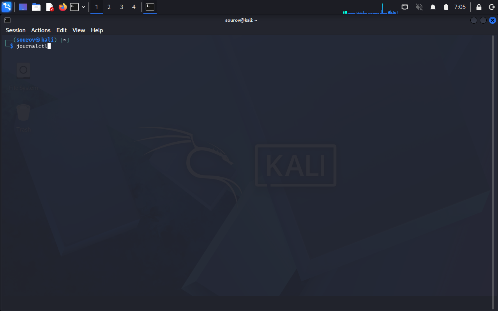

#### 🖼️ Terminal Output
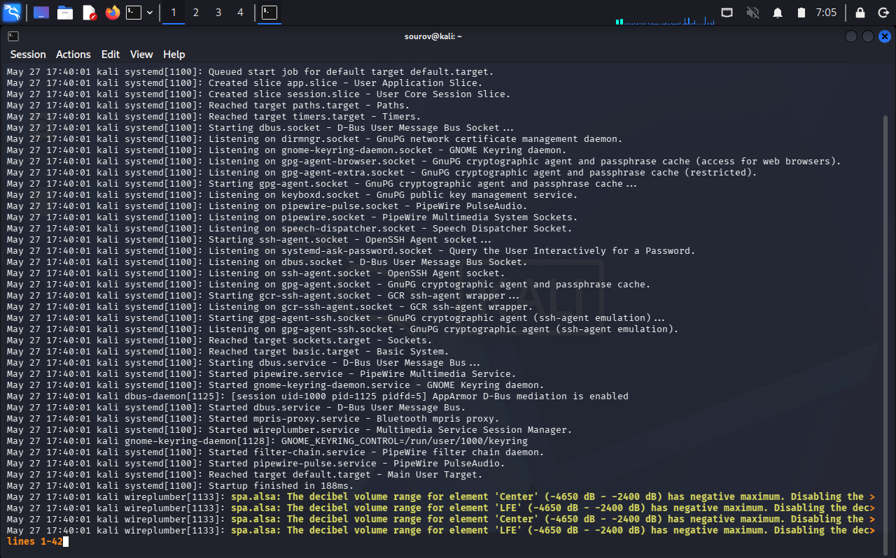
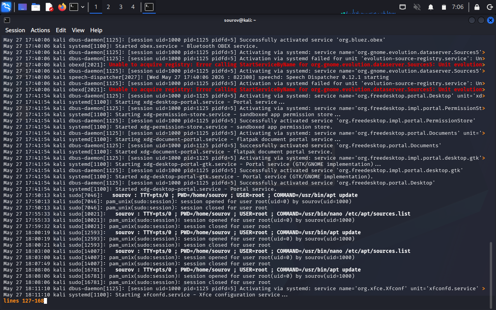
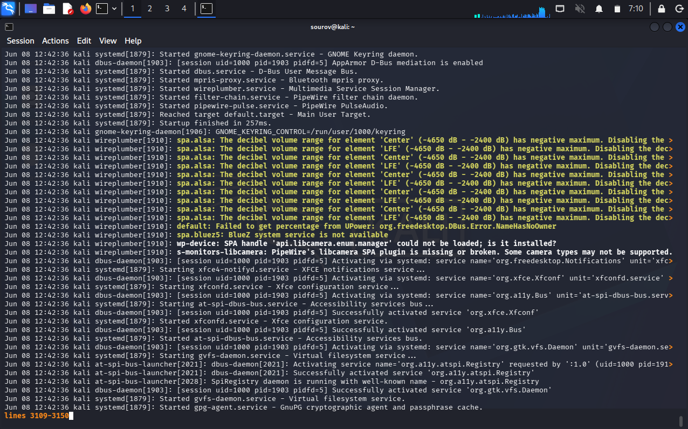
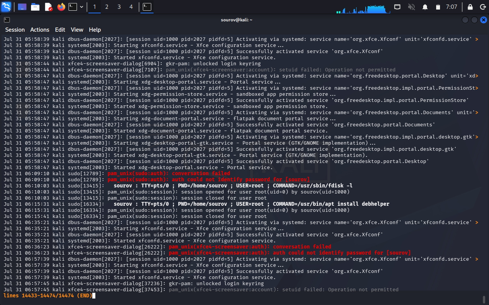

---

### 2. 🛠️ Command-Line Options & Help System Breakdown (`journalctl -h`)

* **Displaying Syntax and Options:**
```bash
journalctl -h

```


* Syntax Structure: `journalctl [OPTIONS...] [MATCHES...]`


#### Key Source & Filtering Flags

| Flag / Option | Description / Function |
| --- | --- |
| `--system` | Show the main system journal. |
| `--user` | Show log entries for the current user session. |
| `-M, --machine=` | Query logs on a specific local container. |
| `-m, --merge` | Merge and show entries from all available journal files. |
| `-D, --directory=PATH` | Query journal files from a custom directory path. |
| `--file=PATH` | Open and query a specific explicit journal file. |
| `-S, --since=DATE` | Show log entries NOT older than the specified date/time. |
| `-U, --until=DATE` | Show log entries NOT newer than the specified date/time. |
| `-b, --boot[=ID]` | Show logs from the current boot cycle or specified boot ID. |
| `-u, --unit=UNIT` | Show logs strictly matching a specific service unit (e.g., `apache2`). |
| `-t, --identifier=STR` | Filter by specific syslog identifier string. |
| `-p, --priority=RANGE` | Filter by log severity priority level (0–7 or string name). |
| `--facility=FACILITY` | Filter by facility type (e.g., `auth`, `daemon`, `kernel`). |
| `-g, --grep=PATTERN` | Filter entries where message body matches regex PATTERN. |
| `-k, --dmesg` | Filter kernel messages from the current boot. |

---

### 3. 🚨 Log Priorities and Facility Filters

* **Log Priority Levels (0 to 7):**
Linux categorizes logs by severity level using standard numerical or textual designations. **Lower numerical priority values correspond to higher severity levels.**

| Code | Severity | Description |
| --- | --- | --- |
| **0** | `emerg` | System is unusable (highest severity). |
| **1** | `alert` | Action must be taken immediately. |
| **2** | `crit` | Critical conditions (e.g., CPU soft lockups, kernel panics). |
| **3** | `err` | Non-critical error conditions. |
| **4** | `warning` | Warning conditions. |
| **5** | `notice` | Normal but significant conditions. |
| **6** | `info` | Informational messages. |
| **7** | `debug` | Debug-level messages (lowest severity). |

* **Querying Logs by Priority (`-p`):**
* **By Name:** `journalctl -p "emerg"`
* **By Number:** `journalctl -p 6` (Displays priority 6 (`info`) and all higher severity levels 0–5).


* **Querying Logs by Service Unit (`-u`):**
* Isolates events for a specific system daemon or service unit.
* **Apache Example:** `journalctl -u apache2`
* **SSH Example:** `journalctl -u ssh`


Example — Querying logs by service unit and priority:

```bash
journalctl -u apache2 -p err

```
#### 🖼️ Terminal Command
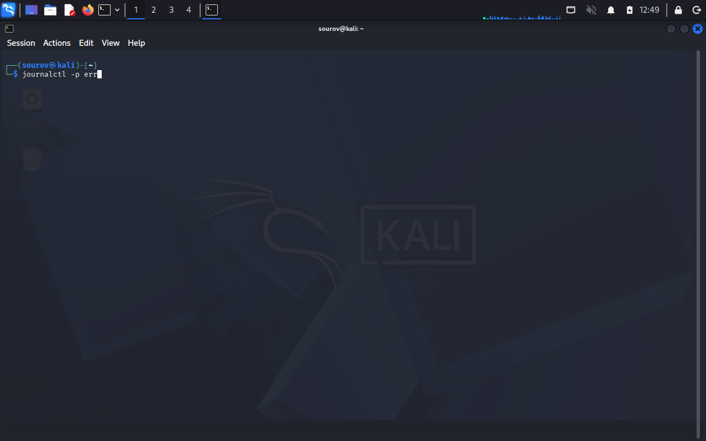

#### 🖼️ Terminal Output
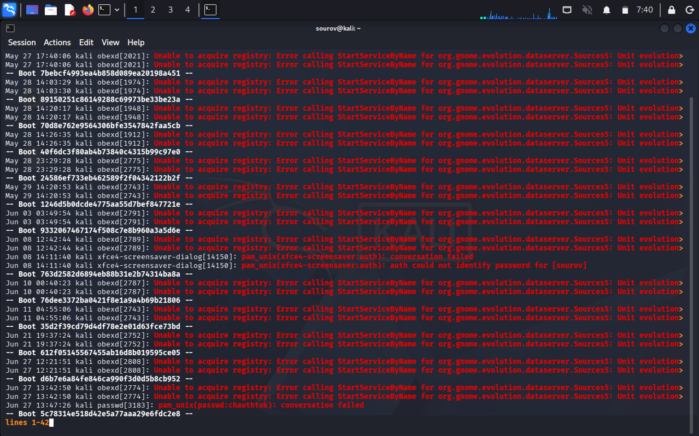
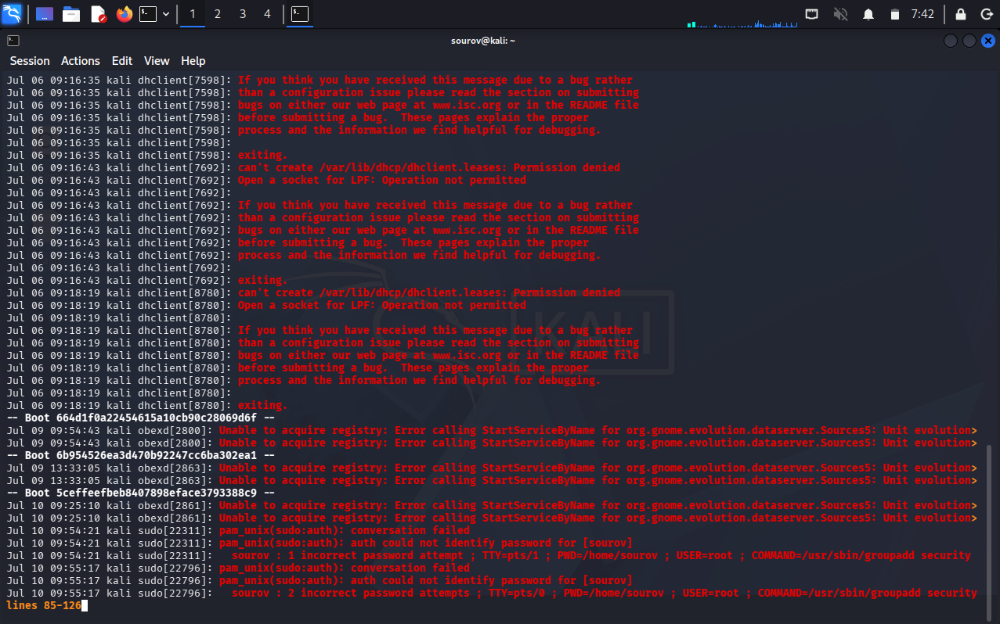
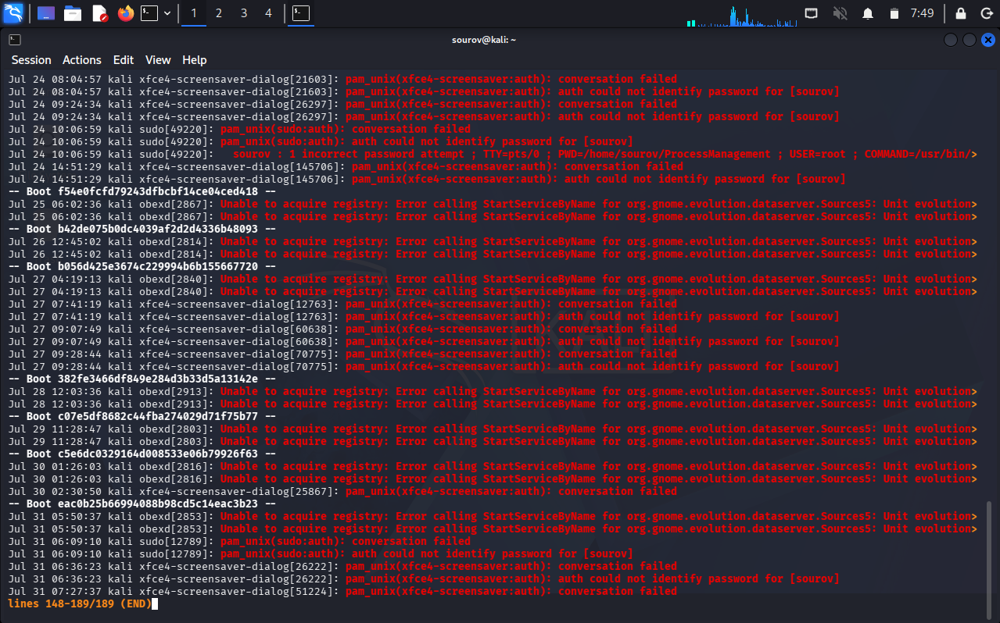


### 4. 🔍 Advanced `journalctl` Querying Techniques

* **Human-Language Time Queries (`--since`):**
* Syntax: `journalctl --since "24 hours ago"`


* **Quiet Flag (`-q`):**
* Suppresses noisy, non-essential status lines, headers, and metadata to lower terminal noise and footprint.
* Command: `journalctl -q --since "24 hours ago"`


* **Querying Events by User ID (`_UID`):**
* Filter journal events based on the user account that triggered them (Root UID = `0`, Default standard user UID = `1000`).
* Command: `journalctl _UID=1000 --since "24 hours ago"`


* **Kernel Ring Buffer / Message Filtering (`-k`):**
* Kernel controls core OS execution; `-k` focuses strictly on kernel-level logs (e.g., hardware/RAM maps, driver initializations).
* Command: `journalctl -k --since "24 hours ago"`


Example — Querying logs triggered by User ID `1000` from the past 24 hours in quiet mode:

```bash
journalctl _UID=1000 -q --since "24 hours ago"

```
#### 🖼️ Terminal Command
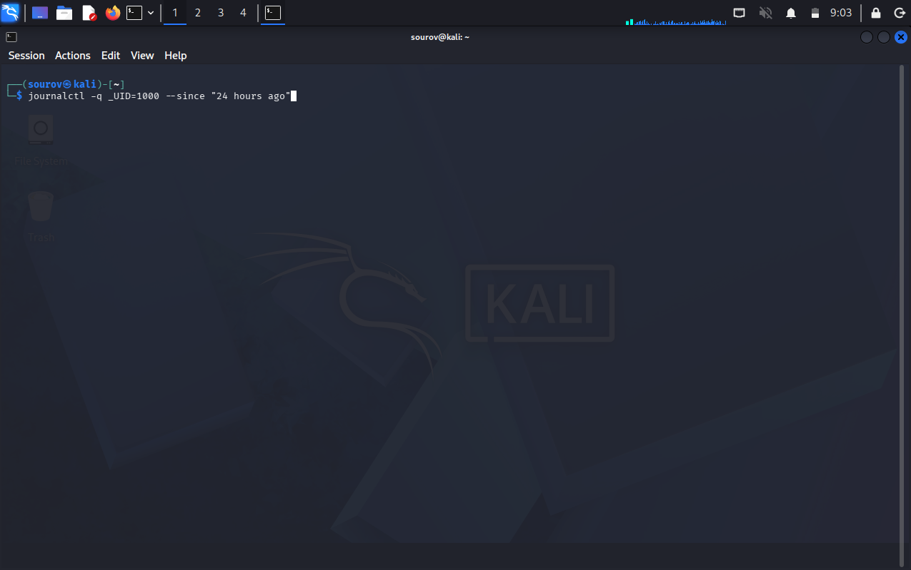

#### 🖼️ Terminal Output
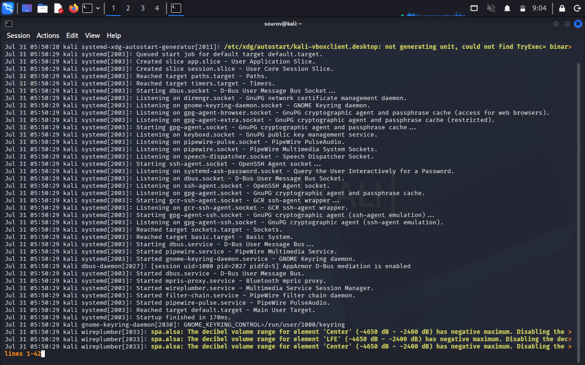
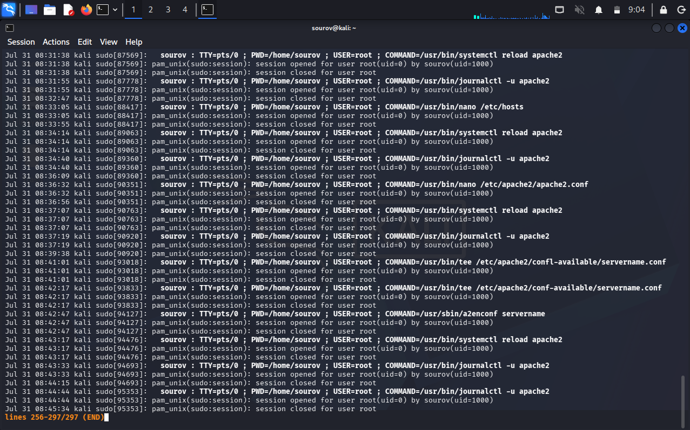

---

Example — Viewing kernel-level ring buffer messages (`-k`):

```bash
journalctl -k --since "24 hours ago"

```
#### 🖼️ Terminal Command
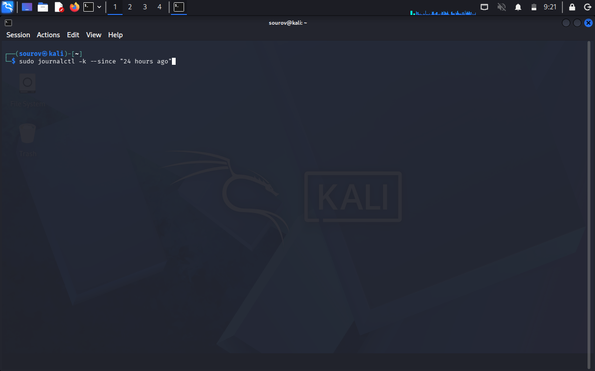

#### 🖼️ Terminal Output


---

### 5. 🧹 Anti-Forensics: Log Vacuuming and Multi-Pass Shredding

* **Selective Log Vacuuming (`--vacuum-time`):**
* Deletes archived journal files older than a specified relative timeframe (requires `sudo`/root).
* Example (Purge Apache web server logs from past day):

```bash
sudo journalctl -u apache2 --vacuum-time=1d

```
#### 🖼️ Terminal Command
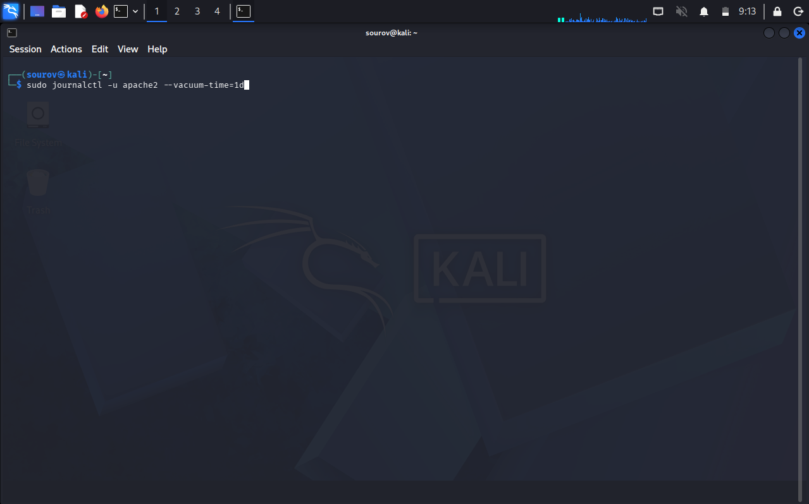

#### 🖼️ Terminal Output
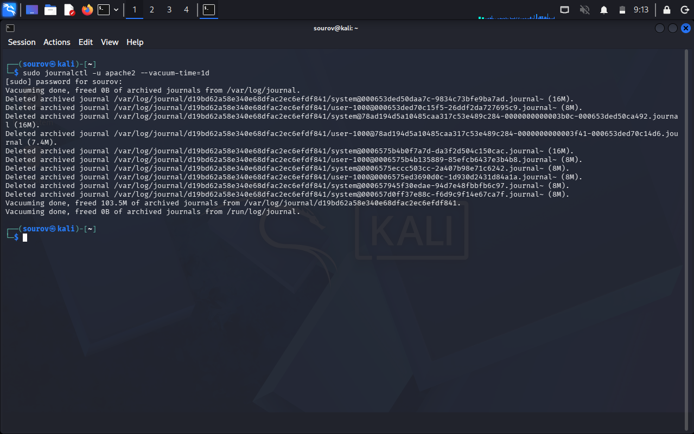


* **Mechanics of Standard Deletion vs. Secure Overwriting (`shred`):**
* **`rm` Utility:** Unlinks file pointers in the filesystem metadata, but leaves raw binary data intact on disk until overwritten.
* **`shred` Utility:** Overwrites targeted disk blocks multiple times with random patterns to defeat forensic recovery tools.
* **Default Behavior:** Overwrites files **4 times** if no pass count is explicitly set.


* **`shred` Command Options & Syntax:**
* **Basic Syntax:** `shred <FILE>`
* **Options:**
* `-f` (`--force`): Forces a permission change on target files to allow overwriting if write access is denied.
* `-n` (`--iterations`): Specifies the exact number of overwrite iterations (e.g., `-n 10`).


* **Multi-Pass Directory Wiping Execution:**
```bash
kali > sudo shred -f -n 10 /var/log/journal/subdirectory name*.*

```


* **Verification:** Viewing a shredded log file (e.g., `mousepad /var/log/journal/filename`) displays unreadable binary garbage.

#### 🖼️ Terminal Output

---

### 6. 🚫 Neutralizing Logging (`Storage=null`)

* **Concept:**
* Redirects incoming log streams directly to a null sink (`/dev/null`) rather than writing log entries to disk.


* **Configuration File Location:**
* `/etc/systemd/journald.conf`


* **Operational Execution Steps:**
1. Open configuration file with elevated privileges:
```bash
kali > sudo mousepad /etc/systemd/journald.conf

```


2. Edit directive under the `[Journal]` section header:
* **Default line:** `#Storage=auto`
* **Updated line:** `Storage=null` *(Remove leading `#` comment symbol)*.


3. Reload service to apply changes immediately:
```bash
kali > sudo systemctl restart systemd-journald

```


* **Outcome:**
* The system halts writing logs to disk until the daemon configuration is restored and restarted.


#### 🖼️ Terminal Output

---

## 🛠️ Utilities & Tool Reference

| Tool / File | Syntax / Example | Description |
| --- | --- | --- |
| `journalctl` | `journalctl -u ssh -S "1 hour ago"` | Central CLI utility to view and filter binary logs managed by systemd. |
| `journald.conf` | `/etc/systemd/journald.conf` | Primary configuration file defining logging behavior and storage targets. |
| `shred` | `shred -f -n 10 /path/to/log` | Overwrites files multiple times with random patterns to block forensic recovery. |
| `systemctl` | `sudo systemctl restart systemd-journald` | Control daemon used to restart services and reload configuration updates. |

---

## 🔑 Key Takeaways for Revision

1. **Syslog vs. Journald Storage Formats:**

$$\text{syslogd } \longrightarrow \text{Plain-Text Files } (/var/log)$$


$$\text{systemd-journald } \longrightarrow \text{Binary Files } (/var/log/journal/)$$


2. **Priority Code Scale:** Lower numerical priority numbers equal higher severity levels:

$$0 \text{ (emerg)} > 1 \text{ (alert)} > 2 \text{ (crit)} > 3 \text{ (err)} > 4 \text{ (warning)} > 5 \text{ (notice)} > 6 \text{ (info)} > 7 \text{ (debug)}$$


3. **Forensic Overwrite Difference:**

$$\texttt{rm} \longrightarrow \text{Unlinks metadata pointers (Data recoverable)}$$


$$\texttt{shred -f -n <passes>} \longrightarrow \text{Multi-pass bitwise overwrite (Data unrecoverable)}$$


4. **Complete Log Suppression Directive:** Set `Storage=null` in `/etc/systemd/journald.conf` and restart `systemd-journald`.

---
