# 🐧 Day 25 : Using and Abusing Services (Part 01)

Welcome to Day 25 of my Linux Security learning journey. This document covers background service management mechanics using `systemctl` and legacy `service`, setting up and customizing an Apache2 HTTP web server for payload delivery and phishing, and constructing a covert remote surveillance node using OpenSSH and a Raspberry Pi ("Raspberry Spy Pi").

---

## 🎯 Key Points & Core Concepts

### 1. ⚙️ Introduction to Linux Services

* **What is a Service?**
* A daemon or background process that runs continuously on a Linux operating system.
* Stays in a passive listening state until triggered by user requests or network triggers.
* Fundamental to hosting infrastructure, remote administration, and red team post-exploitation.


* **Core Services in Penetration Testing & Ethical Hacking:**
* **Apache HTTP Server:** World's most widely deployed web server. Used for serving web applications, hosting malicious payloads, and rendering credential-harvesting phishing portals.
* **OpenSSH:** Secure encrypted remote terminal daemon replacing legacy unencrypted protocols (Telnet, RSH).
* **MySQL / MariaDB:** Relational Database Management System (RDBMS) backing web applications and database-driven dynamic content.
* **PostgreSQL:** Advanced open-source enterprise RDBMS used for backend data storage and security logging infrastructure.


---

### 2. 🎮 Service Management Mechanics (`systemctl` vs. `service`)

Linux uses two primary frameworks for service initiation and runtime control:

* **Legacy Framework (`service`):** SysVinit initialization scheme. Syntax: `service <servicename> <action>`
* **Modern Framework (`systemctl`):** Systemd service supervisor. Syntax: `sudo systemctl <action> <servicename>`

#### Service Management Command Matrix

| Action | Legacy Syntax (`service`) | Modern Syntax (`systemctl`) |
| --- | --- | --- |
| **Start Service** | `service apache2 start` | `sudo systemctl start apache2` |
| **Stop Service** | `service apache2 stop` | `sudo systemctl stop apache2` |
| **Restart Service** | `service apache2 restart` | `sudo systemctl restart apache2` |
| **Check Status** | `service apache2 status` | `sudo systemctl status apache2` |
| **Enable on Boot** | `update-rc.d apache2 enable` | `sudo systemctl enable apache2` |


**Start Service**
```bash
sudo systemctl start apache2

```
#### 🖼️ Terminal Command
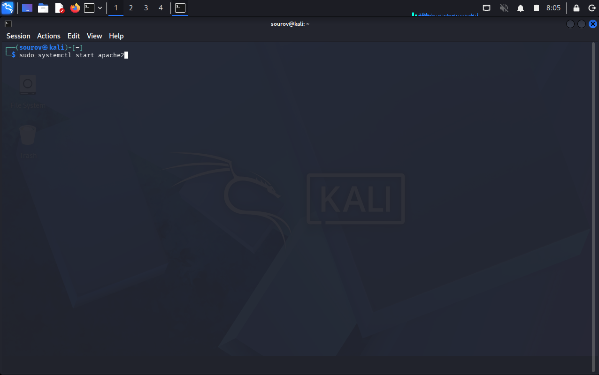

#### 🖼️ Terminal Output
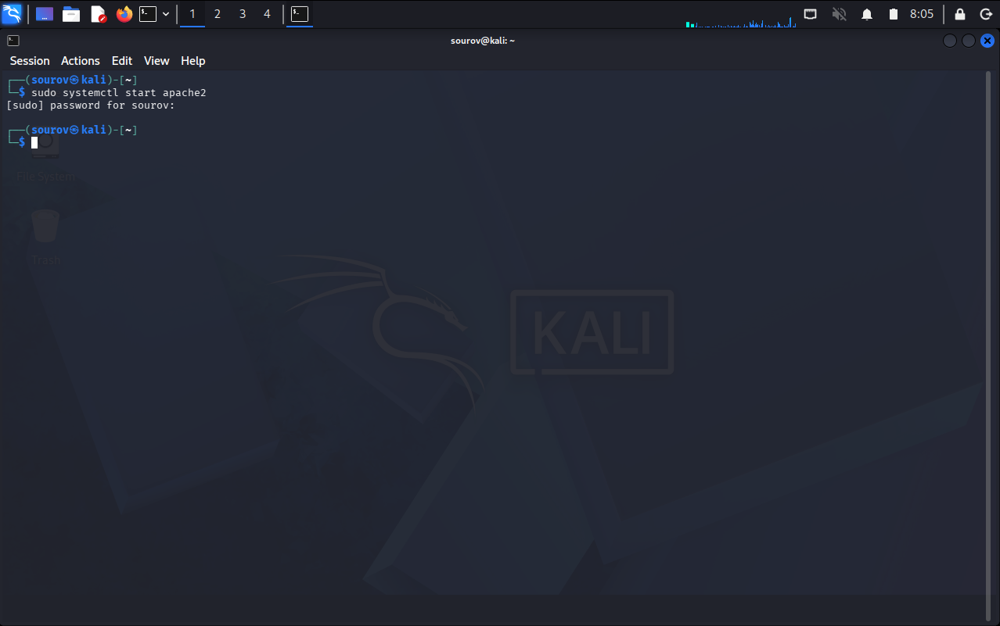
  
**Stop Service**
```bash
sudo systemctl stop apache2

```
#### 🖼️ Terminal Command
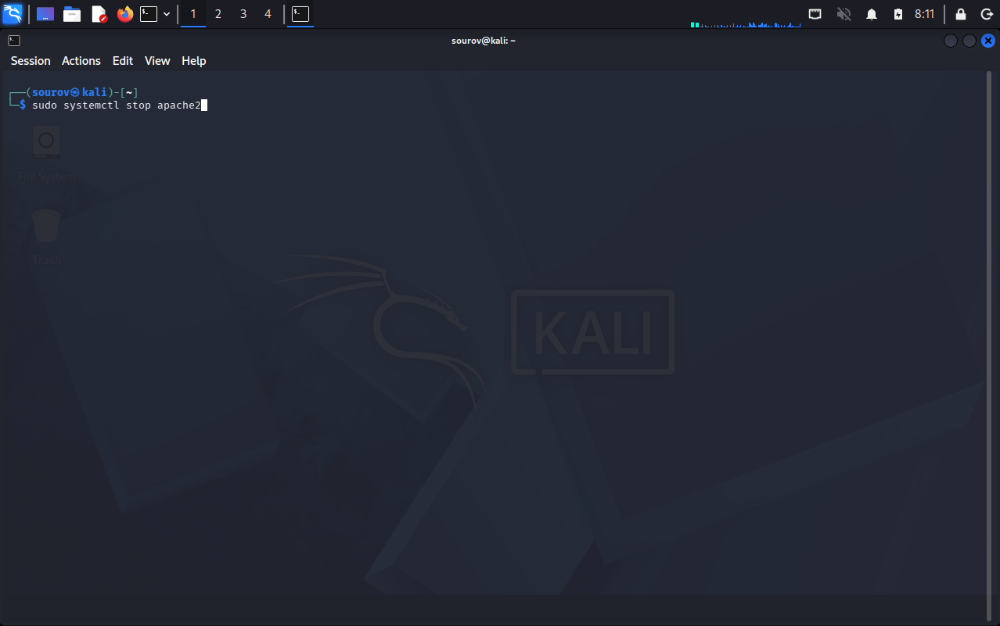

#### 🖼️ Terminal Output
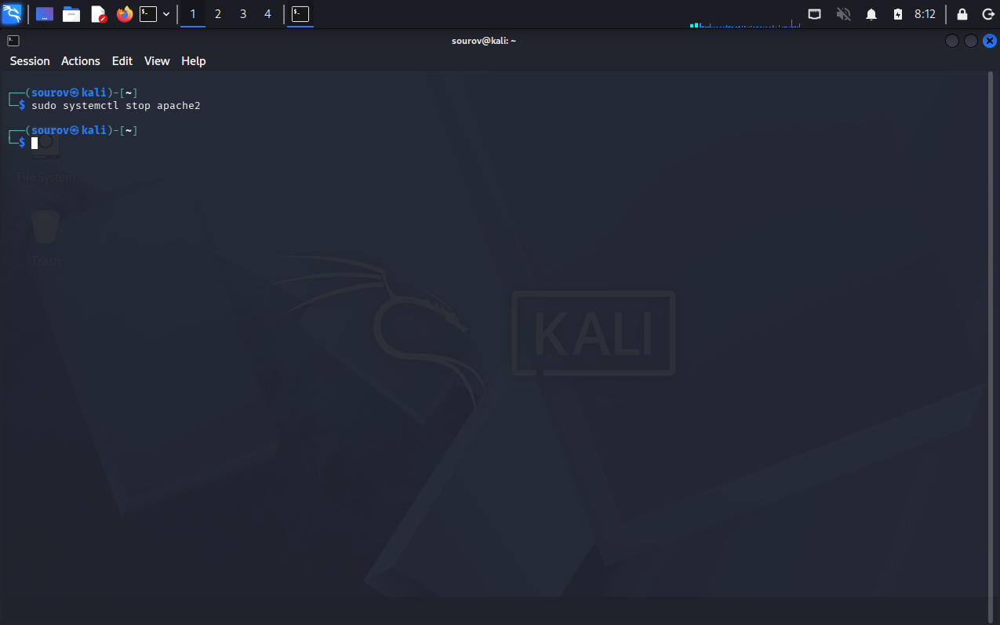
  
**Stop Service**
```bash
sudo systemctl restart apache2

```
#### 🖼️ Terminal Command
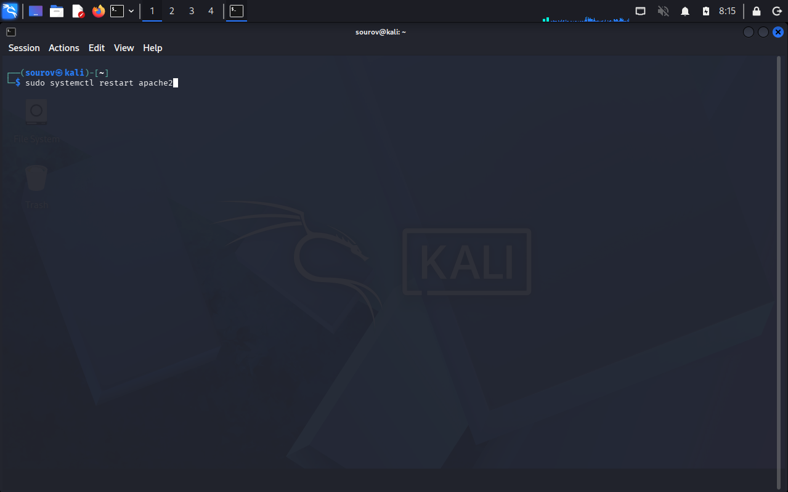

#### 🖼️ Terminal Output
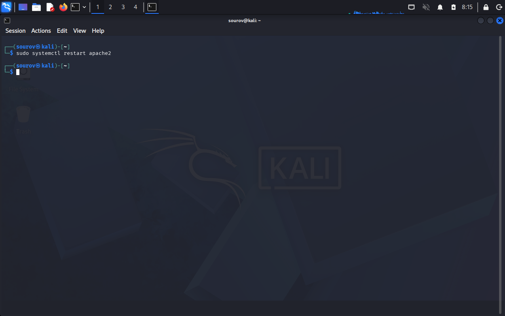

 
> 📌 **Critical Architectural Rule:** Modifying a service configuration file on disk (e.g., `/etc/apache2/apache2.conf`) does **not** alter the running process. You MUST restart (`restart`) or reload (`reload`) the service daemon to force it to re-read configuration changes from disk into volatile RAM memory.

---

### 3. 🌐 Creating an HTTP Web Server with Apache

* **Industry Footprint:**
* Powers ~55% of web infrastructure globally.
* Mastery of Apache setup and configuration is mandatory for web application assessments and red team payload delivery.


* **Offensive Applications:**
* **Payload Delivery:** Hosting reverse shells, exploits, or executable payloads for delivery via Cross-Site Scripting (XSS) or social engineering.
* **Phishing Clones:** Mirroring legitimate authentication portals locally to harvest credentials.
* **Traffic Redirection:** Combining cloned sites with local DNS Spoofing / Poisoning to capture targets on local networks.


* **Common Web Application Stacks:**
* **LAMP Stack (Linux):** Linux OS + Apache Web Server + MySQL Database + PHP/Python.
* **WAMP Stack (Windows):** Windows OS + Apache Web Server + MySQL Database + PHP/Python.


#### Apache Setup & Custom Web Content Deployment

1. **Installation:**
```bash
sudo apt install apache2

```
#### 🖼️ Terminal Command

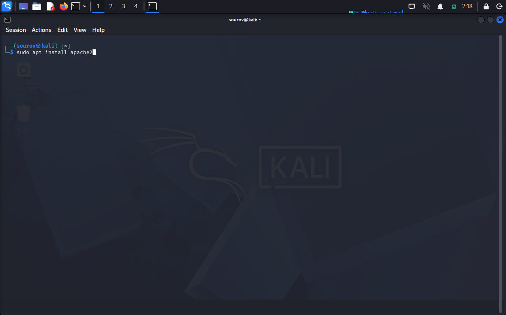

2. **Execution & Status Verification:**
```bash
sudo systemctl start apache2
sudo systemctl status apache2

```
#### 🖼️ Terminal Command
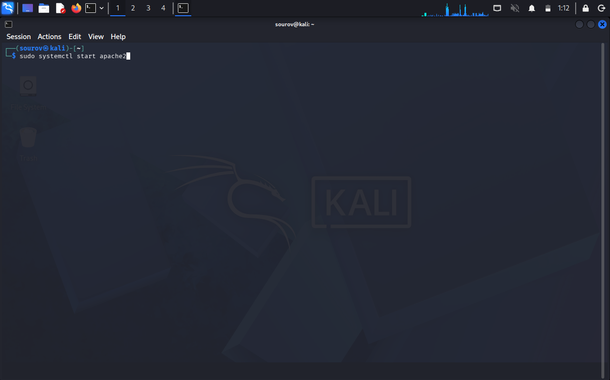

#### 🖼️ Terminal Output

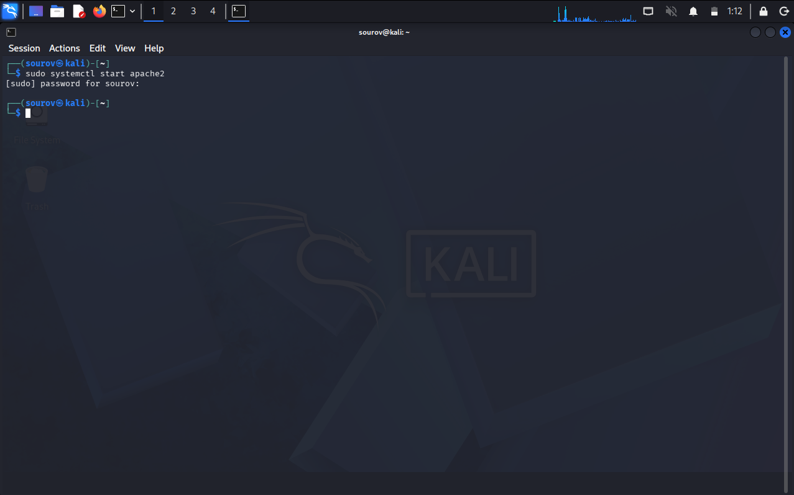

#### 🖼️ Terminal Command


#### 🖼️ Terminal Output
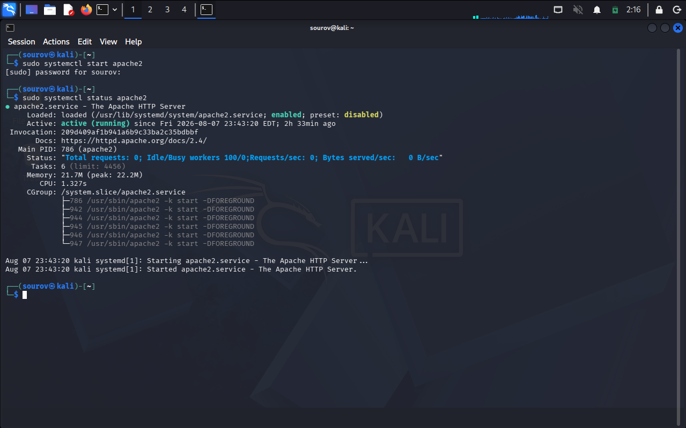


3. **Browser Verification:**
Navigate to `http://localhost/` or `[http://127.0.0.1/](http://127.0.0.1/)` in a web browser. A default installation renders the page: *"Apache2 Debian Default Page: It works"*.

#### 🖼️ Terminal Output

---

#### Custom Web Content Customization

* **Default Web Root Directory:** `/var/www/html/`
* **Default Landing Entry Point:** `/var/www/html/index.html`
* **Editing Command:**
```bash
sudo mousepad /var/www/html/index.html

```
#### 🖼️ Terminal Command
[mousepad index.html command](Screenshot/mousepad-index.html-command.png)

Example — Overwriting `/var/www/html/index.html` with custom HTML payload:

```html
<html>
  <body>
    <h1>Hackers-Arise Is the Best!</h1>
    <p>If you want to learn hacking, Hackers-Arise.com is the best place to learn hacking!</p>
  </body>
</html>

```

After saving the file, refresh `http://localhost/` to view the updated web page.

#### 🖼️ Terminal Output
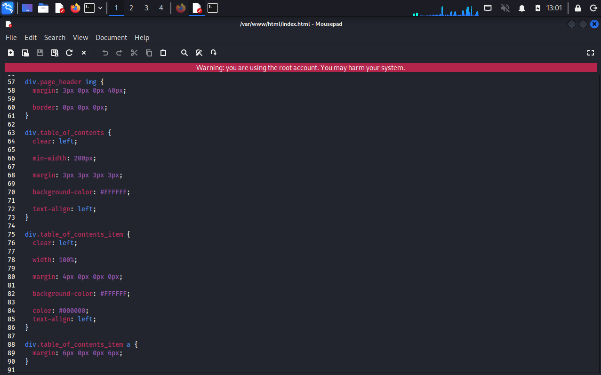
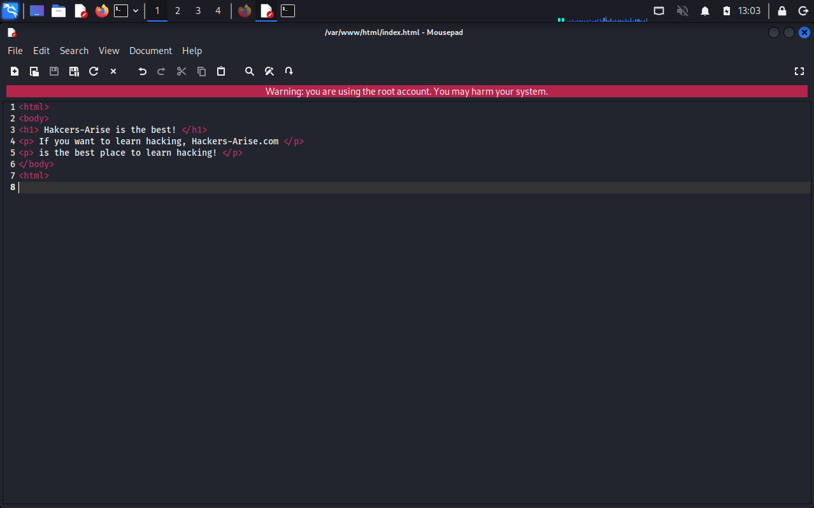


---

### 4. 📹 Remote Access & Surveillance via OpenSSH ("Raspberry Spy Pi")

* **SSH Protocol Mechanics:**
* Operates on default TCP Port 22.
* Provides encrypted replacement for insecure legacy utilities like Telnet and RSH.
* **Security Features:** Access Control Lists (ACLs), public/private key pairs or password authentication, end-to-end traffic encryption.
* **Local Service Execution:**
```bash
sudo systemctl start ssh

```


#### The "Raspberry Spy Pi" Surveillance Node

Transforming a low-cost, ARM-based single-board computer into an un-attributable, remote-controlled surveillance platform.

* **Hardware Specs:**
* Raspberry Pi board (~$50)
* Dedicated Raspberry Pi Camera Module (~$15)


* **Operating System:** Raspberry Pi OS (formerly Raspbian — Debian ARM port).
* **Legacy Default Credentials:** Username: `pi` | Password: `raspberry`

#### Step-by-Step Deployment Architecture

```
+------------------------+      SSH (Port 22)      +---------------------------------+
|   Kali Linux Machine   | ----------------------> |    Raspberry Spy Pi (Target)    |
| (Attacker / Controller)|                         |   IP: 192.168.1.101                 |
+------------------------+                         +---------------------------------+
                                                                   |
                                                                   v
                                                        +--------------------+
                                                        |  Camera Module     |
                                                        |  (Captures Image)  |
                                                        +--------------------+

```

1. **Attach Camera Module & Power On:** Shut down hardware before connecting camera ribbon.
Ensure the Raspberry Pi is completely powered down. Insert the camera ribbon cable securely into the dedicated camera interface slot on the board.

> ⚠️ **CRITICAL WARNING:** The camera module and ribbon contacts are sensitive to electrostatic discharge and shorts. Never allow bare camera leads or circuit components to make contact with energized GPIO pins.

Power on the Raspberry Pi once the ribbon cable is locked into place.


2. **Enable SSH & Identify IP Address:** CLI / GUI configuration.
Enable the SSH daemon via the Raspberry Pi GUI (**Preferences $\rightarrow$ Raspberry Pi Configuration $\rightarrow$ Interfaces $\rightarrow$ Enable SSH**) or execute `sudo systemctl start ssh` inside the terminal.

Obtain the local network private IP address:

```bash
pi@raspberrypi:~ $ ifconfig

```

*(Assuming IP is identified as `192.168.1.101`)*


3. **Establish Remote SSH Connection from Kali:** Connect over TCP Port 22.
From your Kali Linux host terminal, initiate an SSH shell session targeting the Pi's private IP address:

```bash
ssh pi@192.168.1.101

```

When prompted, enter the SSH password (`raspberry`).


4. **Enable Camera Interface via raspi-config:**
Inside the remote SSH terminal session, launch the hardware configuration tool:

```bash
pi@raspberrypi:~ $ sudo raspi-config

```

Navigate to **Option 6 (Interface Options)** $\rightarrow$ **Enable Camera** $\rightarrow$ **Enable**. Save configuration and permit the unit to reboot when prompted.


5. **Capture Remote Snapshot via SSH:**
Re-establish your remote SSH session after the reboot completes (`ssh pi@192.168.1.101`). Execute the camera capture utility:

* **Legacy Raspbian Command (`raspistill`):**

```bash
pi@raspberrypi:~ $ raspistill -v -o firstpicture.jpg

```

* `-v` = Enables detailed verbose diagnostic output.
* `-o` = Specifies output filename and target location.
* **Modern Raspberry Pi OS Command (`rpicam-still`):**

```bash
pi@raspberrypi:~ $ rpicam-still --output firstpicture.jpg

```

Verify image write operation:

```bash
pi@raspberrypi:~ $ ls -l firstpicture.jpg

```


#### 🖼️ Terminal Output

---

## 🛠️ Utilities & Command Reference

| Command / Utility | Syntax Example | Primary Purpose / Description |
| --- | --- | --- |
| **`systemctl`** | `sudo systemctl start apache2` | Modern Systemd service controller utility. |
| **`service`** | `service apache2 status` | Legacy SysVinit service execution script. |
| **`apache2`** | `sudo apt install apache2` | Open-source HTTP web server daemon. |
| **`ssh`** | `ssh pi@192.168.1.101` | Secure Shell client for encrypted remote terminal access. |
| **`raspi-config`** | `sudo raspi-config` | Console configuration menu for Raspberry Pi hardware and interfaces. |
| **`raspistill`** | `raspistill -v -o image.jpg` | Legacy CLI camera snapshot utility for Raspbian OS. |
| **`rpicam-still`** | `rpicam-still --output image.jpg` | Modern CLI camera capture utility for Raspberry Pi OS. |

---

## 🔑 Key Takeaways for Revision

1. **Config Modification vs. RAM State:**

$$\text{Editing } \texttt{/etc/apache2/apache2.conf} \implies \text{Disk modified ONLY}$$


$$\text{Execute } \texttt{sudo systemctl restart apache2} \implies \text{Configuration loaded into active RAM}$$


2. **Default Web Directories:**
* Apache Web Root: `/var/www/html/`
* Primary Web Page: `/var/www/html/index.html`


3. **Hardware Precaution:** Never short camera ribbon cables or module contacts across active Raspberry Pi GPIO pins.
4. **Camera CLI Capture Commands:**

$$\text{Legacy Raspbian } \longrightarrow \texttt{raspistill -v -o <filename.jpg>}$$


$$\text{Modern Raspberry Pi OS } \longrightarrow \texttt{rpicam-still --output <filename.jpg>}$$


---

