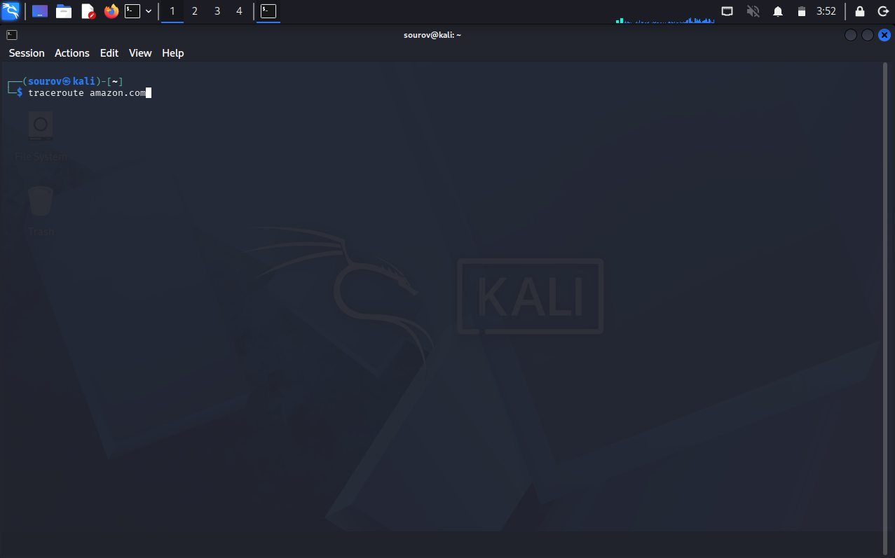
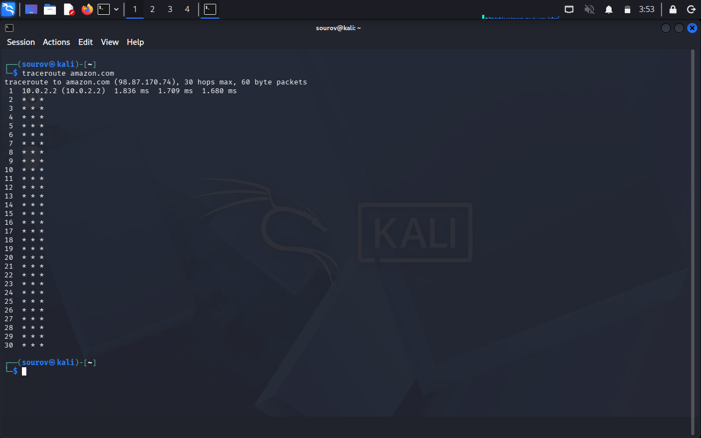
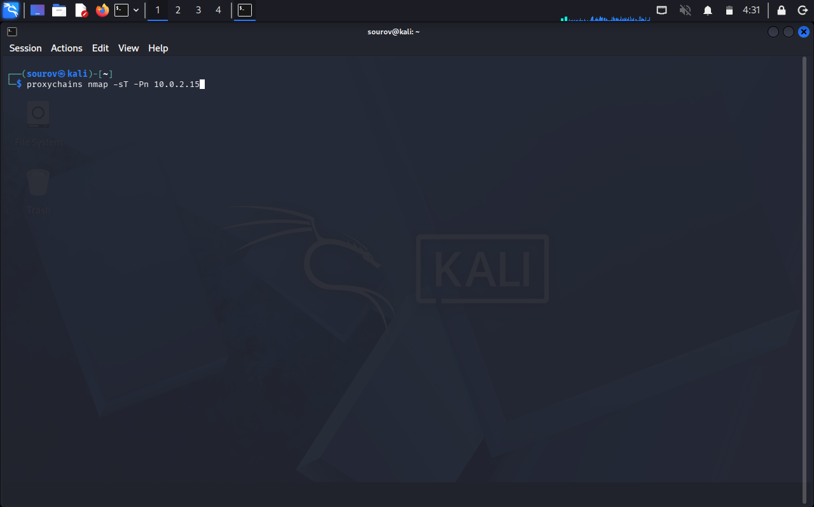
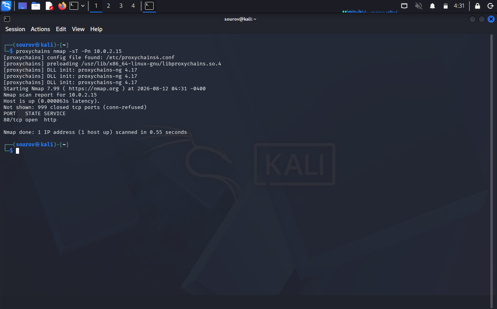

# 🐧 Day 27 : Becoming Secure and Anonymous(Part-01)

Welcome to Day 27 of my Linux Security learning journey. This document covers background mechanics of online tracking, network surveillance, packet routing vulnerabilities, and practical privacy tools including **The Onion Router (Tor)** and **ProxyChains** for penetration testing and privacy preservation.

---

## 🎯 Key Points & Core Concepts

### 1. ⚙️ Introduction: The Need for Anonymity and Security

* **Current Internet Surveillance Landscape:** Nearly everything done on the internet is tracked by commercial entities (e.g., Google) and state surveillance agencies (e.g., NSA). Activities are recorded, indexed, and mined.
* **Critical Need:** Hackers, security professionals, and privacy-conscious individuals must understand how to limit tracking and remain anonymous.
* **Four Core Methods for Anonymous Navigation:**
1. The Onion Router (Tor) Network
2. Proxy Servers
3. Virtual Private Networks (VPNs)
4. Private Encrypted Email / Messaging


* **Important Caveat:** No single method guarantees $100\%$ protection. Given enough time and resources, anything can be tracked. These tools significantly increase the adversary's difficulty level.

---

### 2. 🏛️ How the Internet Gives Us Away

#### Primary Tracking Mechanisms

* **IP Address Identification:** Your IP address uniquely identifies you across the internet. All network packets are tagged with your source IP, making activity easy to trace.
* **Email Service Tracking:** Providers inspect email content and metadata to serve targeted advertisements and build user profile graphs.
* **Packet Journey & Interception:** Packets traverse multiple routers (typically 15 to 30 hops). Interceptors can read source and destination addresses to log activity and auto-login users.

#### Tracing Packet Routes with `traceroute`

The `traceroute` utility displays the layer-3 hop-by-hop route packets take to reach a destination.

```bash
traceroute google.com

```
#### 🖼️ Terminal Command



#### 🖼️ Terminal Output



---

### 3. 🔑 The Onion Router System (Tor)

#### Historical Origins

* **1990s Development:** Initiated by the US Office of Naval Research (ONR) for anonymous internet navigation and intelligence operations.
* **2002 Public Release:** Released publicly as "The Onion Router (Tor) Project."

#### How Tor Works

* **Core Architecture:** Uses a global network of over 7,000 volunteer-operated relays independent of regular internet infrastructure.
* **Encryption Mechanism:** Encrypts data in multiple layers (like an onion). Each hop decrypts only its designated layer to reveal **only** the previous and next hops.
* **Anonymity Protection:** No single router in the chain knows both the origin IP and final destination IP simultaneously.

```
+------------------+     Layer 1 Encrypted     +-------------------+
|  Client Machine  | ------------------------> |   Guard / Entry   |
| (Originating IP) |                           |       Node        |
+------------------+                           +-------------------+
                                                         |
                                                 Layer 2 Encrypted
                                                         |
                                                         v
+------------------+      Unencrypted Payload     +-------------------+
| Target Web Server| <--------------------------- |     Exit Node     |
| (Destination IP) |                              | (Decrypts Layer)  |
+------------------+                              +-------------------+

```

#### Installing and Accessing Tor

1. **1. Download & Install Tor Browser:** Download from torproject.org.
Obtain the official binary package from the Tor Project website and run the installer.


2. **2. Establish Tor Connection:** Construct 3-hop relay circuit.
Launch the browser to connect to the network consensus and build an encrypted circuit (Guard $\rightarrow$ Middle $\rightarrow$ Exit).


3. **3. Navigate Anonymously:** Surface web or .onion sites.
Browse regular web pages or enter hidden service URLs ending in the `.onion` TLD.


#### ⚠️ Security Concerns & Limitations

* **Performance Penalty:** Browsing is significantly slower due to multi-hop relay processing and bandwidth limits.
* **Malicious Exit Nodes:** Traffic exiting unencrypted (HTTP) at the final node can be read by whoever controls that exit node.
* **Traffic Correlation Attacks:** Sophisticated adversaries (e.g., NSA) analyze timing and traffic volume patterns at entrance and exit points to correlate users.

---

### 4. 🛠️ Proxy Servers for Anonymity

#### Core Concepts & Logging

* **Proxy Server:** An intermediate system acting as a middleman. The target website sees the proxy's IP address instead of your real IP.
* **Logging Risks:** Proxy providers may log connection details (timestamps, IP addresses, targets). Reliability depends on provider policies and jurisdiction.

#### Proxy Chains Architecture

* **Strategy:** Routing traffic sequentially through multiple proxies (`User` $\rightarrow$ `Proxy1` $\rightarrow$ `Proxy2` $\rightarrow$ `Proxy3` $\rightarrow$ `Target`).
* **Security Benefit:** An investigator must obtain logs from every proxy in the chain to trace back to the original source.

#### Using ProxyChains in Kali Linux

`ProxyChains` is a built-in Kali utility that forces TCP connections made by CLI tools through user-configured proxy chains.

* **Basic Syntax:**
```bash
proxychains <command_to_proxy> <arguments>

```


* **Practical Example (Anonymous Nmap Scan):**
```bash
proxychains nmap -sT -Pn 10.0.2.15

```
#### 🖼️ Terminal Command



#### 🖼️ Terminal Output



* `-sT`: Executes a full TCP Connect scan (required for proxying).
* `-Pn`: Disables ICMP ping (prevents leaking real IP outside the proxy).


---

### 5. 🗺️ Conceptual Comparison (Tor vs. Proxy vs. VPN)

| Feature / Metric | Tor Network 🧅 | Proxy Servers / Chains 🔀 | Virtual Private Network (VPN) 🛡️ |
| --- | --- | --- | --- |
| **Architecture** | 3-hop volunteer relay circuit | Single proxy or chain of proxies | Single encrypted tunnel to provider |
| **Encryption** | Multi-layered end-to-end | None to moderate (SOCKS/HTTP) | Strong full-tunnel encryption |
| **Anonymity Level** | High (Resists commercial tracking) | Moderate (Relies on provider logs) | Low-Moderate (Must trust provider) |
| **Speed & Bandwidth** | Low (High latency) | Moderate to High | High (Suitable for daily use) |
| **Best Used For** | High-risk browsing & `.onion` sites | Tool traffic redirection (`ProxyChains`) | Daily encrypted network connection |

---

### 🛠️ Utilities & Command Reference

| Utility / Command | Syntax Example | Primary Purpose / Description |
| --- | --- | --- |
| **`traceroute`** | `traceroute google.com` | Displays complete network route and hop count to destination. |
| **`proxychains`** | `proxychains nmap -sT -Pn <IP>` | Routes CLI command traffic through configured proxy chain. |
| **`nmap` (-sT)** | `nmap -sT -Pn <IP>` | Performs full TCP Connect scan compatible with proxy routing. |
| **`Tor Browser`** | Download from torproject.org | Provides anonymous web browsing and dark web access (.onion). |

---

### 🔑 Key Takeaways for Revision

* **IP Address Identification:** Reveals user location and is the primary tracking vector.
* **Hop Exposure Rule:** Intermediate Tor routers only know the IP address of the previous and next hop.
* **ProxyChains Requirement:** Raw socket scans (`nmap -sS`) fail over SOCKS proxies; always use full TCP Connect scans (`-sT`).
* **Tor Performance Tradeoff:** Slower browsing speeds due to volunteer bandwidth and multi-layer encryption.
* **Command Routing Formula:**

$$\text{Command Execution } \longrightarrow \texttt{proxychains <tool> <flags> <target\_IP>}$$

---
