# 🐧 Day 31 : Managing the Linux Kernel & Loadable Kernel Modules

Welcome to Day 31 of my Linux Security learning journey. This document covers background mechanics of Linux operating system architecture, execution spaces, Loadable Kernel Modules (LKMs), kernel version identification, runtime tuning using `sysctl`, and LKM management commands for penetration testing and system administration.

---

## 🎯 Key Points & Core Concepts

### 1. ⚙️ Operating System Architecture: Kernel Space vs. User Space

#### Privileged Execution Domains

An operating system isolates hardware resources into two distinct operational spaces to preserve system stability and security boundary enforcement.

```
+-----------------------------------------------------------------+
|                        USER LAND / SPACE                        |
|  (Applications, Web Browsers, User Commands, Unprivileged Apps) |
+-----------------------------------------------------------------+
                                |
                   System Calls | (Protected Boundary)
                                v
+-----------------------------------------------------------------+
|                          KERNEL SPACE                           |
|    (Memory Management, CPU Control, Hardware Drivers, Storage)  |
+-----------------------------------------------------------------+
                                |
                                v
+-----------------------------------------------------------------+
|                        PHYSICAL HARDWARE                        |
|                 (CPU, RAM, Hard Drives, GPU, NIC)               |
+-----------------------------------------------------------------+

```

#### Operational Domain Breakdown

* **Kernel Space (Privileged Ring 0):** The central core of the OS that directly interfaces between user applications and physical hardware. It manages system memory, CPU execution scheduling, device drivers, filesystems, and low-level I/O. Access is restricted strictly to root or privileged system tasks. Access to kernel space grants unrestricted control over the entire host.
* **User Space / User Land (Unprivileged Ring 3):** An isolated execution environment where standard applications, user services, and unprivileged commands run. Isolation ensures that application crashes or memory violations do not compromise the stability of the core operating system.

---

### 2. 🏛️ Loadable Kernel Modules (LKMs) & Security Implications

#### Monolithic Design & Dynamic Extensibility

Linux uses a monolithic kernel architecture. While traditional monolithic kernels required complete recompilation and a system reboot to add new capabilities, modern Linux supports **Loadable Kernel Modules (LKMs)** to dynamically extend kernel functionality at runtime without rebooting.

#### Common LKM Applications

* **Device Drivers:** Graphics cards (GPUs), Bluetooth adapters, USB controllers, wireless cards.
* **Filesystem Drivers:** Support for ext4, NTFS, Btrfs, and network filesystems.
* **Network Stack Extensions:** Custom packet filters, VPN tunnels, and firewall modules.

#### Offensive Security Implications (Kernel Rootkits)

Because LKMs operate inside Ring 0 with full kernel privileges:

* **Rootkit Vector:** Adversaries can embed malicious code inside trojanized drivers (e.g., a rogue video or network driver).
* **Total Control & Stealth:** Once a malicious LKM is inserted into kernel memory, it can hook system calls and manipulate OS reporting mechanisms—effectively hiding active processes, network connections, open sockets, files, and disk space from monitoring utilities.

---

### 3. 🔑 Kernel Version Identification & Runtime Tuning

#### Identifying Kernel Build Details

Identifying the exact kernel version, architecture, and compiler release is essential when compiling custom exploit payloads or matching kernel modules.

* **Method 1: Kernel Release Query (`uname -a`)**
```bash
uname -a

```

#### 🖼️ Terminal Command View (`uname -a`)

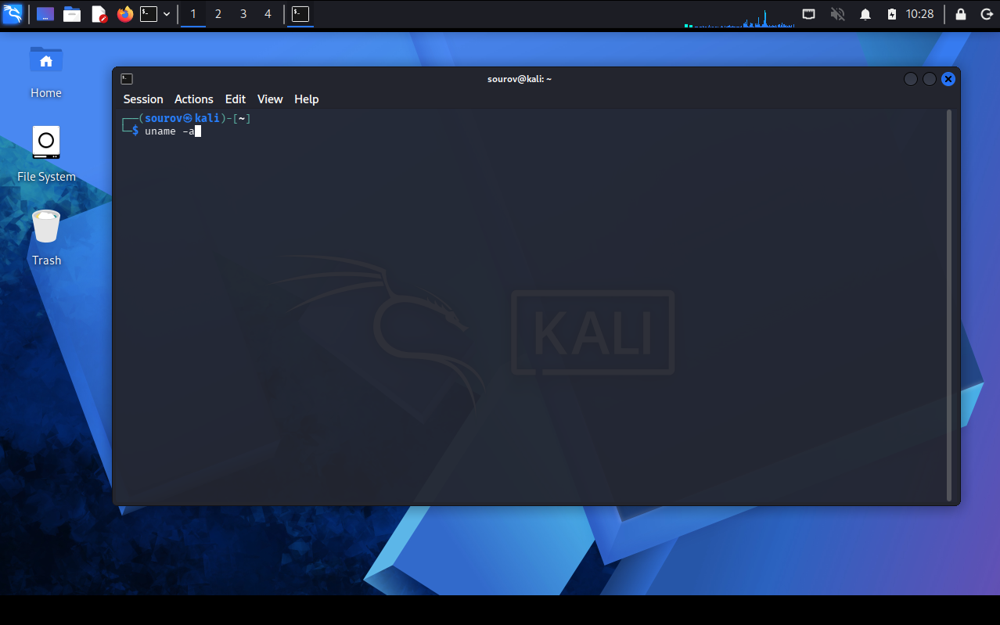

#### 🖼️ Terminal Output View (`uname -a`)

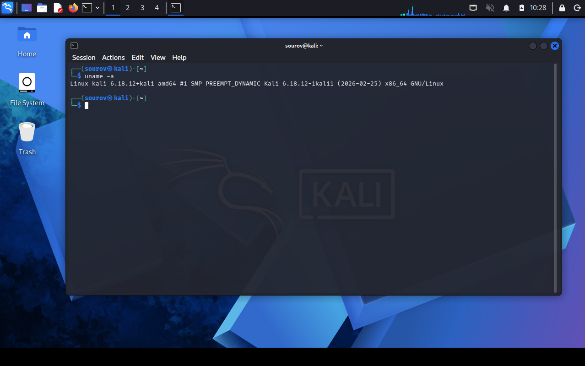


#### Output Data Breakdown:

* `Linux`: OS kernel implementation name.
* `4.19.0-kali1-amd64`: Specific kernel release version and target release build.
* `x86_64`: 64-bit CPU instruction set architecture.
* `SMP`: Symmetric Multiprocessing enabled (supports multi-core/multi-CPU configurations).
* `2019-01-03`: Precise timestamp when the kernel binary was compiled.
* **Method 2: Virtual File Inspection (`/proc/version`)**
```bash
cat /proc/version

```
#### 🖼️ Terminal Command View (`cat /proc/version`)

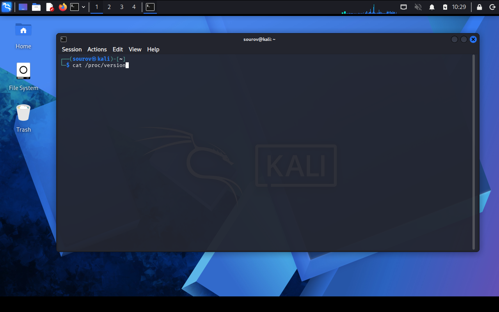

#### 🖼️ Terminal Output View (`cat /proc/version`)

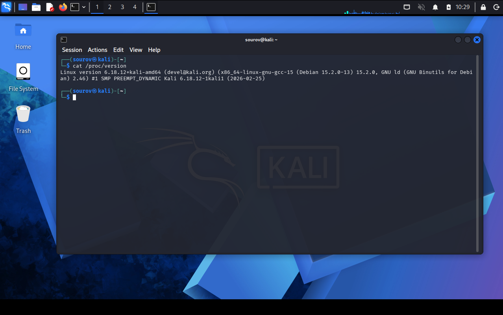

---

#### Kernel Tuning with `sysctl`

The `sysctl` utility allows administrators to inspect and modify kernel runtime parameters dynamically without rebooting the system.

> ⚠️ **Warning:** Command-line modifications via `sysctl -w` take effect immediately in volatile kernel memory, but are lost upon system reboot. Permanent configuration changes must be saved in `/etc/sysctl.conf`.

* **Listing Active Parameters:**
```bash
sysctl -a | grep ipv4 | less

```

#### 🖼️ Terminal Command

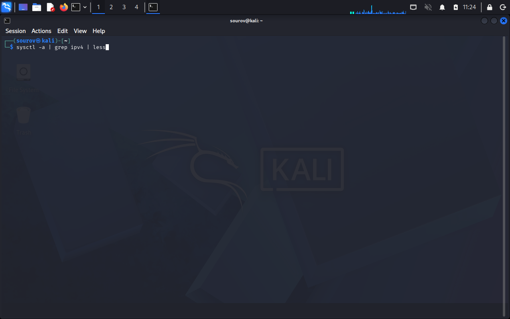

#### 🖼️ Terminal Output

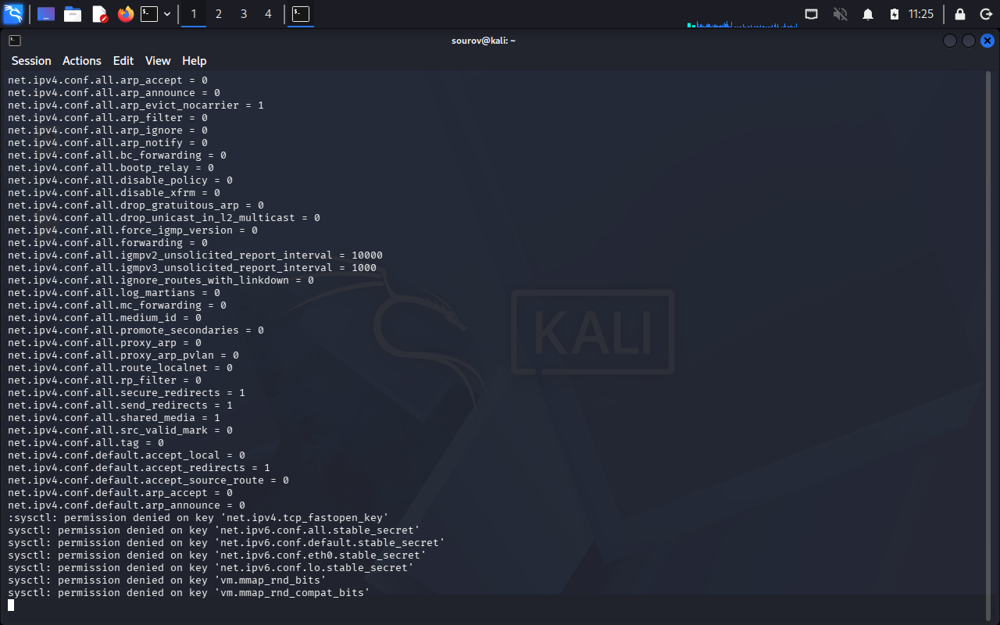

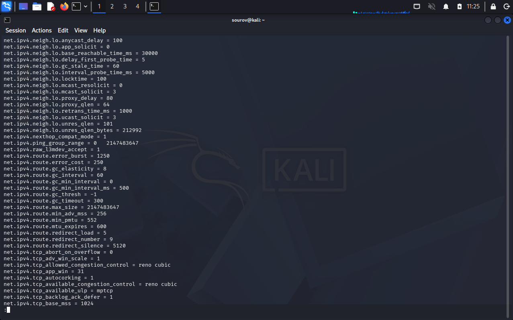

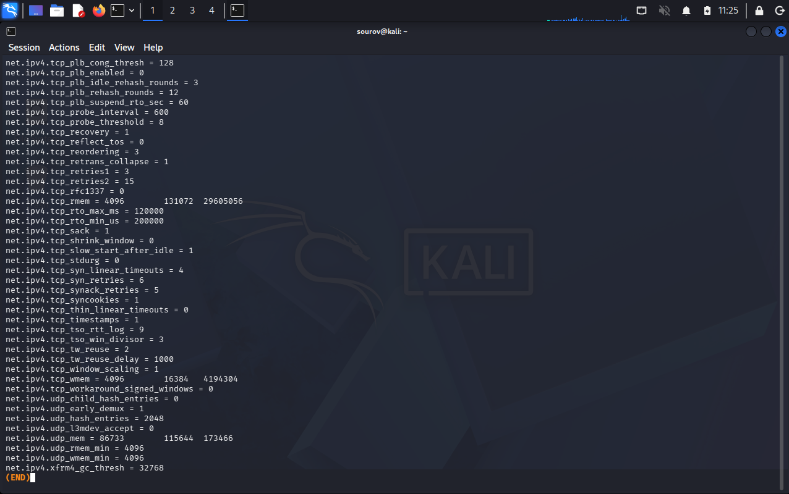

#### Case Study 1: Enabling IP Forwarding for MITM Attacks

In Man-in-the-Middle (MITM) operations (e.g., ARP spoofing), an attacker routes victim traffic through their local machine. IP Packet Forwarding must be enabled to prevent traffic drops.

* **Runtime Enablement (Temporary):**
```bash
kali > sysctl -w net.ipv4.ip_forward=1

```
#### 🖼️ Terminal Command


* **Persistent Configuration (Permanent):**
Add or edit the parameter inside `/etc/sysctl.conf`:
```ini
net.ipv4.ip_forward=1

```


#### Case Study 2: Hardening Against ICMP Echo Sweeps

To obscure a target host from automated ping sweeps during reconnaissance:

* **Persistent Hardening Setup:**
Add the following directive to `/etc/sysctl.conf`:
```ini
net.ipv4.icmp_echo_ignore_all=1

```


* **Reload Settings File:**
```bash
kali > sysctl -p

```


#### 🖼️ Terminal Output View (`sysctl -p`)

```plaintext
net.ipv4.ip_forward = 1
net.ipv4.icmp_echo_ignore_all = 1

```

---

### 4. 🛠️ Kernel Module Management Utilities

Linux provides two distinct utility sets for managing LKMs: legacy utilities (`insmod`/`rmmod`) and modern dependency-aware utilities (`modprobe`).

1. **1. Inspect Active & Available Modules:** lsmod & modinfo.
Display currently loaded modules using `lsmod`. Inspect target `.ko` binary metadata, parameters, and dependencies using `modinfo <module>`.


2. **:** modprobe -a <module.
" title="2. Insert Module with Dependencies">
Load the desired kernel module into memory. `modprobe` automatically resolves and inserts all required prerequisite dependency modules.


3. **:** dmesg | grep <keyword.
" title="3. Verify Kernel Ring Buffer Events">
Interrogate kernel system logs using `dmesg` to verify successful module initialization and check for execution errors or warnings.


4. **:** modprobe -r <module.
" title="4. Unload Module Safely">
Remove the target kernel module from memory along with any unused dependent modules.


---

#### Active Module Inspection (`lsmod`)

Displays all active modules currently resident in kernel memory.

```bash
kali > lsmod

```

#### 🖼️ Terminal Command

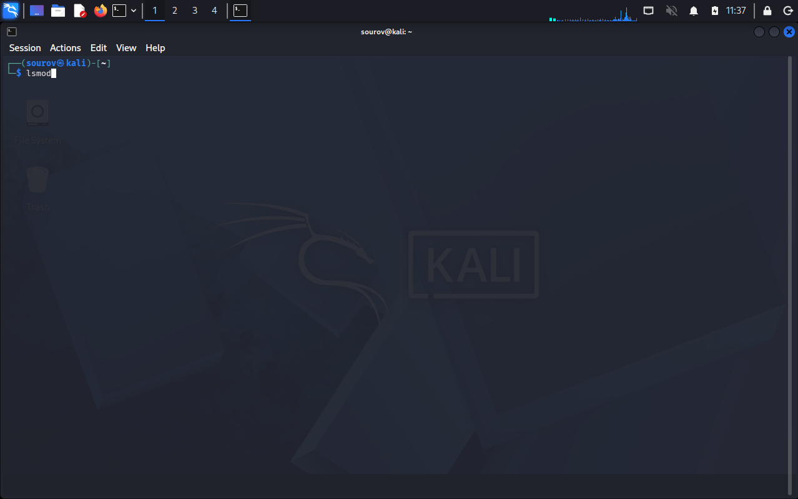

#### 🖼️ Terminal Output

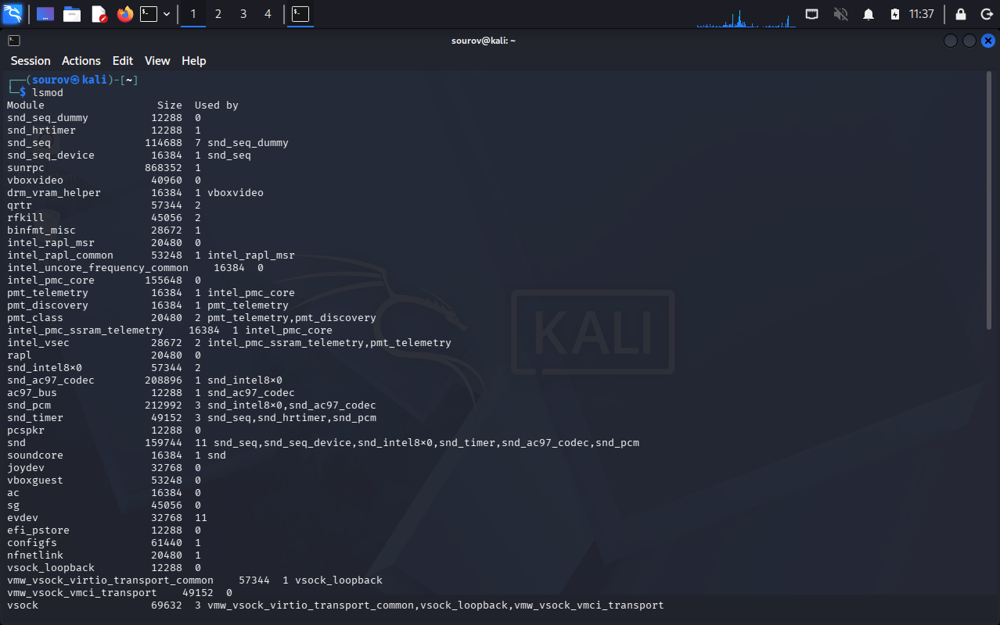
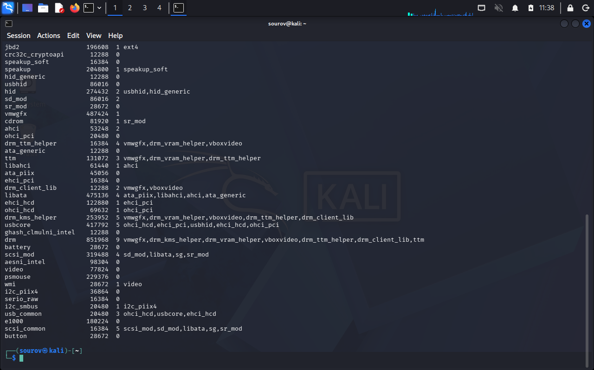

#### Output Data Breakdown:

* `Module`: Name of the loaded kernel module.
* `Size`: Memory footprint size of the module in bytes.
* `Used by`: Count of dependent processes or specific module names relying on this module.

---

#### Detailed Module Metadata (`modinfo`)

Retrieves metadata regarding a specific module file prior to or following insertion.

```bash
kali > modinfo bluetooth

```

#### 🖼️ Terminal Command

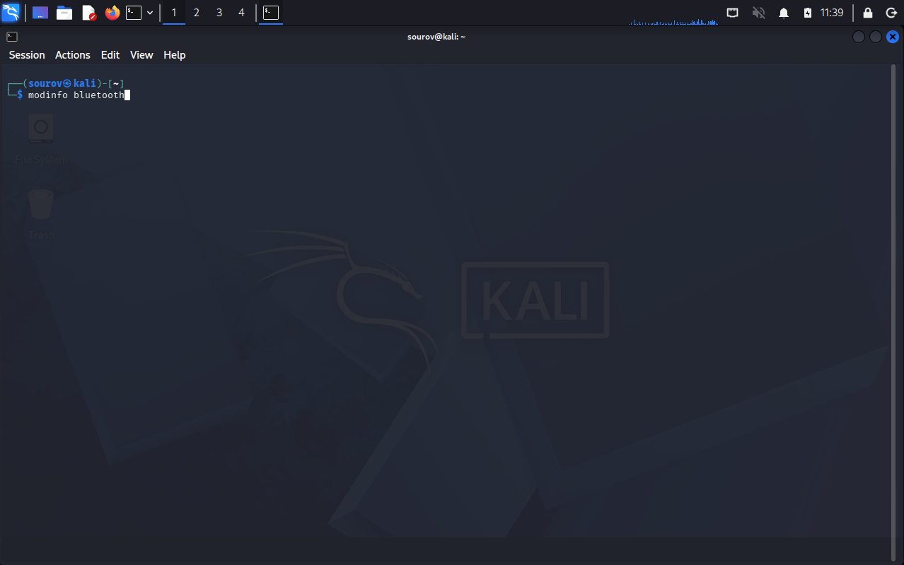

#### 🖼️ Terminal Output

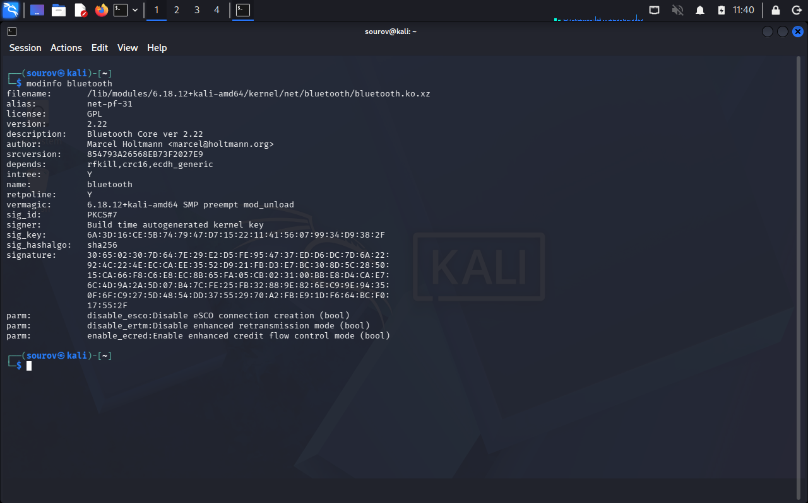

#### Field Description Breakdown:

* `filename`: Absolute disk path to the compiled `.ko` (Kernel Object) binary file.
* `depends`: Prerequisite modules required to be present in memory before loading this module.
* `vermagic`: Exact kernel version string the module was compiled for (must match running kernel).
* `parm`: Optional configurable runtime module parameters and flags.

---

#### Module Insertion, Removal, and Verification Commands

* **Insert Module with Auto-Dependencies:**
```bash
kali > modprobe -a bluetooth

```


* **Unload Module Safely:**
```bash
kali > modprobe -r bluetooth

```


* **Verify Kernel Event Log Messages:**
```bash
kali > dmesg | grep bluetooth

```


#### 🖼️ Terminal Output View (`dmesg | grep bluetooth`)

```plaintext
[   18.412034] Bluetooth: Core ver 2.22
[   18.412061] Bluetooth: HCI device and connection manager initialized
[   18.412065] Bluetooth: L2CAP socket layer initialized
[   18.412071] Bluetooth: SCO socket layer initialized

```

---

### 5. 🗺️ Technology Comparison: Legacy vs. Modern LKM Management

| Feature / Metric | Legacy Utilities (`insmod` / `rmmod`) ⚠️ | Modern Utilities (`modprobe`) 🛡️ |
| --- | --- | --- |
| **Dependency Resolution** | None (Fails if prerequisites are missing) | Automatic (Locates and loads dependencies) |
| **Input Format Requirement** | Requires exact file path (`/path/driver.ko`) | Accepts simple module name (`bluetooth`) |
| **Removal Behavior** | Unloads specified module only | Unloads module and unused dependent modules |
| **Database Source** | Directly loads specified binary file | Queries `/lib/modules/$(uname -r)/modules.dep` |
| **Recommended Usage Context** | Manual kernel development / Standalone `.ko` testing | Standard system administration & penetration testing |

---

## 🛠️ Utilities & Command Reference

| Utility / Command | Syntax Example | Primary Purpose / Description |
| --- | --- | --- |
| **`uname`** | `uname -a` | Displays detailed operating system kernel build metadata and architecture. |
| **`/proc/version`** | `cat /proc/version` | Reads runtime kernel version details and compiler release info from `/proc`. |
| **`sysctl`** | `sysctl -w net.ipv4.ip_forward=1` | Inspects and alters kernel runtime operational variables dynamically. |
| **`sysctl -p`** | `sysctl -p` | Reloads kernel configuration settings directly from `/etc/sysctl.conf`. |
| **`lsmod`** | `lsmod` | Lists all active modules currently resident in kernel memory. |
| **`modinfo`** | `modinfo bluetooth` | Displays detailed metadata, dependencies, and parameters of a `.ko` module file. |
| **`modprobe`** | `modprobe -a bluetooth` | Dynamically loads kernel modules with automatic dependency resolution. |
| **`modprobe -r`** | `modprobe -r bluetooth` | Safely removes specified kernel modules and unused dependent modules. |
| **`dmesg`** | `dmesg | grep bluetooth` | Queries the kernel ring buffer logs for initialization events and errors. |

---

## 🔑 Key Takeaways for Revision

* **Ring Privilege Isolation:** Kernel space runs in Ring 0 with unrestricted hardware access, whereas user space runs in Ring 3 with restricted execution rights.
* **LKM Security Risk:** Loadable Kernel Modules execute inside Ring 0, making malicious LKMs (kernel rootkits) capable of complete system compromise and stealth.
* **Dependency Advantage:** Always prefer `modprobe` over `insmod` for module management because `modprobe` automatically resolves and loads module dependencies.
* **Kernel Parameter Persistence:** Command-line modifications via `sysctl -w` alter memory state temporarily; permanent configuration changes require modifying `/etc/sysctl.conf` and running `sysctl -p`.
* **Runtime Kernel Management Execution Flow:**

$$\text{Inspect Kernel } (\texttt{uname -a}) \longrightarrow \text{Query Modules } (\texttt{lsmod}) \longrightarrow \text{Check Metadata } (\texttt{modinfo}) \longrightarrow \text{Manage LKM } (\texttt{modprobe}) \longrightarrow \text{Verify Log } (\texttt{dmesg})$$

---

*⚡ End of Week 05 • Day 01 Notes • Organized for GitHub & OneNote*
